# Rating Curve Development for River Sections

[Back to Home](..\index#online-documentation)

Rating of natural streams can be developed using the product module ***ChannelRate_WSPRO***. The module is built on WSPRO98 algorithm from USGS, providing a convenient solution environment for interactive input and output of solutions.  It also solves rating curves using simple application of manning's equation.

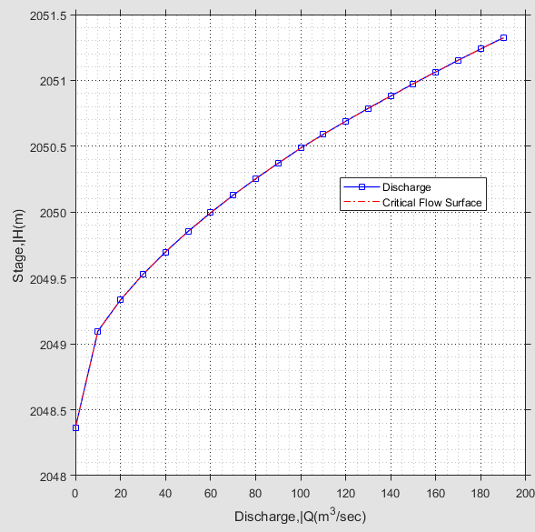

*A solved rating curve for a cross-section*.

## Table of Contents
<!--TOC-->
  - [Conventions:](#conventions)
  - [Typical Workflow](#typical-workflow)
  - [Preparing Objects](#preparing-objects)
  - [Define the Session](#define-the-session)
  - [Solve for Rating Curve](#solve-for-rating-curve)
    - [Define Segments](#define-segments)
    - [Edit Setting Variables](#edit-setting-variables)
    - [Set More Calculation Parameters](#set-more-calculation-parameters)
    - [Solve and Explore Solutions:](#solve-and-explore-solutions)
  - [Save Solution](#save-solution)
  - [Presentation of Results](#presentation-of-results)
  - [Rating curve for multiple cross-sectoins](#rating-curve-for-multiple-cross-sectoins)
  - [Technical Notes](#technical-notes)
<!--/TOC-->

## Conventions: 
[Back to ToC](#table-of-contents)

Typically, this solution adopts the conventions from the WSPRO program.
Cross-section coordinate stations are from left to right, facing
downstream of the flow.

This module can be used to estimate tail water
rating curve from:

1.  A surveyors profile

2.  Extracted profile from cross-section axes or alignment.

> Note: Solutions using this module use WSPRO for upstream direction flow calculation, assuming subcritical flow conditions. Conditions resulting in superciritical flow conditions are therefore not amicable to the current release of the module. Refer the WSPRO manual for further details. 

## Typical Workflow
[Back to ToC](#table-of-contents)

The general workflow for the use of this module is as follows:
1. Prepare objects - this includes the cross-section data plotted and referenced
1. Define the session for ChannelRating
1. Set geometric and hydraulic parametrs
1. Solve for the rating curve, and iterate as needed
1. Save the work, also for use in other modules (e.g., Diversion Weir Design)

Each of these are further elaborated below.

## Preparing Objects
[Back to ToC](#table-of-contents)

For ChannelRating_WSPRO module to work, only one AutoCAD object is needed. That is, the cross-section profile of the stream or river section whose rating curve is required.

This can be created in one of many ways. For instance:
- a profile taken from a topographic data (preferably using iCAD)
- A surveyor's profile data plotted on AutoCAD (preferably using iCAD modules)
- A drawn cross-section (e.g. digitized from a scanned image.)

The maximum allowable number of vertices for the cross-section is 100 points. Any cross-section in excess of this will not be processed.

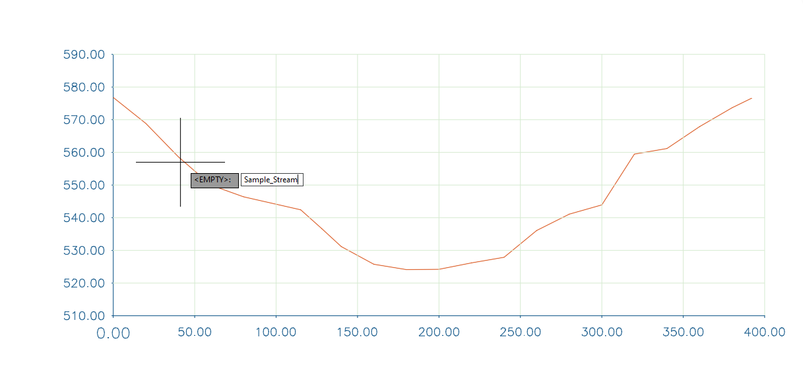

*A cross-section drawing in AutoCAD ready for use by the module.*

In all cases, the object must be refernced to a pair of axis created by iCAD software product. It is not mandatory, but helps, to tag the object with an appropriate name. This can be done from the AutoCAD add-on tools.

> :bulb: **Tip**: If scaling information is not available, the module will not proceed. Use the axis creation and editing tools with in iCAD to reference an existing plot of a cross-section,

> Note: Different approaches are used to solve rating curves when either or both banks are lower than that which can accomodate desired discharges. Read [Set More Calculation Parameters]() below for details.

Once the object is ready, continue to defining the session for the module.

## Define the Session
[Back to ToC](#table-of-contents)

If not already, start iCAD application. This will link it to the existing AutoCAD drawing which contains the cross-section plot object. If you are on an open instance, then clear the iCAD Explorer workspace. Before you continue, make sure to import the cross-section object in to the iCAD workspace, else next steps may not complete succesfully.

1. Start the module browser from `Session > Create and Run Session` or the toolbar option. 

   

2. In the *Module Browser* dialog, choose the **ChannelRate_WSPRO** module, and hit `Continue`. Provide a unique name for the session.

    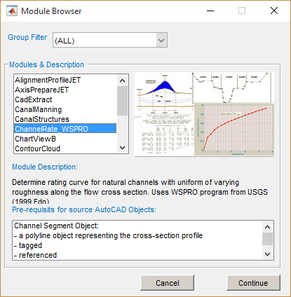

    > Note: The requirements discussed above, are also shown at the bottom of the dialog, under *Pre requisites for Source AutoCAD Objects.*

3. The *New Session* dialog opens. Here, click on the *Channel Segment* space holder. AutoCAD will be in select mode and waiting for input. Choose the ready profile object.
 
    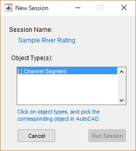

    If the selction is made succesfully, the spaceholder is marked. Hit the `Run Session` button.

    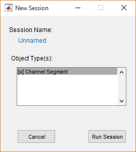
    
    > Note: The object will be marked \[x\] when successfully associated to the the AutoCAD object. If not, the *Run Session* button will remain in Active.

The module is now rinning in the main interface, with all the required prerequisite data. The next step is to define the geometric and hydraulic parameters for the stream cross-section profile.

## Solve for Rating Curve
[Back to ToC](#table-of-contents)

The sections below demonstrate how the above defined session can be used to determine rating curves usine different methods and approaches. The user can control considerations for determining the final result, as it may suite the particular condition of the channel and its properties.

### Define Segments
[Back to ToC](#table-of-contents)

Segments are parts of the cross-section profile having different hydraulic parameters, namely roughness coeficients. By default, one segment - represneting the entire width of the profile - is assigned at start up.

1. To create more segments, Right-click on a location on the cross-seection profile object, and select **Add Segment.** This will insert a vertical bar at the given location. 

   

   You can edit the locaiton of the vertical bar. Right-click on the bar, and choose `Move...` to interactively drag to a location. Or choose `Move to Station...` to input a specific station to move to.

   > Note: Each vertical bar represents the segment of channel section to the left of its location. Notice also the default hydraulic paramereters displayed at the top center for each segment.

2. To edit the roughness coeficient for a segment, right-Click on a it and `Edit Segment` menu option.  In the *Edit Segment* dialog, change the label and roughness values as needed. The changes will be reflected in the main interface.

   

   > Note: A maximum of 5 segments are allowed on a given cross-section.
    
### Edit Setting Variables
Before solving for the rating curve, it is recommended to review the calculation parameters which control the solution methods, approach and assumptions. This can be done from the *Variable Editor* dialog as follows.

1. To set or edit these, go to `Workflow > Edit Variables...` or `Ctrl`+`E` key combination. This will display the *Variable Editor* dialog. The most common ones are:
    - Discharge range of values for calculation, in m^3^ per second.
    - Stream bed slope (m/m).

   The calculated range of discharges is dictated by the minimum height of the canal bank on either end, or the maximum of discharge ranges input, which ever is minimum.

     The figure below shows the variable editor dialog, listing all the settings available.
 
    {br}

    The table below summarizes input description for the common variables.{br}

    <table>
    <colgroup>
    <col style="width: 10%" />
    <col style="width: 20%" />
    <col style="width: 58%" />
    </colgroup>
    <thead>
    <tr class="header">
    <th><strong>Group</strong></th>
    <th><strong>Variable Name</strong></th>
    <th><strong>Variable Description and remarks</strong></th>
    </tr>
    </thead>
    <tbody>
    <tr class="odd">
    <td rowspan="4">
    
Calculation Parameters

    </td>
    <td>Discharge Range</td>
    <td>
An array of discharge values for which a flow stages are to be
    computed.

    
e.g., [0:25:250] from 0 to 250m^3/sec at 25m^3/sec interval
</td>
    </tr>
    <tr class="even">
    <td>Flood Discharge: Qf(m3/sec)</td>
    <td>
Flood magnitudes to show on the rating curve and flow cross section in m3/sec.

    
e.g., 50, 100 draws flood marks for 50 and 100 m3/sec respectively.

    
 A maximum of two valuse can be input.
</td>
    </tr>
    <tr class="even">
    <td>Stream Bed Slope(So)</td>
    <td>
The average stream bed slope in m/m.

    
e.g., 0.001 is 1m drop every 1000 meters
</td>
    </tr>
    <tr class="even">
    <td>Boundary Condition (FSo)</td>
    <td>
 Dictates how water surface elevation is determined at downstream end. 

    
 Fso >=1.0, used slope-conveyance computation to determine initial water surface level at downstream end.

    
 Fso<1, assumes critical flow at downstream end, and determines initial water surface level from the same.
</td>
    </tr>
    </tbody>
    </table>

See just below, for *Analysis Method* and *Distance B/n Templates* settings.

### Set More Calculation Parameters
[Back to ToC](#table-of-contents)

There are three differnet options available to solve for the rating curve, and this can be selected from the `Workflow > Edit Variables` by clicking on the *Analysis Method* variable.

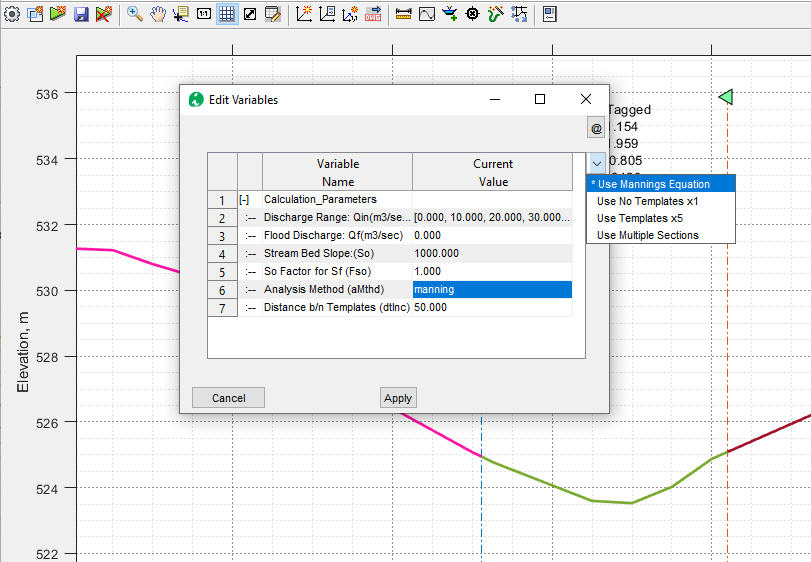

1. **Mannings Equation**: This method applies the mannings equation to the defined cross-section, and uses the slope value from the *Stream Bed Slope* variable. 
    > **Note** If segments are created, this method uses the arithmatic average of N (manning's roughness) values assigned for the segments in the cross-section for all discharge amounts.

1. **Use Template x1**: This method uses the built in WSPRO engine to compute water surface elevations for different discharge rates. It uses the single cross-section data provided. For this option the variable *Distance b/n Templates* is not used.

1. **Use Tempate x5**: This method, similar to the above, uses the built in WSPRO engine. This time, the cross-section is duplicated 5 times, and positioned downstream maintaining a distance specified by the value of *Distance b/n templates* variable. For a default value of 50, each of the four cross-sections will be positioned at 50, 100, 150 and 200 meters downstream. The WSPRO engine then generates a water surface profile for the desired discharge range, starting at the downstream most cross-section, and progressing upwards. The stage determined at the original cross-section is expected to give a more accurate estimates considering friction losses.

    > **Note**: An important assumption in this method of solution is that the channel is prismatic, and hence the cross-sections at various stations are similar.

1. **Use Multiple Sections**: This method can take input for multiple cross-sections of the river down stream of the desired location. To use this method, each cross-section must be plotted in AutoCAD using iCAD tools, or referenced to requirement per iCAD conventions.

> **Note** The last two methods are known to properly account for the variation of roughness values for differnet segments along the defined cross-section.

> Note: For uniform N values, solutions using Slope-conveyance boundary conditions (with FSo=1.0) are similar to mannings solution.

> The method of **Multiple Sections** is an advanced method of analysis. It is presented in detail towards the end of this section.

> Note: When using manning solution, the rating curve is calculated up to a discharge level that can be accomodated below by the lowest bank height.

> Note: When implementing methods that employ the WSPRO model, assumptions in the model hold. That means, water surface elevation for discharges higher than that can be acoomodated by the bank data are calculated by assuming a vertical section at either end of the bank.

Once all parameters are set to desired values, hit on `Apply` button to save them.

### Solve and Explore Solutions:
[Back to ToC](#table-of-contents)

To solve for rating curve, go to `Workflow > Solve` or use `Ctrl`+`S` keyboard short cut. The results are presented on the main iCAD interface, along with a tabular data in the *Data Table* interface.

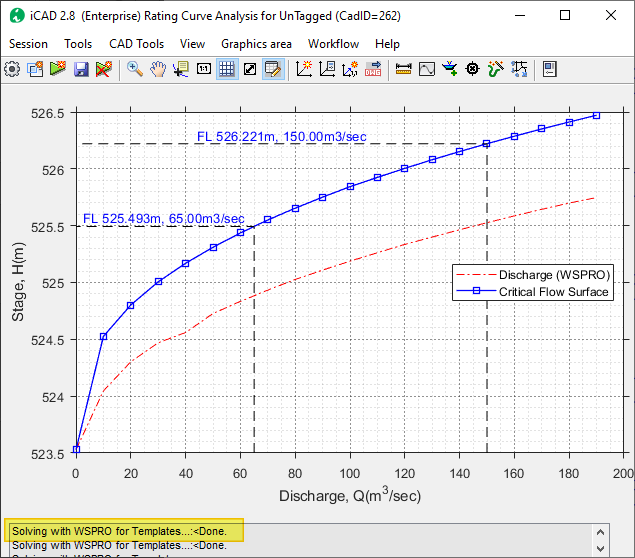

Fig: iCAD main interface showing calculated rating curve, and flood marks.

> Note: Notice the updates on the status bar, showing method of analysis employed in solving the rating curve.

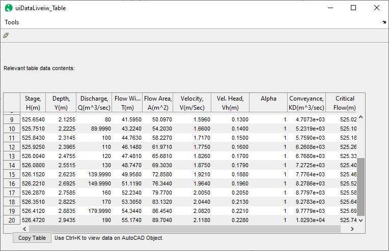

Fig: Data Table view interface presenting detailed calculation results.

To explore graphical presentation of other solutions follow below steps,

- Toggle `Workflow > View Depth Plots` to view stage or depth plots {br}
    
- Toggle `Workflow > View Discharge Curve`   or `Workflow > View Velocity plot` to different rating plots.

- Toggle the table view from the toolbar, to view or copy tabular results.

Users can edit any aspect of the problem definition or calcualtion paraneters described so far, and solve again to see updated results.

##  Save Solution
[Back to ToC](#table-of-contents)

Save the work so it is avilable on subsequent iCAD sessions. To save Go to `Session > Save` or use the toolbar button.

The data for the session are saved on the cross-section object in AutoCAD. This meanse, on subsquent runs of iCAD, importing this object the iCAD workspace, will also bring the session along with the saved data for quick access.

  

  > Note: If save could not complete, make sure the base cross-section object is in the iCAD workspace. 

  > Note: The tabular data of the solution is saved on to the cross-section object in AutoCAD. It can therefore be viewed at any time from **Tools > View CSV Data on Object**.

## Presentation of Results
[Back to ToC](#table-of-contents)

Use iCAD presentation solutions introduced in earlier in [Data Processing, Analysis and Presentaiton]() chapeters for different ways to view, present and store results in iCAD main interface.

- Use data cursor tips to annotate the graph. Hold shift to add more data tips.\

    

- Use `Tools > Copy Graphics  (to File)` to save image to a file.
- Copy graphics data and plot to AutoCAD.
- Copy the table data using `Copy` button at the bottom left  to transfer to reports, or spreadsheets as needed.

    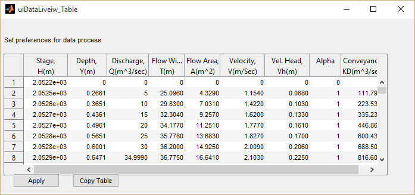

Any of the results on the main interface can also be drawn to AutoCAD using the `Workflow > Draw All to AutoCAD` or `Workslof > Select Draw to AutoCAD` menu commands.

You can read more on this from the guide on *Interacting with iCAD environment* for more details.

## Rating curve for multiple cross-sectoins
[Back to ToC](#table-of-contents)

The WSPRO/USGS manual, and USBR for Small Dams, recommend to use multiple cross-sections for determining stage discharge relationships. This can be done using this module as follows:

1. Prepare the data for all cross-sections and their location stations, and plot them in AutoCAD. The plots can be separate for each cross-section, or using the same axis for all. 
 
1. Define the session using the base cross-section object, which is the most upstream section located at or near the station where the stage-discharge relation ship is required. This will be known as the *Base* cross-section.
1. Once in the main environment, edit the segments for the *Base* cross-section as needed for hydraulic and geometric properties. 
    > Important Note: The number of segments should be equal in all cross-sections, otherwise the solver can not continue.
  
  
1. Next, start `Workflow > Manage profiles` menu tool. (This should be refered to as Manage cross-sections. But cross-sections are also profiles, hence the terminology.)  Accept the default station for the base section, or edit as needed. Then hit `Ok`.

    

1. The *uiChannelRateInit* interface will allow adding more cross-sections to the problem definition. Use `Add` to bring the other cross-sections, and specify the stations for each accordingly.

    > Note: Add each cross-section one by one, sequentially starting from the nearest to the farthest located cross-section, with respect to the base cross-section.

    

6. Next Edit each cross-section for hydraulic and geometric properties similar to the base cross-sectoin. To do this, check the *Show Longitudinal Profile* check box on the top of the interface. This will display all imported sections in order. Then select a section from the list on the left pane, which will also highlight the corresponding object from the longitudinal view. Then choose `Edit Current` button. 

    

6. This will close the interface, and pass the current section to the main interface. Use the usual steps to create and edit segments to this section. When done, go to `Workflow > Restore Source Section` menu command. Repeat for each section.
    > Tip: The number of segments in each cross-section must be equal to that used for the base cross-section.

1. In the main interface go to `Worlflow > Edit Variables`, and set the Analysis method to *MultiSections*. And hit `Apply`.

    

The set up is completed. Now the problem can be solved. Use `Ctrl+s` or `Workdlow > Solve` to do this. The rating curve for the base section is displayed. The computed flow profile for the different sections can be viewed from `Workflow > Show Computed Profile`. {br}

   

  This figure is an edited version of the profile plot for report purposed.

 

## Technical Notes
[Back to ToC](#table-of-contents)

This Module can be thought of as an enhanced input/output interface to
the popular WSPRO program from USGS. The WSPRO program (short for Water
Surface PROfile) and/or its algorithm is widely used in many other
modelling software. ChannelRatingWSPRO module adopts the 1998 Edition of
the program. The technical information in the user manual available from
USGS website is also applicable here.

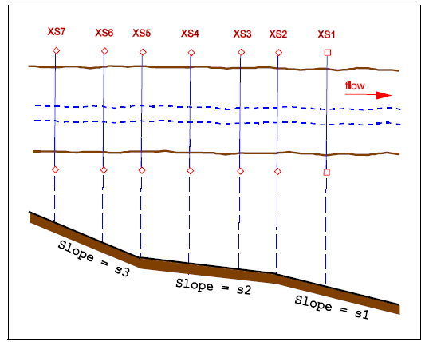

The method of computation used for water surface level computation, as is widely established in practice, uses a number of cross-sections to establish a good estimate of flow level. Usually up to seven cross-section data are used. Using more cross-section data may not improve the accuracy of the results any further. Using less cross-section data however is known to limit the accuracy of the result. This is an important factor to note, as currently only one cross-section can be used in the module.

Flow surface is estimated by starting at a cross-section, and estimating
the normal flow depth there. This is achieved by using the equation:

Q~n~= 1/n*AR^2/3^S^1/2^

Then the water surface profile at the next cross-section is estimated by
using equations of the direct-step method developed to account for
friction slope and flow-energy gradients.

As the solution progresses to the farthest cross-section, the accuracy
of calculated water surface level to represent actual flow levels
increases. In the sketch shown, the computation the beginning
cross-section would be XS1 and the ending cross-section would be XS7.

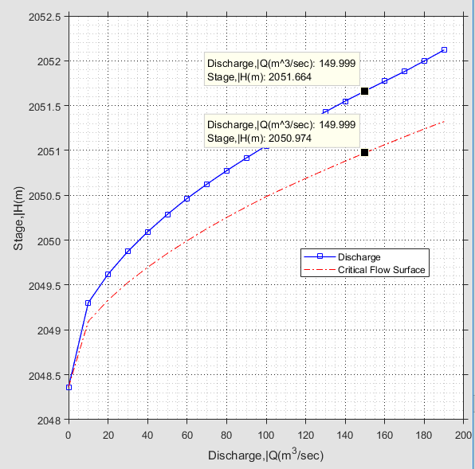{br}

iCAD presents solution for stage-discharge relationship as shown below, including critical flow surface levels for the range of discharge values supplied. In the figure for example, WSP for Q=150m^3/sec is @2051.664. For the same discharge the critical flow WSP is @2050.974, i.e.,

Y~n~ > y~crt~

Indicating subcritical flow.

 {br}

As the canal bed slope is increased, the normal flow depth approaches
the critical flow depth.

After a certain slope, or more precisely the critical slope, the normal
flow depth should be lower than the critical flow depth. However, this
is not properly represented. As the next result snapshot shows, the two
lines simply overlap <u>wrongly</u> showing for any discharge the
critical flow surface and the normal flow surface are the same.

This happens because, critical flow computation is carried out
downstream assuming critical flow at the starting cross-section.

[Back to ToC](#table-of-contents)

END.

