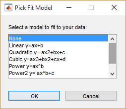
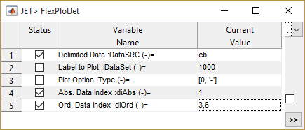
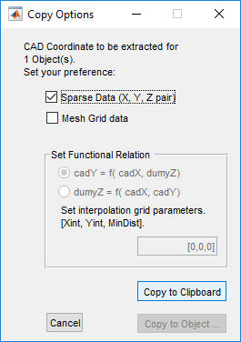

# Data processing, analysis and presentation 

CAD offers a number of tools for data processing and visualization. The tools are selected to fill practical data visualization and presentation challenges in every day design tasks.

This page presents each tool available, and how to use it to tackle design challenges. Use table of contents outline below to navigate through this page.

# Table of Contents
<!--TOC-->
  - [Summary of functions](#summary-of-functions)
  - [Host Data from Excel to AutoCAD Object](#host-data-from-excel-to-autocad-object)
  - [Plot Data in to AutoCAD](#plot-data-in-to-autocad)
  - [Plot Text Table to AutoCAD](#plot-text-table-to-autocad)
  - [Local Coordinate system and Object Referencing for iCAD use](#local-coordinate-system-and-object-referencing-for-icad-use)
    - [Create and Edit floating Axes](#create-and-edit-floating-axes)
      - [Create a new axes](#create-a-new-axes)
      - [Editing Axis](#editing-axis)
      - [Creating Unit axes](#creating-unit-axes)
    - [Creating Referenced Axis](#creating-referenced-axis)
    - [Referencing objects to an Axis system](#referencing-objects-to-an-axis-system)
  - [Create and Edit Alignment Markers](#create-and-edit-alignment-markers)
  - [Generating profile data for Alignment routes](#generating-profile-data-for-alignment-routes)
    - [Conventions](#conventions)
    - [Extracting and displaying profile data](#extracting-and-displaying-profile-data)
    - [Modify extracted data](#modify-extracted-data)
    - [2.5D Profile data generation](#2.5d-profile-data-generation)
    - [Batch processing profiles](#batch-processing-profiles)
  - [Data Visualization](#data-visualization)
    - [Technical Notes: Fitting a Model or adding a trendline:](#technical-notes-fitting-a-model-or-adding-a-trendline)
  - [Using CAD Objects Extractor](#using-cad-objects-extractor)
    - [Collecting and Managing Objects in to the Extractor](#collecting-and-managing-objects-in-to-the-extractor)
    - [Exporting Data](#exporting-data)
    - [Instantiation](#instantiation)
<!--/TOC-->

## Summary of functions
[Back to ToC](#table-of-contents)

Functions for preparing data and AutoCAD objects are available either as CAD Tools in iCAD, or embedded AutoCAD utilities also called **AutoCAD Add-on** utilities.

*AutoCAD Add-on utilities shown on the left of the AutoCAD model space.*

The utilities allow power users to exchange data from iCAD to AutoCAD and back to iCAD, while also allowing easy annotation and rendering of drawing details with in the AutoCAD environment.

The following are the key funcitons available for use in iCAD/AutoCAD environment.
- **Paste Data**: Transfers data from an Excel workbook to an iCAD
process. View Data displays hosted data on objects.

- **Alignment Profile**: Creates a strip profile from a 2D layout (route) object and using cloud of spot data.

- **Marking and Referencing Functions**: Allow to mark, label and
reference AutoCAD objects to cater for modules in iCAD environment.

- **Plot/View Data (FlexPlotJET)**: A versatile plotting/viewing function. It can be used to render analysis and solution to AutoCAD environment. It has a capability to render table data, as well as graphic components from iCAD’s DataLiveiw interface. It can also be used to visualize, and process data before exporting to AutoCAD.

    > **Note**: FlexPlot handles a maximum of 10 data series at once, and can position/label a maximum of 100 tick marks (on an abscissa or ordinate measure.) The user is warned if more than 50 tick marks are encountered. During Object (coordinates) import to iCAD, the current version allows up to a maximum of 120 vertices with an accuracy of 10^-8.

- **Table Plot**: Plot tabular data as a table in to to AutoCAD.

    > Note: Only numeric columns are plotted to AutoCAD.

A typical set of tasks that can be accomplished using tools and functionalities are presented below.

## Host Data from Excel to AutoCAD Object
[Back to ToC](#table-of-contents)

One of the power features of iCAD is its ability to enhance the use of AutoCAD environment as a true design environment by allowing objects to host raw data or relevant processed data.

A common source of raw data is a tabular data from Excel, such as shown here. Another example is the spot data collection from surveying work detailing topographic variations of a development area. Hosting these data on AutoCAD objects makes them easily available and accessible during later analysis and generation of derived data such as contour maps and profile plot.

We will show how to host this data on an AutoCAD object for latter use. 

Before proceeding, follow these steps to make sure to observe the following **Important conventions:** for a successful operation to prepare the data with in Excel, or Notepad (CSV format), or OpenOffice spreadsheet.

- All columns must have headers.

- Headers must have no spaces, and can only no symbol other than the
    open or closed bracket symbol.

- Data table below headers can ONLY contain numbers. No text or string
    data is allowed.

- Data can have any number of rows or columns.

- The data must be copied along with the header information.

Then follow below typical workflow:

1.  Prepare the Object in AutoCAD. Draw an arbitrary object using the AutoCAD polyline command. Use the *Attach Tag* addon tool to give it a recognizable name.
 
    

2.  Start the workspace manager from iCAD interface, and Add the object to the current collection set using the *Add Objects* button. 
    
    
    
    You will see the object listed on the left box with the tag string provided and it’s AutoCAD Object ID.

    > :bulb: **Tip**: Check the *Check for Objects* box, to change view between object list and session list.

3.  Select your desired data in Excel and copy to windows clipboard
    using `CTRL`+`C` short cut.

4.  Back on Workspace Manager, click on the object and select Paste Data tool button. This will start *Select Source* dialog. Choose `Clipboard`. 
    

4. The import dialog starts, showing a preview of the data in the clipboard. Accept `Next` and `Continue` buttons.

    

     {br}

    > **Note** The status bar at the bottom of the main iCAD interface (above). If successful, it reports the paste operation is completed. 
    
    One can view this data, by selecting the object on the Workspace Manager interface, and using *Preview Data* tool button. The data is presented in the *uiDataPreview* table. Use the `<` and `>` buttons to expand and contact the table view.

    

> :notebook: **Technical Note**: These data are saved in CSV format in the accompanying AutoCAD file to the project (*.xsd). They can not be edited. However, they can be replaced with modified data any time.

## Plot Data in to AutoCAD

One of the most needed functionalities is the ability to render plots of
data, analysis results and even graphic objects in to AutoCAD
environment with ease. In iCAD, this is achieved using the
**FlexPlotJET** modile – a powerful and versatile plotting utility
used by all other modular solutions. Data sources for this operation can
be either of:

1)  Windows clipboard data. These can be from:

    1.  copied from Excel, or Notepad (CSV format), or openOffice spreadsheet.

    2.  tabular presentation of other iCAD solutions, or

    3.  graphic data from **DataLiveiw** interface copied using **Tools
        \> Copy Graphics (for AutoCAD Plot)** menu.

2)  Hosted data in AutoCAD object such as pasted raw data as explained
    in previous function or results of analysis such as from a stream
    rating curve analysis.

A typical workflow to plot data using this function is as follows:

1.  Invoke the solution from iCAD Explorer **Tools \> Plot Data to
    AutoCAD** menu. This will bring the input dialog.

2.  Specify the data source in the first row. Click on the *Link to object…* cell to pick an AutoCAD object hosting the data to be plotted. Shift click on *Link to Object…* cell to type **cb** or **clipboard** and use the data on windows clipboard.

3.  Specify which data columns are to be plotted on the abscisa and
    ordinate axis, and select the plot type.

4.  Accept all inputs and proceed.

5.  A dialog box will appear asking for the plot area. Select the
    desired destination from the options.
    
    
    
    Note: **Plot to WCS** plots the data to AutoCAD World Coordinate System (WCS). **Plot to BBox** allows users to select an object whose top-right and bottom-left coordinates are essentially different and are used to define the plot area. **Use Refd Object** option allows to pick an existing object

6.  Specify plot options on the next dialog.

    

    - Accept the **All** option for a fit-to-area plot of your data.

    - Specify a plotting scale \>0 to define a common plotting scale for both horizontal and vertical axes.

    - Input a negative value to specify the plot scale latter in the plot process.

    The data plot is generated in AutoCAD environment as desired.
    
    > :bulb: **Note**: FlexPlotJET handles a maximum of 10 data series at once, and can position/label a maximum of 100 tick marks (on an abscissa or ordinate measure.) All data in excess of 10th series are ignored. The user is warned if more than 50 tick marks are encountered. During Object (coordinates) import to iCAD, the current version allows up to a maximum of 120 vertices with an accuracy of 10^-8.
    
    
    
    
    
    Edit, annotate and enhance plot using iCAD and inCAD utilities.
    - Edit axis tick marks, labels, scaling and more using`CAD Tools > Edit/Make Linear Axis` menu command.
    - Add grid lines using the **Mark Curves** and **Draw Grids to Axes** addon tools from with in AutoCAD (shown above)

## Plot Text Table to AutoCAD

Similarly, you can plot tabular data as a table to AutoCAD. The data
sources for this task can be similar to those for the plot data function
above. In addition, DataTable contents from any of iCAD’s modular
solutions can be used as a source.

The workflow to using this function is:

1.  Invoke the function from **CAD Tools \> Plot Table to AutoCAD.** A dialog box appears asking for a *Dump Object*, the area to place the table in AutoCAD. This is similar to the bounding box concept used in making axes. Click on the *Link to Object* cell to select an object that indicates an area to render the table data in AutoCAD. (shown in red in this example.)
    
    

3.  `Shift`+`Left-Click` on the *Link to object* cell of the *Source Object* variable, and type in **cb** to use clipboard data. If the data is hosted in an object, simply click and link as step one above.

4.  Hit the `>>` button.

The table is generated in AutoCAD.

> :bulb: **Tip**: AutoCAD uses the current text, color and other settings to generate the table data.

> :warning: **Note**: only numeric columns are plotted to AutoCAD using this tool.

## Local Coordinate system and Object Referencing for iCAD use

AutoCAD model space uses its own coordinate system to reference and
position objects. There are two types of coordinate systems. The WCS or
World Coordinate system is the fundamental coordinate system referencing
all objects in the AutoCAD model space globally. The UCS or User
Coordinate System on the other hand is created by the user to create a
local reference axis. This coordinate system allows to (re)locate an
origin of a user coordinate systems anywhere in the model space.

iCAD adopts a similar coordinate system as the local coordinate system
to reference and position objects, such as design charts or drawing
components. The unique advantages of the iCAD created coordinate systems
are:

- Multiple reference axes (or coordinate systems) can be placed on a
  single drawing file, and all can be used simultaneously, and independently of
  each other. (in contrast to the AutoCAD UCS tool)

- iCAD coordinate systems are planar (i.e. X,Y system)

- iCAD coordinate systems can have different scaling in x and y
  direction.

Referencing AutoCAD objects to a local axis allows syncing coordinates
of existing objects to enhance use of spatial information and
facilitating positioning of subsequent new plots. Three basic tasks are
outlined below: thus (a) creating local axis, (b) referencing objects to
axes system and (c) creating additional axis.

### Create and Edit floating Axes
[Back to ToC](#table-of-contents)

Floating axes are not linked to any reference. They are placed randomly, and represent arbitrary range of data.Floating axes creation and editing tools in iCAD can be invoked from the menu commands shown below.

 

They can also be invoked directly from the toolbar menu.

*The toolbar items are, from left to right, for New Axis creation, Editing an existing Axis, and creating a unit axis.*

One can create new axes, or edit existing axes for their details as shown below.

#### Create a new axes
[Back to ToC](#table-of-contents)

1. Start the menu command from `Cad Tools > Make Orthogonal Axes`. 

2. In AutoCAD, pick the object defining the bounding box for the axes area.

3. The variable editor dialog appears. Set axis limits for Abscisa and Ordinate as desired.
   
   
   
   **WCS data**: Uses the AutoCAD World Coordinate System the object is located to create an axis. This will enlarge the BBox a little to set starting and ending positions.
   
   **Ref Data**: Use this if the object selected for the bounding box is referenced to a an existing axes pair. All objects (except Host objects) created by iCAD and CanalNETWORK are by default referenced to an accompanying axes.
   
   **User**: This option lets users define their own start and end for both vertical and horizontal axis.
   
   > Note: The value sets are START, STEP, END.
   
   
   
   *An axis from a diagonal line used as the bounding box, and using AutoCAD WCS option.*

#### Editing Axis
[Back to ToC](#table-of-contents)

The appearance and orientation of axis labels can be changed as follows.

1. Start the menu `CAD Tools >  Make/Edit Linear Axis...` 

2. In the dialog, ckick on the first row second column cell, and pick the axis to edit in AutoCAD.
   
   

3. The dialog box populates the values of the current setting in the box. Edit as desired.
   
   - Axis Limits: START, STEP, END (step is not always applied and depends on the size of the axis)
   
   - Label Position:
     
     - [1, 0] Left: put labels on left side, (refernce counterclockwise to the box), 
     
     - [1, 1] Left Rotated: as above, but rotated to 90deg.
     
     - [-1, 0] Right: put labels on right side, (refernce conterclockwise to the box)
     
     - []-1, 1] Right Rotated: same as above, but rotated to 90deg
   
   - Label number format: specify how many decimals to use for axis labels.
     
     NB: It is not recommended to change below data, especially for axis contaning referened plots.
   
   - Data Scale: Input if specific scaling is required for the axis. If 0 (default), then the axis limits (NOT the data) will fill the bounding box. If a >0 is input, both x and y axis will be scaled to that value. a value of 1 can be used to generate 1:1 scale drawings from the graphic in the main iCAD interface.
   
   - Text Height: Leave the maximum number to allow automatic sizing of texts. But can be set to a desired value as well.

Upon completion, the axis will be redrawn in AutoCAD with the new changes.

#### Creating Unit axes
A unit axes is a pair of orthogonal axes, whose data limits in both the x and y direction are [0, 1]. These may be required for varying reasons.

To create a unit axes:
1. Draw a bounding box object in AutoCAD. If similar scaling is required in both x, and y direction, use a circle or a square.
1. Start `CAD Tools > Make Unit Axes`. The *Flex Plot Action* dialog appears.
1. Select *Plot to BBox (AutoCAD)* option, and hit `Continue`.

    
1. AutoCAD is in select mode. Pick the circle object.

This will generate the desired axis, deletes the circle object, and creates a diagonal refernced object.

1. In the *Edit Variables* dialog, set the Abcsisa and Ordinate range variables to *User*, and leave the default [0, 1] on both.

### Creating Referenced Axis
[Back to ToC](#table-of-contents)

Referenced axes, in contrast to floating axes, are linked to the AutoCAD World Coordinate System (WCS). These create axes and data limits pertinent to the location where the bounding box is located with respect to the WCS.

To create a local axis system anywhere in the drawing space:

1. Draw a rectangle, circle or diagonal polyline whose bottom left and
top-right coordinates are used to define the limits (commonly referred
to as the bounding box or BBox in iCAD documentation) of the axes to be
created. 

    
    

2. Invoke **CAD Tools \> Create Orthogonal Axes**. The JET input dialog appears. Assign the variables as follows:
    - Click on *Link Object* value cell, and go to AutoCAD to pick the BBox object created above. 
    - Choose **CAD WCS Location**. 
    - (optional) Do the same for the *Vertical Range: yLim* variable.

3. Hit the `>>` button to continue. The **iCAD local axes** will be generated
around the BBox object using the AutoCAD location values.
> :bulb: **Note**: The actual axes may be slightly larger than the original bounding box object. This is because the axes MUST start at a whole number convenient for presentation, and not where the box is arbitrarily located.

### Referencing objects to an Axis system

There are two methods to reference polyline objects to an iCAD local
axis - from a axes, and from previously referneced objects.

To reference any object to an axes pair:

1. Select **Utilities-Paint axis info to Objects** utility as shown.
    
    
    AutoCAD will prompt to pick the reference axes.

2. Pick the horizontal and vertical axis consecutively. 
2. AutoCAD will then ask for the object to reference. Select the polyline object (or multiple polyline objects one at a time) and right click to finish selection. AutoCAD will confirm succefully referenced at the status bar.

    

**NOTICE**
- ONLY polyline objects are accepted for referencing with iCAD local
  axes.
- The number of objects successfully referenced is displayed in the
  AutoCAD command prompt.

Once can also reference objects by using previously referenced objects. If already referenced objects exist, then this method is slighly faster:

1. Start the command **Utilities-Paint axis info to Objects** from the Addon toolbar. 
1. Instead of picking a Horizintal axis, as prompted by AutoCAD, hit the &downarrow; (down arrow) on the keyboard, and select `Copy` option. AutoCAD will prompt for the base referenced object. Pick the existing referenced object.

2. Click on the new object or objects, and right-click when done. All objects are now referenced to the base axis to which the base reference object is referenced.

*AutoCAD will confirm successfully referenced objects on the command line.*

## Create and Edit Alignment Markers
[Back to ToC](#table-of-contents)

An alignment line is a polyline object drawing in AutoCAD that represents a layout instance of a canal route, or similar. Marking an alignment is the task of putting station markers along the alignment at specified intervals and text orientation.

To create markers along an alignment use below steps:

1. Start the menu `CAD Tools > Mark Alignment` menu command, or the tool bar option. AutoCAD will be ready in select mode, promoting *Pick Alignment object to Mark:* 
   
   

2. Pick the object for marking. If the object is not referenced, a dialog will apear to confirm the process. Accept and continue. If not, it will continue. 
   
    

3. If the Alignment has longitudinal informaiton, it will continue to step 4. If not,  a dialog will apear to confirm. Accept `Set New`. Input the deisred starting station for the object.
   
    
   
    
   
   Markers are created using default settings.
   
    
   
   Start the command again, and select the marked alignment to edit the specification for the markers.
   
   

4. Upon selection of a marked object, the below dialog appears to change how the markers are displayed.
   
    
   
   - **Begining Station**: Starting marker value. 
   
   - **Ending Station**: Ending marker value. 
   
   - **Marker spacing**: Minor and Major Steps for marking the alignment. Major marker locations bear text information, while minor marker locaitons are drawn as simple ticks.
   
   - **Text Format**: [A.B notation] A represents the location of + sign on station markers, and B represents the number of decimal places to use when generating station tetxts. For example, for station value of 12345.3456:
     
     - 3.0 will give 12+345
     
     - 3.2 will give 12+345.34
     
     - 0.3 will give 12345.345
   
   - **Text Orientation**: Parallel orientation rotates anotation texts parallel to the alignemnt object, while Perpendicular rotates them to appear normal to the alignment.
   
   - **Text Position**: Specified whethter text is to be put to the right or to the left of the alignment object.
   
   - **Skip Beg/End markers**. If editing markers on plan views, the end markers are automatically generated and need not change. Use this option to skip affecting them.
   
   Partial stations can be marked by specifing statting and ending stations accordingly. For the above example, using 300, 900) will work out as below.
   
    
   

## Generating profile data for Alignment routes
[Back to ToC](#table-of-contents)

The solution **CAD Tools \> Extract Profile** or CTRL+F invokes the
modular function that creates a strip profile from a 2D layout (route)
object and cloud of spot data. Such data are the starting points for
many other iCAD modules including **CanalStructures, JumpDesign** and
**RetwallDesign** among others.

### Conventions
[Back to ToC](#table-of-contents)

- Station distance increases from beginning to ending vertex.

- Offset is left (-ve) to right (+ve) face-upstream or facing opposite
  the direction of station increment.

- Elaborate full process with relevant content (Succinct)

### Extracting and displaying profile data
[Back to ToC](#table-of-contents)

Alignment objects should be drawn using the polyline object tool on a
contour plot and reference it. Prepare the alignment object in this
manner and:

 1. Invoke the **CAD Tools \>
Extract Profile** module. When the JET dialog appears, set the values of
each variable as appropriate.

- Link an object hosting cloud of spot data (the surveyors list of x,y,z
  pairs) to the *Cloud source* variable.

- Link the referenced alignment route object to the *Plan Layout*
  object.

- Select the desired offset settings from the dropdown list, or provide
  a different offset specification.

**Tip**: The notation *\[start: increment: end\]* can be used to specify
offset locations. \[-2:1:3\] for instance is the same as \[-2, -1, 0, 1,
2, 3\].

**Note**: Offsets are specified from left to right, facing towards the
beginning of the alignment object. For profile alignment along a river
centerline, for example, the offset is specified from left bank to right
bank, facing upstream.

**Note**: The module can generate strip profile for a maximum of 29
transverse data points.

**Note**: The cloud data source should be referenced to an iCAD
generated local axes system.

**Tip**: Use 0 (or defualt ***\*0 Only at center line*** to generate
data along the center only.

Accept the input values, and continue. Provide further inputs in the
*Edit Variables* dialog as follows:

1. *Starting Station (m)*:
Input starting station for the alignment route. Default is 0.00

2\. *Incremental Distance (m):* The desired spacing between successive
profile data points. Default is 20m interval.

3\. *Include Vertex (-):* Specify whether to include vertex points of
the alignment in profile data. Settings **Yes** forces data to be read
at vertex points. If **No** is used data points are extracted only at
incremental locations.

Click **Apply** to preview the profile data.

3\. Click on the *Data Table* toolbar in **Data Liveiw** to get the
numerical data for further use.

Note: If offset stations are provided, the profile will be plotted along
with a band data indicating the variation of the ground level in the
transverse direction.

When done, go to **Sessions
\> Save** to save the extracted profile data. This will save the data to
the alignment route object itself. The object can then be used as a
source object for further design or analysis work, as for example in
canal reach design.

Note: For **Save** to be successful, the alignment route object should
already be in the current collection of iCAD workspace. If an object is
listed in the left box in unguided mode, it is in the current
collection. If not, use **Workspace \> Pick Collection** or CTRL+K to
add objects to the current collection.

### Modify extracted data
[Back to ToC](#table-of-contents)

You may want to modify an already extracted data often. For instance
when the alignment route has changed its coordinates, or you want the
data at a finer resolution. To modify or update profile data, simply
repeat the process.

1\. Invoke the module from **CAD Tools \> Extract Profiles.** Provide
the inputs as shown earlier.

2. The *Confirm Action*
dialog will appear. Choose *Re-extract Data.* This will bring the *Edit
Variables* dialog with the profile data specification variables. Input
your new values, click apply and continue.

You will see the newly extracted profile. Save your work, before you
exit.

Tip: You can use this process, to view/review an existing profile data
on an alignment object. In the above *Confirm Action* dialog, choose
*View Existing Data.*

### 2.5D Profile data generation
[Back to ToC](#table-of-contents)

iCAD can also generate strip profile using a 2D profile data (along a
center line) .This method helps when there is no cloud data source
available, and only centerline profile data is available. Consider the
center line profile data as shown in the figure below.

1\. First, create a tentative layout object of comparable scale. (See
*Creating Local Axis* chapter earlier in this section to learn how to
create axes and associate objects to it.) This object will host the
profile data you will generate.

2.
Start **CAD Tools \> Extract Profile.** Choose the center line profile
as the cloud source, and the layout object as the *Plan Layout* object.
Choose or set the desired offset locations for the strip profile
generation.

3. Set extraction variables
to your needs, or accept the defaults. Choose *Apply* and continue.

4. On the *Choose Action*
dialog, you can choose to specify an object for transverse profile, or
choose to make it flat. For illustration, a small profile is prepared on
the vertical axis (shown in zoom) extending between -14.5 and 20.8,
covering the offset dimensions specified above.

Note: Duing data generation,
the transverse profile object at its STA=0.0 is snapped to the
centerline elevation profile at each increment point. Hence, the
variation of elevation is important rather than the elevation at which
it is drawn.

Choose *Yes (Pick Obj).* AutoCAD will be in Select mode. Go to AutoCAD
and pick the transvers profile object.

The profile is generated, as shown. You can save and use data

### Batch processing profiles
[Back to ToC](#table-of-contents)

iCAD version 1.9.8 includes a new feature, called **Instantiation**, to
help in batch processing some tasks. Profile extraction is one of them.

Batch processing in profile data extraction is generation of profile
data for more than one alignment route objects in one-go. This is most
helpful for instance when preparing a system of canal layouts for
design. Essentially, the preferences and data extraction settings will
apply to all profile data. To use this method.

1\. Prepare all your layout objects, as you would normally for profile
data extraction. This includes, referencing to a common axis. Then
instance all the alignment objects using a host object. (See *Using CAD
Objects Extractor, Instantiation* in this section).

2. Start **CAD Tools \>
Extract Profile.** Choose your cloud source, and offset settings as you
would normally. Choose the instance object for *Plan Layout* variable.
Continue to generate the profile for objects. A progress bar will show
status.

Note: The profile data for each Alignment object is generated and saved
automatically. There will be no preview or interim processing of the
data. Use the steps discussed above to view/review the extracted data.

## Data Visualization
[Back to ToC](#table-of-contents)

Data can be viewed in the iCAD environment with ease. Data sources can
be AutoCAD objects hosting results of a pre-run iCAD module, e.g.,
ChannelRate_WSPRO hosting stage discharge relationships; or a data table
from an MSExcel worksheet.

To use this functionality,
start from **CAD Tools \> Plot/View Data.** On the JET input dialog,
select your data source. If data is in windows clipboard, use
**Shift+Click** to input **cb** or **clipboard.** Otherwise click on the
cell, and AutoCAD will be on select mode. Pick the object hosting the
data.

Once in DataLiveiw, each data series can be viewed or processed
separately. Tools are accessible by right clcking on the data points.

**Toggle Line**: Switches
on/off the connecting line between data points

**Line Style**: Changes the line style of the connecting line
(continuous, dashed, dash-dot, and dotted)

**Marker Style**: Changes the shape used to represent data points
(Square, Circle, pentagram, or X mark.

**Interpolant**: Specifies the interpolant function to use when creating
the connecting line.

- None: Use no interpolant (straight lines between data points)

- Linear: Use linear interpolation with nearest neighborhood enabled

- Cubic: Use cubic interpolation of neighborhood data points

- Spline: Use spline interpolation of neighborhood data points

**Trend line:** This function fits a model to the data points in the
series and display a statistics of goodness-of-fit.

The *Interpolant* feature is helpful when interpolating for intermediate
values.

Trend line option displays the dialog to select a model from. A number
of models are available to choose from. The statistics of the fit is
displayed.

Note: The line style of the fit model, is similar to that of the data
points.

Variables for Data visualization

<table>
<colgroup>
<col style="width: 19%" />
<col style="width: 80%" />
</colgroup>
<thead>
<tr class="header">
<th><strong>Variable Name</strong></th>
<th><strong>Description and remarks</strong></th>
</tr>
</thead>
<tbody>
<tr class="odd">
<td>Normalize Data</td>
<td>Allow or prevent data scaling and centering using mean and standard
deviation of the data points</td>
</tr>
<tr class="even">
<td>Exclude</td>
<td>A list of indices representing data points to exclude in computing
model fit, such as outlier data points. This can contain up to 15 data
indices.</td>
</tr>
<tr class="odd">
<td>Force Robust</td>
<td>On/Off: Enables or disables use of robust fitting method for the
trend line (see note below)</td>
</tr>
<tr class="even">
<td>Algorithm</td>
<td>
Specify the algorithm to use in determining the best fit trend
line: two options available.

<ol start="6" type="1">
<li>
Trust region
</li>
<li>
Levenberg-Marquardt
</li>
</ol></td>
</tr>
<tr class="odd">
<td>Axes Layout</td>
<td>
Scaling of the abscisa and
ordinate axes:

<ul>
<li>
Normal-Normal: No scaling
</li>
<li>
Log-Normal: Log scaling to horizontal axis only
</li>
<li>
Log-Log: Log scaling to both axes
</li>
<li>
Normal-Log: Log scaling to vertical axis only
</li>
</ul></td>
</tr>
<tr class="even">
<td>Projection Data</td>
<td>A list abscissa values for which prediction is required using the
fitted model.</td>
</tr>
<tr class="odd">
<td>Fit Extents</td>
<td>
Dictates the range of abscisa values for which the model is
computed.

<ul>
<li>
Data Limits restricts the fitted model to be calculated only
between the beginning and end of the data range
</li>
<li>
Axis Limits allows calculation of fitted model over the current
abscissa axis limits, whether in or beyond the data limits.
</li>
</ul></td>
</tr>
<tr class="even">
<td>Flip Plot</td>
<td>This functionality allows easy flipping of data from the abscissa to
the ordinate, and vice versa. See example beow.</td>
</tr>
</tbody>
</table>

### Technical Notes: Fitting a Model or adding a trendline:
[Back to ToC](#table-of-contents)

Fitting models to data points are based on certain assumptions, such as
a normal distribution of errors in the observed responses. If the
distribution of errors is asymmetric or prone to outliers, model
assumptions are invalidated, and parameter estimates, confidence
intervals, and other computed statistics become unreliable. The robust
fitting method is less sensitive than ordinary least squares to large
changes in small parts of the data.

Goodness-of-fit of the fitted model to a given data series, also called
Coefficient of determination (R-squared), indicates the proportionate
amount of variation in the response variable y explained by the
independent variables X in the linear regression model. The larger the
R-squared is, the more variability is explained by the regression model.

R-squared is the proportion of the total sum of squares explained by the
model. R-squared, a property of the fitted model, is a structure with
two fields:

Ordinary — Ordinary (unadjusted) R-squared

$$R^{2} = \frac{SSR}{SST} = 1 - \frac{SSE}{SST}$$

Adjusted — R-squared adjusted for the number of coefficients:

$$R_{adj}^{2} = 1 - \left( \frac{n - 1}{n - p} \right)\left( \frac{SSE}{SST} \right)\ $$

- SSE is the sum of squared error, SSR is the sum of squared regression,
  SST is the sum of squared total, n is the number of observations, and
  p is the number of regression coefficients (including the intercept).

Because R-squared increases with added predictor variables in the
regression model, the adjusted R-squared adjusts for the number of
predictor variables in the model. This makes it more useful for
comparing models with a different number of predictors.

RMSE – Root mean square error is a basic measure of how closely a model
fits some data which measures the average mismatch between each data
point and the model. High RMSE values can indicate problems. The smaller
the RMSE, the closer our model follows the data; if a model goes through
each data point exactly, then the RMSE is zero.

Notes (Flip Data):

A good application for the need of this variable can be demonstrated
when fitting models to a stage-discharge relationship. Usually such data
is available as shown in below table. One may copy such data to the
windows clipboard (Ctrl+C), and visualize such data.

| \(1\)       | \(2\)       | \(3\)                 | \(4\)            | \(5\)             | \(6\)                  | \(7\)            | \(8\) | \(9\)                   |
|-------------|-------------|-----------------------|------------------|-------------------|------------------------|------------------|-------|-------------------------|
| Stage, H(m) | Depth, Y(m) | Discharge, Q(m^3/sec) | Flow Width, T(m) | Flow Area, A(m^2) | Velocity, V(x50 m/Sec) | Vel. Head, Vh(m) | Alpha | Conveyance, KD(m^3/sec) |
| 2052.224    | 0           | 0                     | 0.000            | 0.000             | 0.000                  | 0.000            | 0     | 0.0                     |
| 2052.649    | 0.425       | 10                    | 31.948           | 8.896             | 56.200                 | 0.064            | 1     | 316.0                   |
| 2052.802    | 0.578       | 20                    | 35.932           | 14.138            | 70.700                 | 0.102            | 1     | 632.2                   |
| 2052.916    | 0.692       | 30                    | 37.326           | 18.313            | 81.900                 | 0.136            | 1     | 948.2                   |
| 2053.014    | 0.79        | 40                    | 38.530           | 22.050            | 90.700                 | 0.167            | 1     | 1264.5                  |
| 2053.101    | 0.877       | 50                    | 39.437           | 25.443            | 98.250                 | 0.197            | 1     | 1579.7                  |
| 2053.18     | 0.956       | 60                    | 39.973           | 28.551            | 105.050                | 0.225            | 1     | 1896.3                  |
| 2053.253    | 1.029       | 70                    | 40.473           | 31.485            | 111.150                | 0.252            | 1     | 2212.8                  |
| 2053.321    | 1.097       | 80                    | 40.944           | 34.284            | 116.650                | 0.277            | 1     | 2529.8                  |
| 2053.386    | 1.162       | 90                    | 41.386           | 36.942            | 121.800                | 0.302            | 1     | 2843.7                  |
| 2053.448    | 1.224       | 100                   | 41.813           | 39.537            | 126.450                | 0.326            | 1     | 3161.6                  |
| 2053.507    | 1.283       | 110                   | 42.217           | 42.019            | 130.850                | 0.349            | 1     | 3475.9                  |
| 2053.565    | 1.341       | 120                   | 42.611           | 44.456            | 134.950                | 0.371            | 1     | 3793.7                  |
| 2053.62     | 1.396       | 130                   | 42.989           | 46.825            | 138.800                | 0.393            | 1     | 4111.3                  |
| 2053.673    | 1.449       | 140                   | 43.355           | 49.125            | 142.450                | 0.414            | 1     | 4427.2                  |
| 2053.725    | 1.501       | 150                   | 43.705           | 51.354            | 146.000                | 0.435            | 1     | 4740.4                  |
| 2053.775    | 1.551       | 160                   | 44.050           | 53.561            | 149.350                | 0.455            | 1     | 5057.1                  |
| 2053.821    | 1.597       | 170                   | 44.630           | 55.609            | 152.850                | 0.476            | 1     | 5373.6                  |
| 2053.866    | 1.642       | 180                   | 45.986           | 57.645            | 156.100                | 0.498            | 1.002 | 5689.4                  |
| 2053.91     | 1.686       | 190                   | 47.315           | 59.700            | 159.100                | 0.519            | 1.005 | 6006.4                  |

Notice:

- The data must be selected without the column numbers at the top (1) to
  (9), which are added here for convenience of reference.

- Velocity column is listed multiplied by 50x for ease of visibility

The standard way to visualize stage-discharge relationship is Discharge
on abscissa and stage on the ordinate axes. But our data comes with
Stage in the first column and discharge on the third column. It is
possible to specify data indices in the JET dialog as follows to view
stage-vs-discharge relationship.

The challenge comes to superpose a second series of data, say
stage-vs-velocity. The two challenges are:

- The abscissa index cell only takes the first indices even if you
  mention *3,6* only 3 (in this case representing Discharge column will
  be read.).

- Data is plotted, using the abscissa value from the base column, and
  ordinate value from the value column. Requesting two sources for the
  abscissa value does not work.

The flip options solves this problem easily. Simply specify abscissa and
ordinate column values as you would normally, i.e., 1 for abscissa and
3, 6 for ordinate.

The resulting plots are shown below, with Flip set to *noFlip* and
*yesFlip* respectively. As can be seen the second plot on the right is a
more appropriate representation of the data.

## Using CAD Objects Extractor
[Back to ToC](#table-of-contents)

The CAD Object extractor
module helps to explore and use AutoCAD objects and their properties in
the iCAD workspace. The most common use of the module is to extract
geometric properties, such as area, length or vertex coordinates and
make this data available for subsequent processing.

### Collecting and Managing Objects in to the Extractor
[Back to ToC](#table-of-contents)

Start the interface from
**CAD Tools\>Extract CAD Objects** or from the toolbar menu *Extract
AutoCAD object Coordinates.*

To add objects:

8.  Use \[+\] button. AutoCAD will be in select mode.

9.  Pick the object(s) you want, and right-click when done. The objects
    are read in to the interface and their property displayed.

Note: Only polyline objects can be collected in to the table.

To remove object(s):

10. Select the checkbox for the object you want to remove from the list

11. Use the \[x\] button.

Tip: You can check/uncheck
the *Select All* checkbox at the bottom left, to select or deselect the
whole collection.

**Show ZTag**: Normally objects are listed using the Tag information
provided in AutoCAD. Alternatively you can view the elevation of the
objects by checking this box. The table would change as shown.

Note: You have to select objects after checking the box.

**Highlight objects in
AutoCAD**: This interactive feature highlights the currently selected
object(s) in the table in AutoCAD.

### Exporting Data 
[Back to ToC](#table-of-contents)

The following data can be
obtained from the collected objects:

Export the table as is for use in a word or excel document.

Check the *Table Data*  radio (circle marker)

13. Click on *Go Copy…* button.

14. Go to you word or excel document and paste.

Extract and export coordinates of the selected objects:

   
    
    
    
    Check the *Coordinates* radio button

16. Click *Go Copy…* button.

17. Choose *Sparse Data (X,Y,Z pair)* and click on *Copy to clipboard.*

18. Go to your word or excel document and paste.

Note: This tool allows to extract parametric plots for further
processing. A useful application is in digitizing design charts. Request
advanced features guide for details.

### Instantiation
[Back to ToC](#table-of-contents)

In version 1.9.8 and latter, a new feature is included in iCAD software
called instantiation. This process allows representing different AutoCAD
objects in one host object, called the instance object. This feature
allows batch processing for many tasks including:

- Reference objects

- Import to workspace

- Import to CAD extract

- extract profile

- Extract BoQ

The CAD Extract interface
allows to interactively manage instantiation of objects. To use it:

1.  
    
    Clear contents and add an instance object. The instance object is imported along with the instanced objects. Here an object hosting one other object named Block50 is shown.

    

    Note: The *Loaded Instances* panel is populated and the update button activated.

2.  Add the other objects in AutoCAD that you want to append to the host or instance object (denoted with (+) suffix). You can do this using the \[+\] button as described above. For this example four farm blocks are added to the list.

    Alternatively, use the +\[L\] button at the bottom row to import objects contained in a Layer. In the *Pick Layer* dialog, select the layer containing your objects and click OK. This will import all objects on the selected layer to the CAD Extract table.

    Tip: Manually remove any objects that you do not want in the group using \[x\] button.

3.  Clcik on the *Update*
    button. This will signal that you want to instantiate all listed
    objects to the host object.
    
    

    

4. Click *Yes* on the *Confirm Action* dialog.

   

   Check the contents of the host object after the update simply clear the contents using \[x\] button. Then add the host object using \[+\] button. The object now brings with it all 5 objects in to the table.

END.

[Back to ToC](#table-of-contents)
