# Diversion Weir Design

[Back to Home](..\index#online-documentation)

iCAD offers the **Diversion Weir Design** product to handle the design
of weirs and regulating structures in an interactive environment,
allowing engineers to solve design and analysis tasks for diversion
weirs and canal headwork structures on previous foundations.

Note: this module is developed for the design of weirs on previous
foundations. However, owing to the fact that many of the surface
hydraulic analysis follow the same principle, it may be used to assess
and design weirs on different foundation material with due diligence.

Note: This module covers all design aspects, except the design of
abutment structures which is solved using a different module.

## Table of Contents
<!--TOC-->
  - [Conventions](#conventions)
  - [Workflow](#workflow)
  - [Prepare Object types](#prepare-object-types)
  - [Defining the session](#defining-the-session)
  - [Transverse design](#transverse-design)
  - [Hydraulic Parameters](#hydraulic-parameters)
  - [Sluice bay dimensions](#sluice-bay-dimensions)
  - [Transverse Dimensions](#transverse-dimensions)
  - [Abutment Provisssions](#abutment-provisssions)
  - [Longitudinal Design](#longitudinal-design)
    - [Longitudinal Dimensions](#longitudinal-dimensions)
    - [Overflow Section](#overflow-section)
    - [Surface flow analysis:](#surface-flow-analysis)
    - [Sub-surface flow analysis:](#sub-surface-flow-analysis)
    - [Cutoff-Dimensions](#cutoff-dimensions)
  - [Downstream Apron design and Dimensions](#downstream-apron-design-and-dimensions)
  - [Overall stability analysis, and safety paramters](#overall-stability-analysis-and-safety-paramters)
  - [The Sluice Bay section Design](#the-sluice-bay-section-design)
  - [Outlet Designs and Settings](#outlet-designs-and-settings)
  - [Technical Notes:](#technical-notes)
    - [Overflow rating:](#overflow-rating)
    - [Surface hydraulics:](#surface-hydraulics)
    - [Sub-Surface hydraulics:](#sub-surface-hydraulics)
    - [Stability analysis:](#stability-analysis)
    - [Sluice Bay Hydraulics](#sluice-bay-hydraulics)
    - [References:](#references)
<!--/TOC-->

## Conventions

- Draw Weir Axis, from Left to Right, Face-upstream view

- Transverse design is drawn in Face-upstream view

- Longitudinal view drawn facing the right-bank (facing upstream).

## Workflow

iCAD software handles the design using the **Diversion Weir Design**
module. The module requires:

- a weir axis object defined in AutoCAD, that is referenced, and contains sufficient profile data

- a river/stream section downstream of the weir axis, that is solved for stage-disharge relations using the CnanelRateWSPRO module.

The module creates a tentative design using default parameters, and
displays that design. Other project specific data and information are
provided in-process. There are two steps to input these informations:

- change the view to as desired view. There can be upto 5 views available, including transverse, up to three longitudinal views, and up to two outlet section views.
- start the variable editor to edit inpus to parameters relevant to the view.

A typical weir design task using iCAD follows the steps outlined below.

## Prepare Object types
 [Back to Toc](#table-of-contents)

To use this module, prepare three objects:
- the weir axis object
- the stream cross-section object downstream of the weir axis that is rated using ChannelRate_WSPRO module, and 
- a data host object, as described here under.
 

    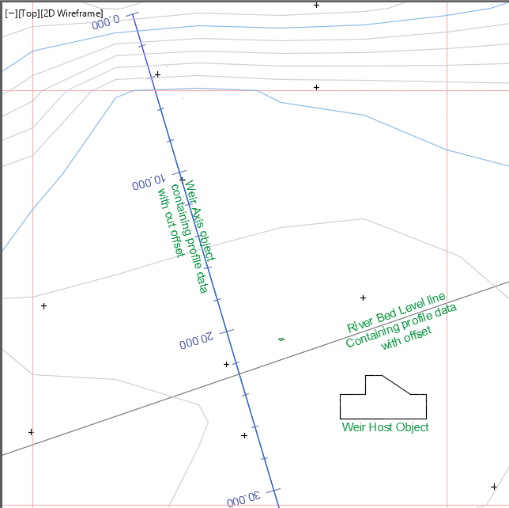

1. **The weir Axis object**: The axis line should cover the expected weir position in the head work area and some more. Draw the axis using the AutoCAD polyline tool, and reference it to axes pairs drawn to AutoCAD WCS. Run a profile extraction session with sufficient offset detail for both incremental distance and offsetbdistance. Often it may suffice to use 2.5m intervals, using -10:2.5:20.

2. **Rated Downstream section**: This object is the river cross-section profile, processed using **ChannelRate_WSPRO** module, and containing solved data for the stage-discharge relation ship to be used. This must be located some distance downstream of the expected weir end.

    > :bulb: **Tip**: To Check appropriate data are readily available on the
cross-section object, collect the object to the workspace, click on it,
and hit the **Preview Data on Current Object** tool button. If the data
is available, the data preview table interface launches listing the
stored data..

    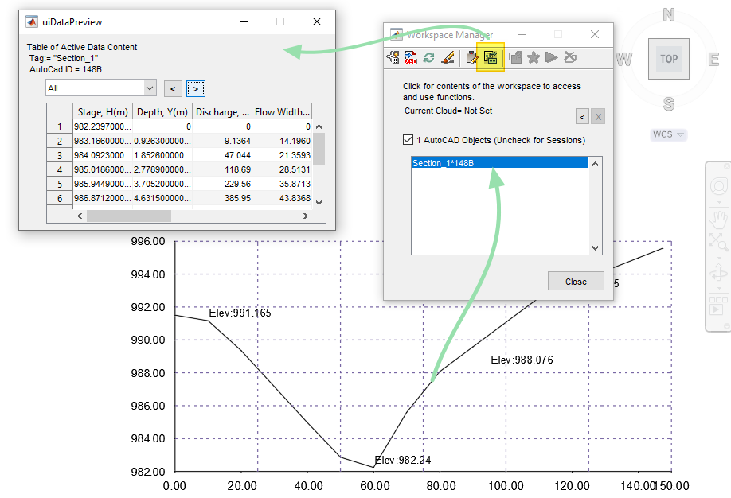

    > Note: This object is not required during session definition. However, it is required immediately upon running the defined session,

3. **The Date Host Object**: A third object is needed to complete the session definition. This object stores all the information regarding the design process at all times. Any object can be used as a host. It is strongly recommended to use the appropriate shape from `CAD Tools > Create Host Objects`. To create the
host object:

    1. Start the `CadTools > Create Host Objects` tool.
    2. Prepare in AutoCAD a diagonal line that is somewhat equal in height and width using the polyline tool.
    3. Select yhe desired host object shape, and then hit the `>` button.
    4. Back in AutoCAD, select the starter object (the diagonal line).

This will do two things:

1)  reshape the starter object to take the desired shape, and

2)  assign a Tag string to the Object, that makes it easy to identify it in subsequent processes.

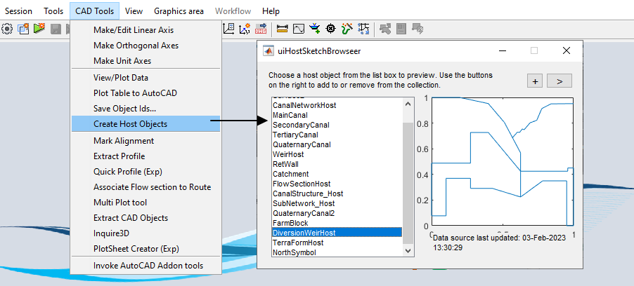

>NOTE: If this object in AutoCAD is DELETED, all the information saved will be inaccessible permanently.

## Defining the session
 [Back to Toc](#table-of-contents)

Before defining a new session, it is best practice to clear iCAD work space from the workspace browser or `Ctrl`+`0`. Then continue as follows:
1. Start Workspace Manager from `Session > Workspace Manager`.

2.  Define a new session using `Sessions > Create & Run New Session`. On the *Module Browser* dialog, select `DiversionWeirDesign` module, and hit `Continue`.

    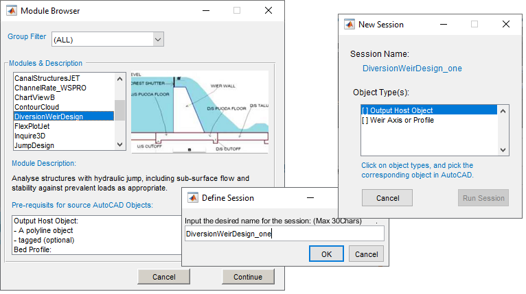

3.  On the *Define Session* dialog, give the session a related name to the task, and hit `Ok`.  

4.  In the *New Session* dialog, two object types are rquired. Click on the first one, go to AutoCAD and pick the Host object created above. Do the same for the second object type, and go to AutoCAD to pick the weir axis object.

    > Tip: iCAD DataLiview status bar will report OK for each successful association of the object with the object type. When association is successful, object types are marked \[x\], and the `Run Session` button is active.

5.  The session is now completely defined and is set to the active session. Hit
    the Run Session button to begin the solution. On prompt to pick the rated river section. Choose `Pick in AutoCAD`, and select the solved cross section object.

    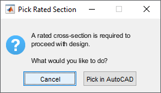

If all data are available as expected, the module will start by
displaying the transverse cross-section view of the structure. This is
the default starting view for the module.

## Transverse design
 [Back to Toc](#table-of-contents)

Often the first design sub-task is the transverse design of the weir
structure. Simply put, this is the positioning and dimensioning of key
components of the weir structure across the stream (and along the weir
axis.).

To change from any view to this view, go to Workflow \> Transverse View.

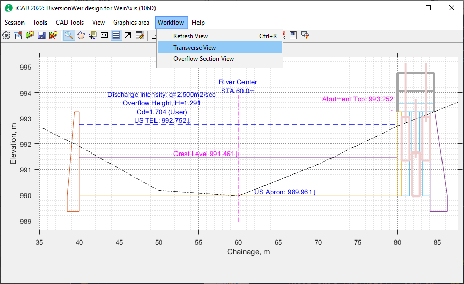

Note, the module automatically positions the structure as follows:

- center of overflow span located to the center of the river. The river center along the weir axis line, is taken to be the station where the minimum elevation is recorded from the profile data.

- Right and left position of the overflow span located at equal distance from the identified center line

- The weir crest level is determined based on the default weir height given.

- Overflow depth is calculated for the default discharge, available overflow span and default coefficient of discharge.

Numerous variables are set by default to create the tentative design in
the first place. These parameters can be accessed from `Workflow > Edit
Variables` menu command (Ctrl+E).

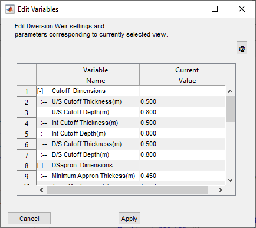

Below each category of variables is presented with detail.

## Hydraulic Parameters
 [Back to Toc](#table-of-contents)

The hydraulic parameters are used to determine the upstream flow
hydraulics, and corresponding structural components such as abutment
elevation and total width.

<table>
<colgroup>
<col style="width: 7%" />
<col style="width: 20%" />
<col style="width: 10%" />
<col style="width: 61%" />
</colgroup>
<thead>
<tr class="header">
<th>NO</th>
<th>Variable Name</th>
<th>Default Values</th>
<th>Notes</th>
</tr>
<tr class="odd">
<th>1</th>
<th>Coefficient of Discharge, Cd</th>
<th>1.704</th>
<th>
Number value representing the anticipated overflow condition over
the weir span.

1.0&lt;= Cd &lt;=2.0
</th>
</tr>
<tr class="header">
<th>3</th>
<th>Calculation Method for Cd</th>
<th>User</th>
<th>
There are five methods.

1. User Input Value (The default method, uses the user input value
above

2. Critical Flow method

3. Momentum Eqn

4. Bos Equation

5. Salmasi
</th>
</tr>
<tr class="odd">
<th>3</th>
<th>Discharge Range(m3/sec)</th>
<th>100</th>
<th>
The maximum design discharge (peak flood) for which design is
desired.

1.0&lt;Q&lt;=1000
</th>
</tr>
</thead>
<tbody>
</tbody>
</table>

See technical notes at the end of this page for details on each method of rating
curve determination.

## Sluice bay dimensions
 [Back to Toc](#table-of-contents)

The variables in this group determine the size and orientation of sluiceways at one or both ends of the weir

<table>
<colgroup>
<col style="width: 7%" />
<col style="width: 26%" />
<col style="width: 16%" />
<col style="width: 49%" />
</colgroup>
<thead>
<tr class="header">
<th>No</th>
<th>Variable Name</th>
<th>Default Values</th>
<th>Notes</th>
</tr>
<tr class="odd">
<th>1</th>
<th>Crest Sill Height(m)</th>
<th>0.150</th>
<th>
Height of sluice crest above upstream apron level (Max of 0.50
meter is allowed.)

0.0&lt;=hbay&lt;=0.50
</th>
</tr>
<tr class="header">
<th>2</th>
<th>Individual Bay Width(m): [Left, Right]</th>
<th>[1.0, 1.0]</th>
<th>
Width of individual bays (Face Up Stream):

<ul>
<li>
for left side bays

<li>
for right side bays

</blockquote></li>
</ul>

Accepted range of values: 0.0&lt;=Wbay&lt;=2.0

0 value means no bay is needed.
</th>
</tr>
<tr class="odd">
<th>3</th>
<th>Number of Bays: {Left, Right]=</th>
<th>[1, 3.000]</th>
<th>
Number of bays desired on each side. The bays are provided using
the bay width value provided above.

If bay width is 0/0, this value is ignored, and no bay is
provided.
</th>
</tr>
<tr class="header">
<th>4</th>
<th>Pier Thickness(m)</th>
<th>0.300</th>
<th>
The thickness of pier columns dividing sluice bays.

Accepted Range of Values; 0.30&lt;=t&lt;=0.50

If the bay width is 0.0, this value is ignored, and no piers walls
are provided.
</th>
</tr>
<tr class="odd">
<th>5</th>
<th>Divide wall Width(m)</th>
<th>0.500</th>
<th>
The thickness of divide wall provision separating the overflow
span from the sluice bay (if any).

Accepted Range of Values: 0.50&lt;=t&lt;=2.0

If bay width is 0/0, this value is ignored, and no divide wall is
provided.
</th>
</tr>
<tr class="header">
<th>6</th>
<th>Divide wall extension(m)</th>
<th>1.0</th>
<th>
The extension length of the divide wall downstream of the end of
the weir structure (behind the end of glacis).

Accepted Range of Values: 0&lt;=L&lt;=1000

1000 represents a length equal to the length of the downstream apron,
resulting in complete isolation of undersluice flow from crest
overflow.
</th>
</tr>
<tr class="odd">
<th>7</th>
<th>Gate Proud Height(m)</th>
<th>0.200</th>
<th>
The height of the gate panels above the weir crest elevation.

Accepted Range of Values: 0.10&lt;=h&lt;=0.30
</th>
</tr>
</thead>
<tbody>
</tbody>
</table>

The schematic below shows a right side sluice bay, with three bays, and a
slightly raised crest. The gate dimensions are automatically sized and sketched.

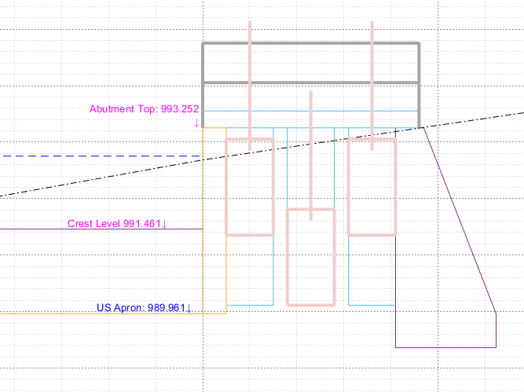

See Technical notes, to learn how sluice bay capacity is determined.

## Transverse Dimensions
 [Back to Toc](#table-of-contents)

These group of variables determine the key deisgn level and span parametrs for the structure, that determine the its hydraulic performance.

<table>
<colgroup>
<col style="width: 7%" />
<col style="width: 25%" />
<col style="width: 14%" />
<col style="width: 52%" />
</colgroup>
<thead>
<tr class="header">
<th>No</th>
<th>Variable Name</th>
<th>Default Values</th>
<th>Notes</th>
</tr>
<tr class="odd">
<th>1</th>
<th>Weir Crest Elevation</th>
<th>Calculated</th>
<th>
Calculated crest elevation, from the sum of:

<ul>
<li>
Upstream Apron Level, which equals the minimum bed level at the weir
axis.
</li>
<li>
Weir height (can be set from the Longitudinal view)
</li>
</ul>

Accepted Range of Values: displayed on the popup menu. The minimum
and maximum values of crest elevation are determined based on allowable
ranges for weir height (see longitudinal view).
</th>
</tr>
<tr class="header">
<th>2</th>
<th>Overflow Span(excl. Scour Bays) (m)</th>
<th>15.0</th>
<th>
The clear overflow length of the weir, excluding divide wall and
other provision (if any).

Accepted Range of Values:
</th>
</tr>
<tr class="odd">
<th>3</th>
<th>Wall Free Board (m):</th>
<th>0.500</th>
<th>
Free board provision above upstream energy grade line (US
EGL).

Acceptable Range of Values: 0.5&lt;=FB&lt;=3.0
</th>
</tr>
<tr class="header">
<th>4</th>
<th>Abutment Location, Left (m)</th>
<th>-1.0</th>
<th>
Left side abutment location measured from the start of axis.

-1 indicates centered automatic positioning with respect to the river
center line.

Accepted Range of Values, -1 &lt;=Xl&lt;=Inf

Setting this value will reposition the Right abutment location as
well, based on values set for other variables.
</th>
</tr>
</thead>
<tbody>
</tbody>
</table>

> **Note**: Some variables affect others as well, but their effects will only be seen once the settings are applied.

## Abutment Provisssions
 [Back to Toc](#table-of-contents)

These values are a sequence of settings dictating the shape and length
of segments of the abutment wall portion beyond the upstream and
downstream aprons, and on each side of the weir.

The values are input as Angle, Length Pair. The angle is measured from
abutment wall extension as shown below. {br}

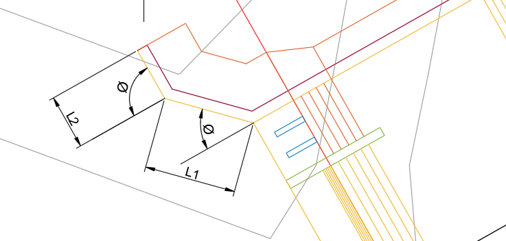 

*FIgure showing dimensions and naming used for abutment size and shape definition.*

Table of Abutoment Provission Variables.

<table>
<colgroup>
<col style="width: 8%" />
<col style="width: 36%" />
<col style="width: 22%" />
<col style="width: 32%" />
</colgroup>
<thead>
<tr class="header">
<th>No</th>
<th>Variable Name</th>
<th>Default Values</th>
<th>Notes</th>
</tr>
<tr class="odd">
<th>1</th>
<th>Angle &amp; Length of Abutment Extension, US Left (Deg, m)</th>
<th>[45.000, 5.000, 90.000, 3.000]</th>
<th rowspan="4">
Minimum input size: 2

Maximum input size: 6;

Acceptable range of values: 0&lt;=values &lt;=90;
</th>
</tr>
<tr class="header">
<th>2</th>
<th>Angle &amp; Length of Abutment Extension, DS Left (Deg, m)</th>
<th>[60.000, 7.000]</th>
</tr>
<tr class="odd">
<th>3</th>
<th>Angle &amp; Length of Abutment Extension, US Right (Deg, m)</th>
<th>[45.000, 5.000, 90.000, 3.000]</th>
</tr>
<tr class="header">
<th>4</th>
<th>Angle &amp; Length of Abutment Extension, DS Right (Deg, m)</th>
<th>[60.000, 7.000]</th>
</tr>
</thead>
<tbody>
</tbody>
</table>

This completes definition of the weir structure in the transverse view. As these are defined, the overflow hydraulics is computed and displayed, ready fo the next step of longitudinal design.

## Longitudinal Design
[Back to Toc](#table-of-contents)

Longitudinal design handles the sizing and detailing of the weir
elements in the longitudinal direction. This involves working on a
number of components mainly the main overflow section and the sluice bay
section.

The user can change between these different views from the workflow menu. Depending on whether sluice bays are provided, and on which side, the available number of longitudinal section views vary. of sluice bays, the available views also vary.

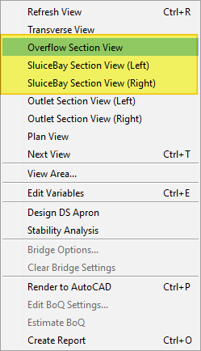

The overall sizing of the elements of the weir are as follows.

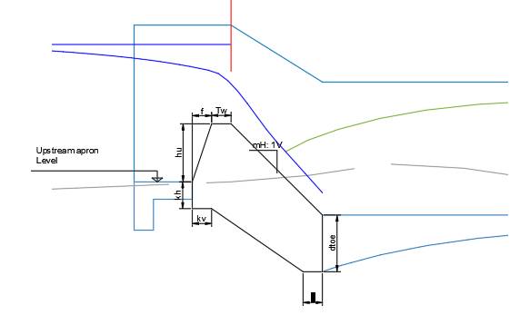

### Longitudinal Dimensions
 [Back to Toc](#table-of-contents)

<table>
<colgroup>
<col style="width: 10%" />
<col style="width: 28%" />
<col style="width: 17%" />
<col style="width: 43%" />
</colgroup>
<thead>
<tr class="header">
<th>NO</th>
<th>Variable Names</th>
<th>Default Value</th>
<th>Notes</th>
</tr>
<tr class="odd">
<th>1</th>
<th>Height of Weir(m)</th>
<th>1.500</th>
<th>
The height of the weir body, measured from the upstream apron
level.

Acceptable Range of Values: 1.0&lt;=hu&lt;=2.5m
</th>
</tr>
<tr class="header">
<th>2</th>
<th>Height of Silt Deposit(m)</th>
<th>0.000</th>
<th>
The silt deposit level to be considered for design.

Allowable Range of Values: 0&lt;= hs&lt;=1000

1000 denotes maximum height up to the height of the weir.
</th>
</tr>
<tr class="odd">
<th>3</th>
<th>Top Width of Weir(m)</th>
<th>0.500</th>
<th>
The length of the crest of the weir, measured in the direction of
flow.

Allowable Range of Values= 0.5&lt;=Tw&lt;=5.0
</th>
</tr>
<tr class="header">
<th>4</th>
<th>U/S Flare width(m)</th>
<th>0.500</th>
<th>
The length of the upstream inclined face measured horizontally
from the tip of the weir crest.

Allowable Range of Values: 0&lt;=f&lt;=2.0
</th>
</tr>
<tr class="odd">
<th>5</th>
<th>D/S Glacis slope(H:1V)</th>
<th>1.000</th>
<th>
The slope of the downstream glacis of the weir body.

Allowable Range of Values: 1&lt;=m&lt;=4
</th>
</tr>
<tr class="header">
<th>6</th>
<th>Toe Depth(-)</th>
<th>US</th>
<th>
The source of value for the depth of the downstream end of the
weir.

Allowable values:

US= use the thickness of the upstream apron.

DS= use the thickness of the downstream apron.
</th>
</tr>
<tr class="odd">
<th>7</th>
<th>Bottom Key Dims(m)</th>
<th>[0.500, 0.500]</th>
<th>
Dimensions of key provisions on upstream end of the weir,
specifying vertical drop and horizontal offset from the upstream apron
level at the toe of the weir.

Allowable values: h, w &gt;0

(Minimum apron thickness is maintained if lesser value of kv is
used).
</th>
</tr>
<tr class="header">
<th>8</th>
<th>Total Longitudinal Length (m)</th>
<th>15.000</th>
<th>
Overall length of the weir structure from upstream to downstream
aprons.

Allowable values: 7.0&lt;Lt&lt;=50
</th>
</tr>
<tr class="odd">
<th>9</th>
<th>Length of Approach Section(m)</th>
<th>1.500</th>
<th>
Length of upstream apron from the weir

ALlowable values: 0&lt;=Lu&lt;=5.0’
</th>
</tr>
</thead>
<tbody>
</tbody>
</table>

Note the following key positions set automatically:

- The weir is positioned so that the end of its top width (the beginning of the downstream glacis) aligns with the weir Axis.

- The upstream apron level is situated equal to the minimum river bed level. Other positions on the weir structure and its components are based on this key parameter.

- The downstream sill level (exit level) of the structure is also fixed equal to the river bed level at the exact location downstream of the axis. This ensures proper automatic positioning of key components.

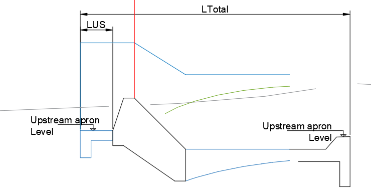

 *Figure showing key longitudinal dimensions of a diversion weir.*

### Overflow Section
[Back to Toc](#table-of-contents)

This view displays the section along the main overflow region. It allows
to handle the main design tasks of (a) surface flow analysis, (b) Sub-surface
flow analysis, (c) downstream apron design. These are presented below.

### Surface flow analysis:
[Back to Toc](#table-of-contents)

Surface flow condition for the entire length of the structure, i.e.,    upstream, over flow, and downstream sections, are automatically evaluated for the current geometric and hydraulic set of parameters.

- The upstream flow hydraulics is estimated from solutions of Bosenisques energy equation at different sections.

- The downstream flow hydraulics is determined by analyzing the type of expected hydraulic jump in relation to the prevalent tail water depth condition.

- The plotted flow surfaces and text info highlight the results.

    (For details on these calculations, see Technical Notes section further
below.)

    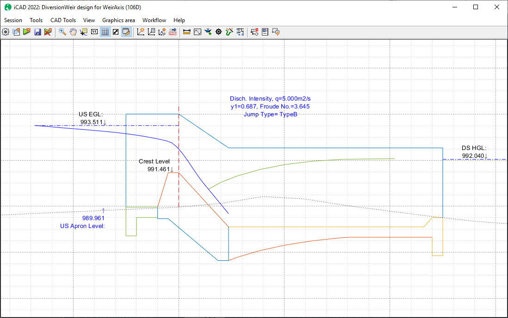
*Figure for surface flow clalculation and water surface profile determination.*

> :bulb: **Important Note**: The flow surface profile created is a result of the calculations made according to the provisions in the Technical Notes (at the end of this page), and may vary from results that may be obtained from numerical analysis or simulation methods.

### Sub-surface flow analysis:
[Back to Toc](#table-of-contents)

Subsurface flow analysis is also automatically carried out, as a
function of the dimensions and position of the different components of
the structure. Khosla's solution to the theory of seepage is used to
determine the variation of subsurface pressure along the bottom of the
structure.

For details, see the technical notes section.

The variation is calculated and plotted for two key design conditions:

- Maximum flood level (HFL) condition

- Pool Level flow (NPL) flow condition.

These are presented in the overflow section view, shown in dotted lines
in below figure. They are automatically calculated every time dimensions
are revised.

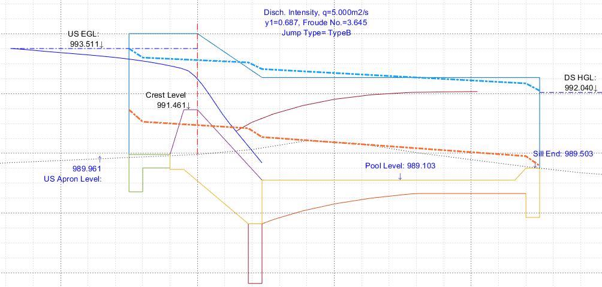

These determined pressure lines are used to estimate the magnitude of
unbalanced hydrostatic pressure at the bottom of the downstream apron,
to determine its thickness.

The following parameters pertain to the determination and use of
subsurface hydraulic pressure variation.

### Cutoff-Dimensions
[Back to Toc](#table-of-contents)

Table of variables for Curoff dimensions and values.

<table>
<colgroup>
<col style="width: 9%" />
<col style="width: 19%" />
<col style="width: 15%" />
<col style="width: 55%" />
</colgroup>
<thead>
<tr class="header">
<th>No</th>
<th>Variable Name</th>
<th>Default Value</th>
<th>Notes</th>
</tr>
<tr class="odd">
<th></th>
<th>U/S Cutoff Thickness(m)</th>
<th>0.500</th>
<th>
Thickness Of upstream cutoff wall:

Allowable Range of Values:

0.05&lt;tu&lt;0.5
</th>
</tr>
<tr class="header">
<th></th>
<th>U/S Cutoff Depth(m)</th>
<th>0.800</th>
<th>
Depth of upstream cutoff wall measured below upstream apron level
(after thickness ta).

Allowable Range of Values:

0.5&lt;=du&lt;=5.0
</th>
</tr>
<tr class="odd">
<th></th>
<th>Int Cutoff Thickness(m)</th>
<th>0.500</th>
<th>
Thickness Of intermediate cutoff wall.

Allowable Range of Values:

0.05&lt;tu&lt;0.5
</th>
</tr>
<tr class="header">
<th></th>
<th>Int Cutoff Depth(m)</th>
<th>2.000</th>
<th>
Depth of intermediate cutoff wall measured from depressed invert
level of the downstream end of the weir body.

Allowable Range of Values:

0.0&lt;=du&lt;=5.0

ti=0.0 indicates no intermediate cutoff wall.
</th>
</tr>
<tr class="odd">
<th></th>
<th>D/S Cutoff Thickness(m)</th>
<th>0.500</th>
<th>
Thickness Of downstream cutoff wall.

Allowable Range of Values:

0.1&lt;tu&lt;0.5
</th>
</tr>
<tr class="header">
<th></th>
<th>D/S Cutoff Depth(m)</th>
<th>0.800</th>
<th>
Depth of downstream cutoff wall measured after the minimum apron
thickness provision (below pool depth).

Allowable Range of Values:

0.5&lt;=du&lt;=5.0
</th>
</tr>
</thead>
<tbody>
</tbody>
</table>

Furhter more, the following parameters dictate the analysis and sizing for the downstream apron.

## Downstream Apron design and Dimensions
[Back to Toc](#table-of-contents)

The design of downstream appron or the stilling basin of the weir structure is based on the key dimensions provided as input. These are found in the Appron Dimensions variable group, and are set according to the descriptions in below table.

<table>
<colgroup>
<col style="width: 8%" />
<col style="width: 22%" />
<col style="width: 14%" />
<col style="width: 54%" />
</colgroup>
<thead>
<tr class="header">
<th>No</th>
<th>Variable Name</th>
<th>Default Value</th>
<th>Notes</th>
</tr>
<tr class="odd">
<th></th>
<th>Minimum Apron Thickness(m)</th>
<th>0.450</th>
<th>
Minimum apron thickness to maintain across the length of the
structure.

Allowable Range of Values: 0.30&lt;ta&lt;=1.0
</th>
</tr>
<tr class="header">
<th></th>
<th>Jump Mechanism (-)</th>
<th>TypeI</th>
<th>
The choice of energy dissipation mechanism in the downstream
pool.

Allowable values: Currently only Type I pool is available.
</th>
</tr>
<tr class="odd">
<th></th>
<th>Pool Depth(m)</th>
<th>0.400</th>
<th>
Depth of the downstream pool, below the end sill level of the
weir.

Allowable Range of Values; 0&lt;=dp&lt;=2.0
</th>
</tr>
<tr class="header">
<th></th>
<th>Pool End Chamfer(-)</th>
<th>1.000</th>
<th>
Slope of end chamfer for pool exit.

Allowable Range of Values: 0.00&lt;dc&lt;2.0
</th>
</tr>
<tr class="odd">
<th></th>
<th>Thickness Point(m)</th>
<th>0.000</th>
<th>
Points along the downstream apron to simplify the bottom geometry
of he apron thickness measured as a ration of the apron length.

ALlowable range of values; 0&lt;= la &lt;= 0.70

0 means apply thickness as calculated (curved bottom results)

a maximum of two values can be specified.
</th>
</tr>
<tr class="header">
<th></th>
<th>Unbalanced Pressure use</th>
<th>MFL</th>
<th>
Source of unbalanced pressure head to use in sizing the apron
thickness.

Allowable values:

MFL: use subsurface HGL for maximum flood level

NPL: use subsurface HGL for normal pool level condition

MAX: Calculate for both conditions, and take the maximum.
</th>
</tr>
</thead>
<tbody>
</tbody>
</table>

Once the variables are set to desired values, the design of the downstream apron is carried out by calculating the unbalanced pressure acting on the apron, using the specifics detailed above. Three possible evaluations can be made:

1.  Unbalanced head for high flood level conditions

2.  Unbalanced head for normal flow conditions (upstream water at pool level, and downstream no water condition)

3.  the maximum of the two conditions.

Once the unbalanced head is determined using one of the methods, the thickness at various points along the length of the downstream apron are determined from the below relation ship.

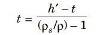

Here h’ represent the magnitude of the unbalanced head above the bottom of the floor level, t is the thickness of the apron, and $\rho_{s}$ and $\rho$ are the densities of the apron material and water respectively.

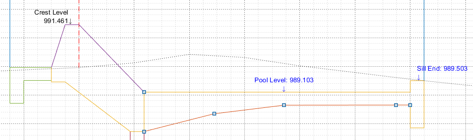

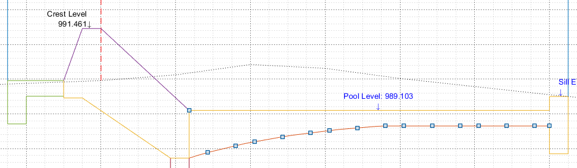

*Figures demonstrate the results of apron thickness design with and with out thickness points specified, respectively.*

## Overall stability analysis, and safety paramters
 [Back to Toc](#table-of-contents)

The longitudinal view also allows the analysis of overall stability of the weir body. This is done by following standard procedures in practice, determining the magnitudes of all acting forces on the weir body, evaluating their momentum.

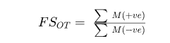 {br}

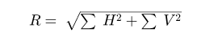{br}

The result is summarized in the schematic presentation, similar to the one shown below.

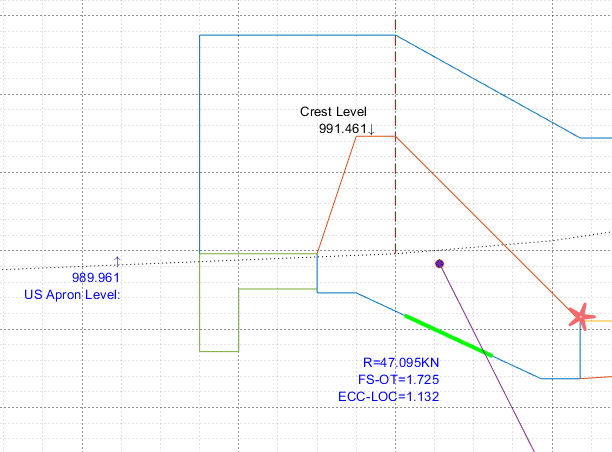

One can see that:

- All moments are calculated with respect to pivot point at toe of the weir (shown in asterisk above figure).

- FS-OT (Factor of safety against overturning) is calculated and shown, along with the resultant of all acting forces

- The crossing of the resultant on the bottom surface is also shown, with the middle-third highlighted in green.

> :bulb: **Important Note**: Stability analysis is carried out neglecting any downstream water below the toe of the weir body. However, pressure due to sub-surface flow is accounted fully. As such, FOS determined form fully submerged weirs is not in the scope of the current release.

The variables relevant to stability analysis, can also be edited from
the overflow section view. They are listed below.

The safety parameters variable group values are set according to the following table.

<table>
<colgroup>
<col style="width: 6%" />
<col style="width: 25%" />
<col style="width: 18%" />
<col style="width: 49%" />
</colgroup>
<thead>
<tr class="header">
<th>NO</th>
<th>Variable Name</th>
<th>Default Values</th>
<th>Notes</th>
</tr>
<tr class="odd">
<th>1</th>
<th>Safety Exit Gradient</th>
<th>0.167</th>
<th>
Safe exit gradient value for the river bed material.

Allowable Range of Values: 0&lt; GExit &lt; 0.50
</th>
</tr>
<tr class="header">
<th>2</th>
<th>Safety Against Overturning</th>
<th>1.500</th>
<th>
Limiting factor of safety against overturning.

Allowable range of values: 1.2&lt;=FS-OT &lt;=2.0
</th>
</tr>
</thead>
<tbody>
</tbody>
</table>

## The Sluice Bay section Design
[Back to Toc](#table-of-contents)

Sluice bays, if provided, are taken in to consideration in the
positioning and sizing of the diversion structure. A cross-section view
can be generated and viewed for each of the left and right sluice bays,
as provided. These views can be accessed from the `Workflow` menu as shown below.

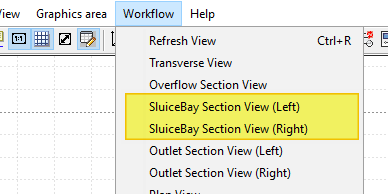

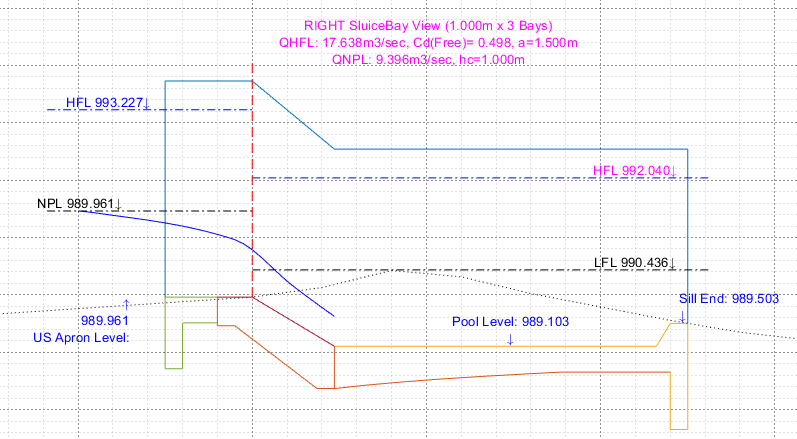

The sluice bay parameters discussed earlier on the Transverse Design
section, are at play in this view, and can also be edited from this
view.

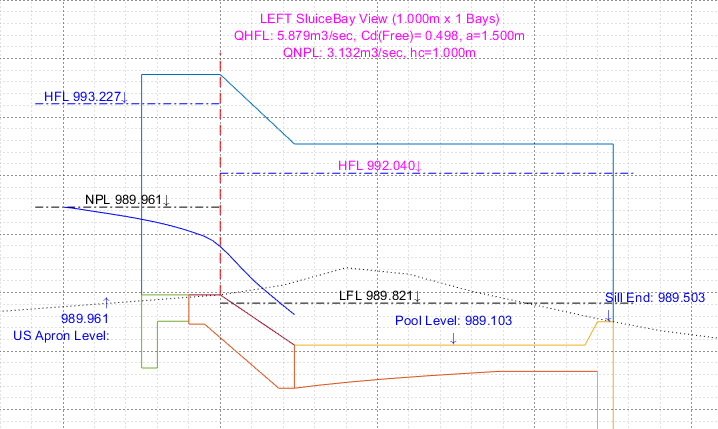

The view provides adequate information on results of hydraulic analysis
for both HFL and NPL conditions. The presented discharge capacities of
the bays are calculated as follows:

- The maximum opening size for sluice gates are calculated based on sill crest height, gate proud height, the weir height and abutment height.

- NPL Condition: Gates are fully open, and critical flow prevails, with un-submerged hydraulic jump downstream

- HFL condition: Gates are fully open, and under sluice flow prevails, with free or submerged flow conditions.

- Total capacity of each bay is determined by multiplying the discharge through one bay by the number of bays provided.

Refer to technical notes for textbook details on the hydraulic
calculations implemented.

## Outlet Designs and Settings
 [Back to Toc](#table-of-contents)

This view allows the design and analysis of outlets on either - or
both - sides of the diversion weir. The view can be accessed from
**Workflow \> Outlet Section View (Left)** and **Workflow \> Outlet
Section View (Right).**

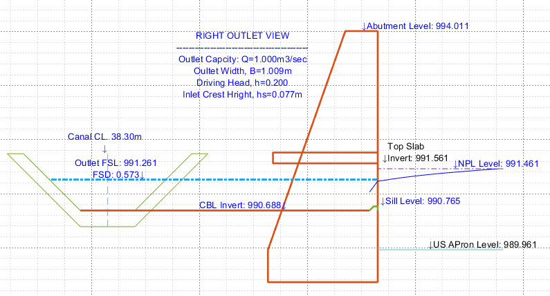

The view positions the outlet relative to the crest level of the weir
and the upstream apron level. The following are key assumptions used.

- critical flow prevails on entering the outlet tunnel

- The available width of the outlet is set equal to the width of the offtaking canal.

- The invert level for the top slap is provided by applying the clearance value desired above the crest level of the weir (NPL).

- The FSL in the offtaking canal is calculated by solving the manning's flow equation for uniform flow for the specified canal geometry and bed slope.

The settings responsible for the hydraulic design and sizing of the outlet structure are presented below.

The settings used for designing and positioning outlet provission are summarized in below table.

<table>
<colgroup>
<col style="width: 9%" />
<col style="width: 22%" />
<col style="width: 17%" />
<col style="width: 50%" />
</colgroup>
<thead>
<tr class="header">
<th>No</th>
<th>Variable Name</th>
<th>Default Values</th>
<th>Notes</th>
</tr>
<tr class="odd">
<th></th>
<th>Outlet Capacity (m3/sec):</th>
<th>[1.000, 0.500]</th>
<th>
The desired capacity of the outlets in the left and right side of
the diversion weir (Face up stream).

Allowable Range of Values: 0&lt;= Qdes &lt;=10m3/sec

Note: 0 means there is no outlet on that side of the weir.
</th>
</tr>
<tr class="header">
<th></th>
<th>Outlet Canal Distance (Left, Right]:(m)</th>
<th>5.000</th>
<th>
The (display) distance of the outlet canal from the Abutment wall
face.

Allowable Range of Values: 4&lt;D&lt;15
</th>
</tr>
<tr class="odd">
<th></th>
<th>Driving Head (m)</th>
<th>0.200</th>
<th>
Driving head to consider between the crest level (i.e., Normal
pool level flow condition) and the offtaking canal FSL flowing at design
capacity,

Allowable Range of Values: 0.05&lt;Hd&lt;0.50
</th>
</tr>
<tr class="header">
<th></th>
<th>Manning's Roughness, N(-)</th>
<th>0.014</th>
<th>
Roughness value of the outlet canal, used in determining the
normal flow depth for the canal geometry specified.

Allowable Range of Values: 0.001&lt;N&lt;=0.10’
</th>
</tr>
<tr class="odd">
<th></th>
<th>Canal Side Slope (-)</th>
<th>1.000</th>
<th>
Side slope of the offtaking canal

Allowable Range of Values: 0&lt;m&lt;3.0
</th>
</tr>
<tr class="header">
<th></th>
<th>Design B to D ratio(-)</th>
<th>-1.000</th>
<th>
B?D ratio to be used in sizing the canal for the specified design
capacity.

Allowable Values: -1&lt;B/D&lt;10

Note: -1 indicates to use the build in equation

If Q&lt;0.20, B/D= 1.0

If Q&gt;0.20 B/D= 1.76*Q^0.35

If B2D=0.0, indicate to use the USBR recommended ratio shown
below.
</th>
</tr>
<tr class="odd">
<th></th>
<th>Bed Slope, So(m/m)</th>
<th>1000.000</th>
<th>
Bed slope of the offtaking canal

Allowable Range of Values: 1/50&gt;So&gt;1/1000
</th>
</tr>
<tr class="header">
<th></th>
<th>Freeboard, FB(m)</th>
<th>-1.000</th>
<th>
Freeboard for offtaking canal.

Allowable Range of Values: -1&lt;Fb&lt;2.0

If FB==-1 the USBR recommendation shown below is used to determine
the required freeboard corresponding to the canal capacity.

Else the user supplied value is taken.
</th>
</tr>
<tr class="odd">
<th></th>
<th>Canal Lining type, Ltyp(-)</th>
<th>0.000</th>
<th>
The lining type desired for the offtaking canal.

Allowable Range of Values: -1&lt;Ltyp&lt;1 (integer)

-1: Unlined canal

0: Thin LIned canal

1: thick lined canal
</th>
</tr>
<tr class="header">
<th></th>
<th>Lining Thickness, Thk(m)</th>
<th>0.300</th>
<th>Lining thickness</th>
</tr>
<tr class="odd">
<th></th>
<th>Foundation Thickness, THK(m)</th>
<th>0.600</th>
<th>Foundation thickness.</th>
</tr>
</thead>
<tbody>
</tbody>
</table>

The outlet canal way is designed using standard flow section design steps. Thus, B/D and FB are determined from the following charts, depending on the settings above.

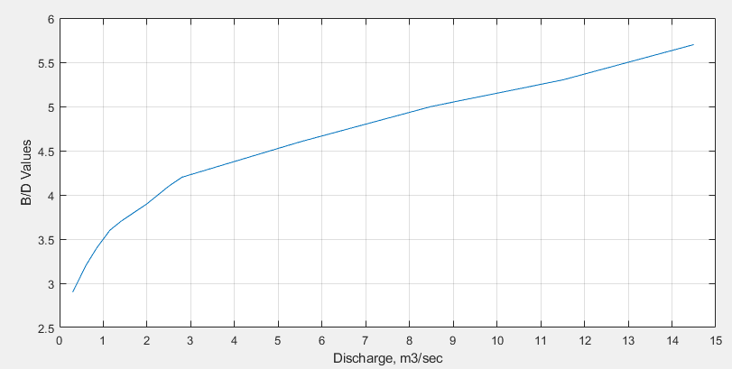

*B/D ration as a funciton of Discharge capacity of canals (from USBR)*.

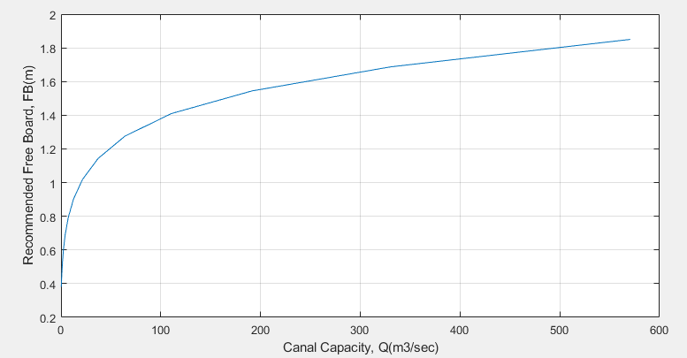

*Recommended Freeboard as a funciton of Discharge capacity (from USBR)*

Below figures show the symbols used to represent the key dimensions of the diverison weir structure, as found in the variable editor.

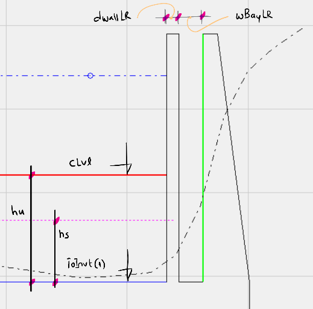

*Figure showing key transverse dimensions.*

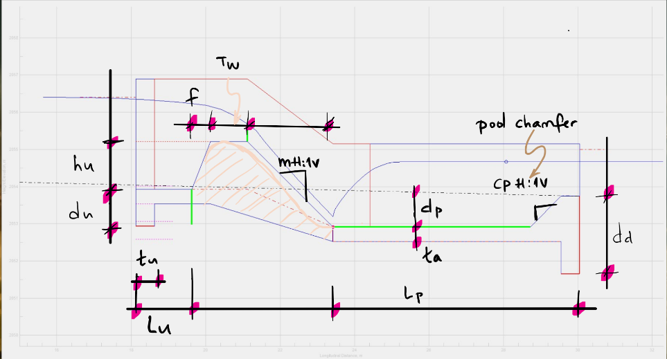

*Figure showing key longitudinal dimensions.*

## Technical Notes:
[Back to Toc](#table-of-contents)

This seciton provides important details about the important hydraulic calcualtions carried out by the module.
**

### Overflow rating: 
[Back to Toc](#table-of-contents)

The rating of flow over the weir body can be calculated using one of the
below formula.

Where C is determined from a set of curves relating overflow head,
Height of regulator and inclination of upstream face as shown in the
charts below.

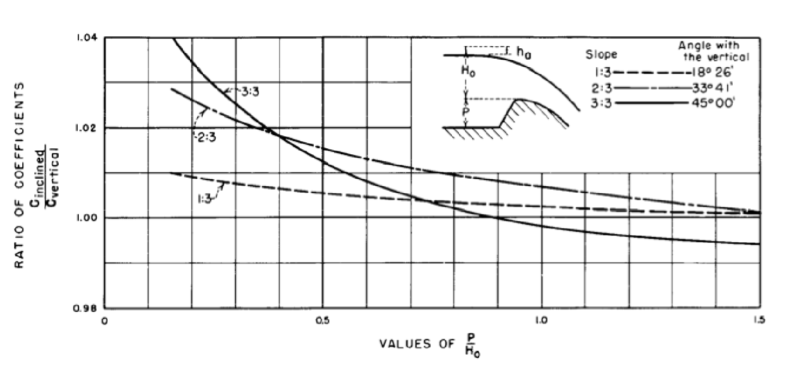

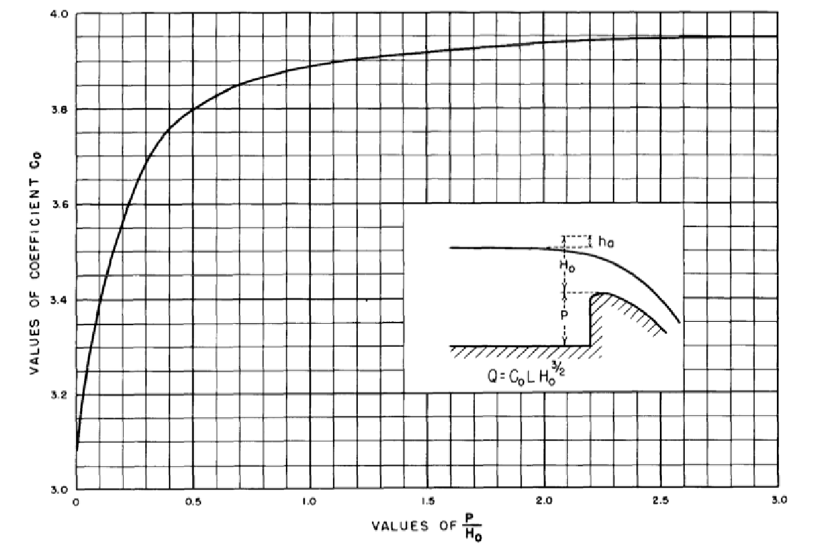

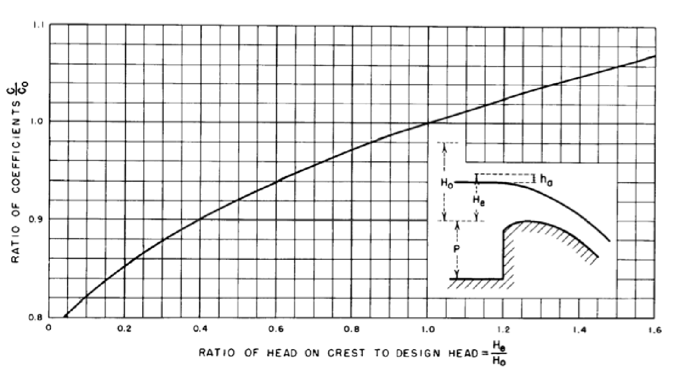

In the above equations, Cd= Coefficient of discharge, Ho, H= depth of
overflow, B= top width of the weir, P= height of the weir, L= length of
overflow, and g= gravitational acceleration.

Flow contraction coefficient is considered when K~a~ >= 0 is input.
In this case the effective overflow length is calculated from

Where L~o~ is the total available overflow length, and H~o~ is the
overflow height.

### Surface hydraulics: 
 [Back to Toc](#table-of-contents)

The pre-jump flow conditions are computed applying the energy equation
between the approach section, and points along the downstream glacis
(Asawa 2002).

Hydraulic jump is calculated using the relationship:

and

Where Z, y, v, F represent the elevation, depth of flow, velocity and
Froude numbers in pre-jump and post jump conditions.

Jumps are classified comparing with tail water conditions as follows:

If y~2~ > y~tail~, Type A jump,

if y~2~ = y~tail~, Type CD jump, and

if y~2~ < y~tail~, Type B jump occurs.

Jump profile is estimated from the design chart shown below, where x is
distance from jump beginning, and y2 and y1 are sequent depths of the
jump.

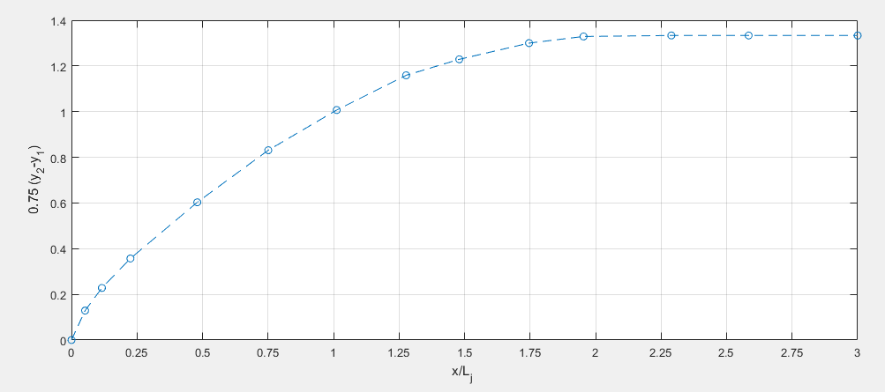

Location and profile of the resulting hydraulic jump is calculated using
the following relation ships. For jumps on sloping
canals,

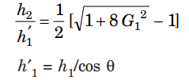 {br}

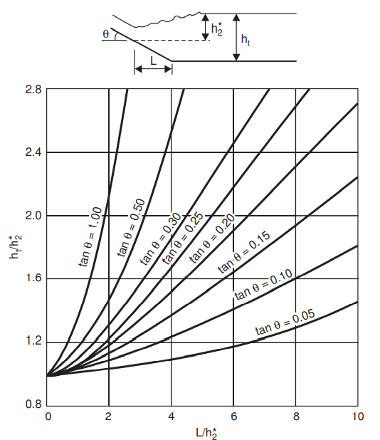

For type B, C and D jumps, the location of the jump on the glacis is
determined from the following chart.

The length of the jump is determined from the below chart relating the
Froud number **F~r~** calculated above to the ratio of total jump length
to the sequent depth.

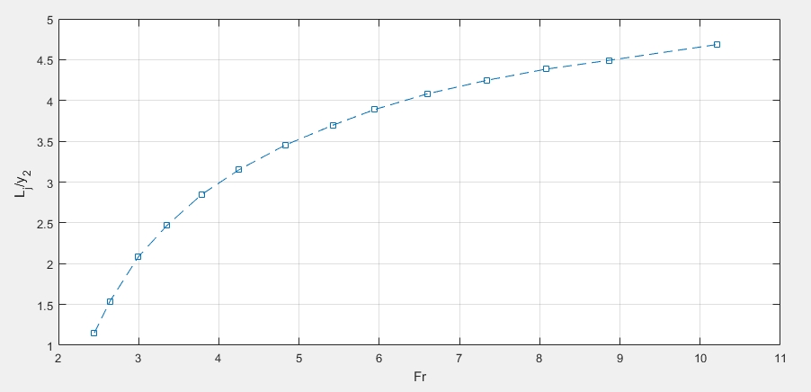

The chart relating flow depth and jump profile is used to approximate
the length and shape of the rapidly varied flow after the jump starting
point.

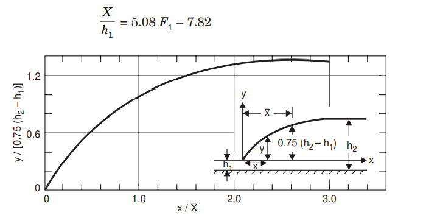

The value of **L~j~** is futher checked against the common practice of **L~j Final~ = max(L~j~, 5.5(EGL~us~ - EGL~ds~))**

### Sub-Surface hydraulics:
 [Back to Toc](#table-of-contents)

Khosla’s theory is applied to estimate subsurface flow head loss and
residual pressure at different points along the bottom of the impervious
floor (Asawa 2002), (Garg 2009). Thus, for the poles at eiher the
upsream end or the downstream end,

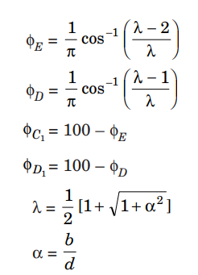

For the piles at the intermediate point,

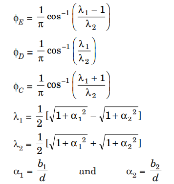

Correction for mutual interference for key points is applied as:

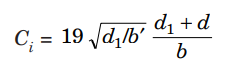

The exit gradient is estimated from:

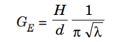

The cited reference materials provide sufficient detail on the
theoretical basis and practical application of the formula above, as
implemented in the module.

### Stability analysis: 
 [Back to Toc](#table-of-contents)

The stability of the weir body and its component provisions are
evaluated against the following (Asawa 2002):

Where **FS~OT~** is factor of safety against overturning, e=
eccentricity, **q~heel,toe~** are stresses at heel and toe of the
bottom of the weir structure.

### Sluice Bay Hydraulics
 [Back to Toc](#table-of-contents)

The basic relation ship for flow under sluice bay is given by:

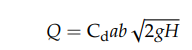

where $C_{d}$ is the coefficient of discharge, Ho and hz are as shown in
below figure.

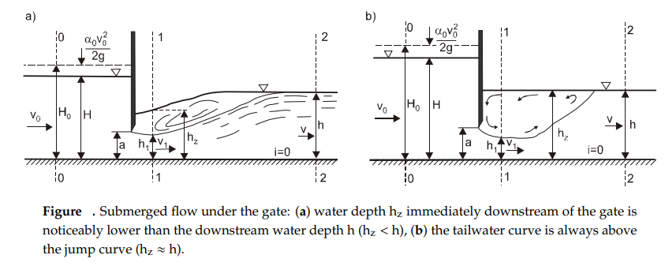

The sluice gate is considered to be submerged if the following condition
is fulfilled

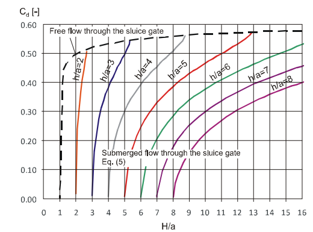 {br}

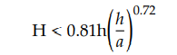

The coefficient of discharge in both cases, for a given set of upstream
and downstream hydraulic grade levels, are determined from the below
chart.

[Back to Toc](#table-of-contents)

END.

### References:
[Back to Toc](#table-of-contents)

Elbaban et al, Flow Measurements Using a Sluice Gate; Analysis and
Applicability, Water Journal, 2020.

G,L Asawa, Irrigation and Water Resources Engineering, New Age
International Publishers, New Delhi, 2008

S.K. Garg, Irrigation and Hydro Power Engineering,

R. Baban, Design of Diversion Weirs, Small Scale Irrigation In Hot
Climates. Joh Willey and Sons, New York

R.W.P. May et al, Hydraulic Design of Side weirs, Thomas Telford
Publishing, London, 2003.

Wayne Coleman, Civil Engineering Hand Book - Hydraulic Design of
Spillways, MC Graw Hill, 2004

Rizghar Ahmad, Variation of Uplift Pressure and Exit Gradient Downstream
of Hydraulic Structures, Unpublished, 1997

Stream Hydraulics, Part 654 Stream Restoration Design National
Engineering Handbook, United States Department of Agricutlure, 2007

Federal High Way Administration, Users Manual for WSPRO - A computer
model for Surface Profile COmputations, Washington (1998)
