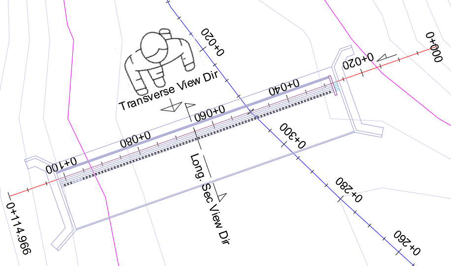
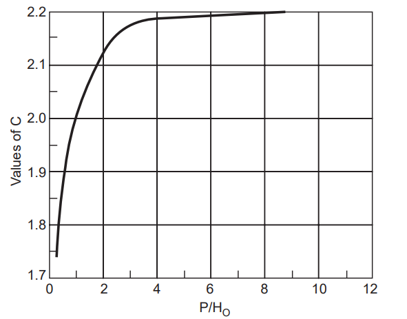
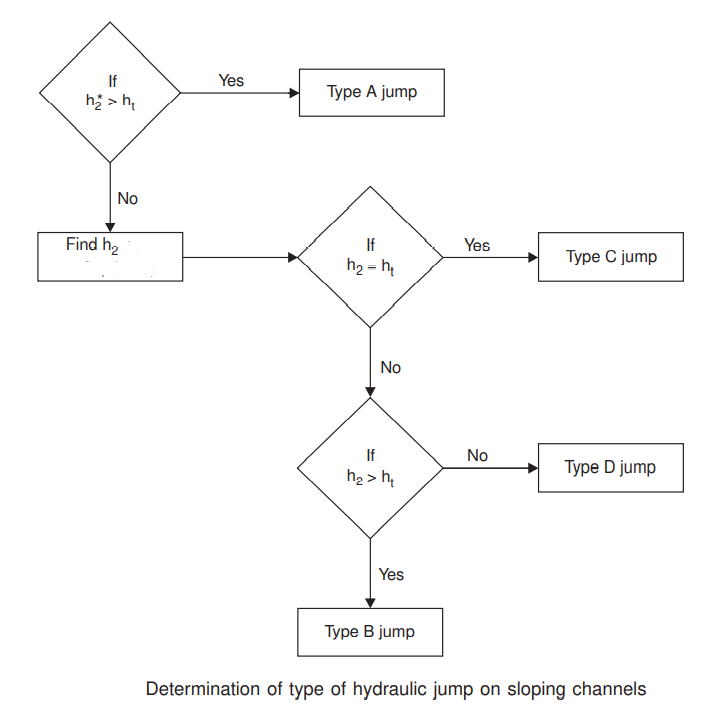

# Diversion Weir Design

[Back to Home](..\index#online-documentation)

<!--- Work on these as you get time.
[  ] Teraform/Diversion Weir - create contours on plan view based on loaded surface data if available (instead of the profile data)
[  ] Material definition using mlab app, and import to assembly editor, export from terraform.
[   ] Combine assembly releases on its own

[  ] ! ! Diversion Weir - indRBL= ... +1 (drawLongitudinalSection)
[  ] Diversion weir - opening height not correct (Trans view) 
[  ] Diversion weir - scour rating curve (operating curve)
[  ] Diversion Weir - Inlet Height above sill level
[  ] Diversion weir - Scour Energy dessipator and length
[  ] Diversion weir - outlet energy dessipator and length
[  ] Diversion weir - BoQ with offset

[  ] Doc: Design level/source object editor in asdembly editor (Edit button)
[  ] Document - saved cross-sections for processing profiles
[  ] Prep ogee design guide
[  ] start working paper on WSP method for afflux computation

--->

iCAD offers the **Diversion Weir Design** product to handle the design
of weirs and regulating structures in an interactive environment,
allowing engineers to solve design and analysis tasks for diversion
weirs and canal headwork structures on previous foundations.

Note: this module is developed for the design of weirs on previous
foundations. However, owing to the fact that many of the surface
hydraulic analysis follow the same principle, it may be used to assess
and design weirs on different foundation material with due diligence.

Note: This module covers all design aspects, except the design of
abutment structures which is solved using a different module.

## Table of Contents
<!--TOC-->
  - [Capabilities and Operating Limits](#capabilities-and-operating-limits)
  - [Conventions](#conventions)
  - [Features Under Development](#features-under-development)
  - [Workflow](#workflow)
  - [Prepare Object types](#prepare-object-types)
  - [Defining the session](#defining-the-session)
  - [Transverse design](#transverse-design)
  - [Hydraulic Parameters](#hydraulic-parameters)
  - [Transverse Dimensions](#transverse-dimensions)
  - [Abutment Provisssions](#abutment-provisssions)
  - [Longitudinal Design](#longitudinal-design)
    - [Longitudinal Dimensions](#longitudinal-dimensions)
    - [Overflow Section](#overflow-section)
    - [Surface flow analysis:](#surface-flow-analysis)
    - [Sub-surface flow analysis:](#sub-surface-flow-analysis)
    - [Cutoff-Dimensions](#cutoff-dimensions)
  - [Downstream Apron design and Dimensions](#downstream-apron-design-and-dimensions)
  - [Overall stability analysis, and safety paramters](#overall-stability-analysis-and-safety-paramters)
  - [The Sluice Bay section Design](#the-sluice-bay-section-design)
  - [Outlet Designs and Settings](#outlet-designs-and-settings)
  - [Creating Reports](#creating-reports)
  - [Known Issues](#known-issues)
  - [Technical Notes:](#technical-notes)
    - [Overflow rating:](#overflow-rating)
    - [Surface hydraulics:](#surface-hydraulics)
      - [Pre-Jump flow profile](#pre-jump-flow-profile)
      - [Hydraulic Jump profile](#hydraulic-jump-profile)
    - [Energy Dessipators Provission](#energy-dessipators-provission)
    - [Scour Depth](#scour-depth)
    - [Sub-Surface hydraulics:](#sub-surface-hydraulics)
      - [Basic relationships](#basic-relationships)
      - [Correction Factors](#correction-factors)
      - [Exit gradient](#exit-gradient)
    - [Stability analysis:](#stability-analysis)
    - [Sluice Bay Hydraulics](#sluice-bay-hydraulics)
    - [References:](#references)
<!--/TOC-->

## Capabilities and Operating Limits
The Diversion weir module is developed to entertain the design of water diversion structures that are typically used for irrigation projects. the module has the following capabilities

- Trapezoidal and Ogee shaped weirs
- Multi-opening Sluice bays on left, right or both directions
- Outlet sizing based on Outflow discharge capacity on the left, right or both directions
- Integrated sluice bay and overflow energy dissipaters

The operating limits of the module include the following.

- Maximum weir height 5.0meters
- Minimum apron thickness of 0.3m, and pile thickness of 0.05m
- Correction factors for apron slope is not considered. Floor thickness and interference effects are considered and applied based on prevailing theory and practice (See technical notes below.)

## Conventions

The following conventions are used when defining views in design, analysis and presentation of diversion weir structures. The figure below represents these conventions.

- Draw Weir Axis, from Left to Right, Face-Downstream view

- Transverse design is drawn in Face-Downstream view

- Longitudinal view drawn facing the left-bank (facing downstream).

    

## Features Under Development
The following features are under development, and will be available as soon as they are completed.

- Outlet detail view
- Bridge Deck addition to weir top
- Auto Design feature to guide the engineer safe weir dimensions form iterative solutions as a function of some (or all ) varying parameters, such as Top width, flare width, downstream slope and bottom key dimensions
- Concrete capping with nominal reinformcement provission

## Workflow

iCAD software handles the design using the **Diversion Weir Design**
module. The module requires:

- a weir axis object defined in AutoCAD, that is referenced, and contains sufficient profile data

- a river/stream section downstream of the weir axis, that is solved for stage-disharge relations using the CnanelRateWSPRO module.

The module creates a tentative design using default parameters, and
displays that design. Other project specific data and information are
provided in-process. There are two steps to input these informations:

- change the view to as desired view. There can be upto 5 views available, including transverse, up to three longitudinal views, and up to two outlet section views.
- start the variable editor to edit inpus to parameters relevant to the view.

A typical weir design task using iCAD follows the steps outlined below.

## Prepare Object types
 [Back to Toc](#table-of-contents)

To use this module, prepare three objects:
- the weir axis object
- the stream cross-section object downstream of the weir axis that is rated using ChannelRate_WSPRO module, and 
- a data host object, as described here under.
 

    

1. **The weir Axis object**: The axis line should cover the expected weir position in the head work area and some more. Draw the axis using the AutoCAD polyline tool, and reference it to axes pairs drawn to AutoCAD WCS. Run a profile extraction session with sufficient offset detail for both incremental distance and offsetbdistance. Often it may suffice to use 2.5m intervals, using -10:2.5:20.

2. **Rated Downstream section**: This object is the river cross-section profile, processed using **ChannelRate_WSPRO** module, and containing solved data for the stage-discharge relation ship to be used. This must be located some distance downstream of the expected weir end.

    > :bulb: **Tip**: To Check appropriate data are readily available on the
cross-section object, collect the object to the workspace, click on it,
and hit the **Preview Data on Current Object** tool button. If the data
is available, the data preview table interface launches listing the
stored data..

    

    > Note: This object is not required during session definition. However, it is required immediately upon running the defined session,

3. **The Date Host Object**: A third object is needed to complete the session definition. This object stores all the information regarding the design process at all times. Any object can be used as a host. It is strongly recommended to use the appropriate shape from `CAD Tools > Create Host Objects`. To create the
host object:

    1. Start the `CadTools > Create Host Objects` tool.
    2. Prepare in AutoCAD a diagonal line that is somewhat equal in height and width using the polyline tool.
    3. Select yhe desired host object shape, and then hit the `>` button.
    4. Back in AutoCAD, select the starter object (the diagonal line).

This will do two things:

1)  reshape the starter object to take the desired shape, and

2)  assign a Tag string to the Object, that makes it easy to identify it in subsequent processes.

>NOTE: If this object in AutoCAD is DELETED, all the information saved will be inaccessible permanently.

## Defining the session
 [Back to Toc](#table-of-contents)

Before defining a new session, it is best practice to clear iCAD work space from the workspace browser or `Ctrl`+`0`. Then continue as follows:
1. Start Workspace Manager from `Session > Workspace Manager`.

2.  Define a new session using `Sessions > Create & Run New Session`. On the *Module Browser* dialog, select `DiversionWeirDesign` module, and hit `Continue`.

    

3.  On the *Define Session* dialog, give the session a related name to the task, and hit `Ok`.  

4.  In the *New Session* dialog, two object types are rquired. Click on the first one, go to AutoCAD and pick the Host object created above. Do the same for the second object type, and go to AutoCAD to pick the weir axis object.

    > Tip: iCAD DataLiview status bar will report OK for each successful association of the object with the object type. When association is successful, object types are marked \[x\], and the `Run Session` button is active.

5.  The session is now completely defined and is set to the active session. Hit
    the Run Session button to begin the solution. On prompt to pick the rated river section. Choose `Pick in AutoCAD`, and select the solved cross section object.

    

If all data are available as expected, the module will start by
displaying the transverse cross-section view of the structure. This is
the default starting view for the module.

## Transverse design
 [Back to Toc](#table-of-contents)

Often the first design sub-task is the transverse design of the weir
structure. Simply put, this is the positioning and dimensioning of key
components of the weir structure across the stream (and along the weir
axis.).

To change from any view to this view, go to Workflow \> Transverse View.

Note, the module automatically positions the structure as follows:

- center of overflow span located to the center of the river. The river center along the weir axis line, is taken to be the station where the minimum elevation is recorded from the profile data.

- Right and left position of the overflow span located at equal distance from the identified center line

- The weir crest level is determined based on the default weir height given.

- Overflow depth is calculated for the default discharge, available overflow span and default coefficient of discharge.

Numerous variables are set by default to create the tentative design in
the first place. These parameters can be accessed from `Workflow > Edit
Variables` menu command (Ctrl+E).

Below each category of variables is presented with detail.

## Hydraulic Parameters
 [Back to Toc](#table-of-contents)

The hydraulic parameters are used to determine the upstream flow
hydraulics, and corresponding structural components such as abutment
elevation and total width.

<table>
<colgroup>
<col style="width: 7%" />
<col style="width: 20%" />
<col style="width: 10%" />
<col style="width: 61%" />
</colgroup>
<thead>
<tr class="header">
<th>NO</th>
<th>Variable Name</th>
<th>Default Values</th>
<th>Notes</th>
</tr>
<tr class="odd">
<th>1</th>
<th>Coefficient of Discharge, Cd</th>
<th>1.704</th>
<th>
Number value representing the anticipated overflow condition over
the weir span.

1.0&lt;= Cd &lt;=2.0
</th>
</tr>
<tr class="header">
<th>3</th>
<th>Calculation Method for Cd</th>
<th>User</th>
<th>
There are five methods.

1. User Input Value (The default method, uses the user input value
above

2. Critical Flow method

3. Momentum Eqn

4. Bos Equation

5. Salmasi
</th>
</tr>
<tr class="odd">
<th>3</th>
<th>Discharge Range(m3/sec)</th>
<th>100</th>
<th>
The maximum design discharge (peak flood) for which design is
desired.

1.0&lt;Q&lt;=1000
</th>
</tr>
</thead>
</table>

See technical notes at the end of this page for details on each method of rating
curve determination.

## Transverse Dimensions
 [Back to Toc](#table-of-contents)

These group of variables determine the key deisgn level and span parametrs for the structure, that determine the its hydraulic performance.

<table>
<colgroup>
<col style="width: 7%" />
<col style="width: 25%" />
<col style="width: 14%" />
<col style="width: 52%" />
</colgroup>
<thead>
<tr class="header">
<th>No</th>
<th>Variable Name</th>
<th>Default Values</th>
<th>Notes</th>
</tr>
<tr class="odd">
<th>1</th>
<th>Weir Crest Elevation</th>
<th>Calculated</th>
<th>
Calculated crest elevation, from the sum of:

<ul>
<li>
Upstream Apron Level, which equals the minimum bed level at the weir
axis.
</li>
<li>
Weir height (can be set from the Longitudinal view)
</li>
</ul>

Accepted Range of Values: displayed on the popup menu. The minimum
and maximum values of crest elevation are determined based on allowable
ranges for weir height (see longitudinal view).
</th>
</tr>
<tr class="header">
<th>2</th>
<th>Overflow Span(excl. Scour Bays) (m)</th>
<th>15.0</th>
<th>
The clear overflow length of the weir, excluding divide wall and
other provision (if any).

Accepted Range of Values:
</th>
</tr>
<tr class="odd">
<th>3</th>
<th>Wall Free Board (m):</th>
<th>0.500</th>
<th>
Free board provision above upstream energy grade line (US
EGL).

Acceptable Range of Values: 0.5&lt;=FB&lt;=3.0
</th>
</tr>
<tr class="header">
<th>4</th>
<th>Abutment Location, Left (m)</th>
<th>-1.0</th>
<th>
Left side abutment location measured from the start of axis.

-1 indicates centered automatic positioning with respect to the river
center line.

Accepted Range of Values, -1 &lt;=Xl&lt;=Inf

Setting this value will reposition the Right abutment location as
well, based on values set for other variables.
</th>
</tr>
</thead>
</table>

> **Note**: Some variables affect others as well, but their effects will only be seen once the settings are applied.

## Abutment Provisssions
 [Back to Toc](#table-of-contents)

These values are a sequence of settings dictating the shape and length
of segments of the abutment wall portion beyond the upstream and
downstream aprons, and on each side of the weir.

The values are input as Angle, Length Pair. The angle is measured from
abutment wall extension as shown below. {br}

 

*FIgure showing dimensions and naming used for abutment size and shape definition.*

Table of Abutoment Provission Variables.

<table>
<colgroup>
<col style="width: 8%" />
<col style="width: 36%" />
<col style="width: 22%" />
<col style="width: 32%" />
</colgroup>
<thead>
<tr class="header">
<th>No</th>
<th>Variable Name</th>
<th>Default Values</th>
<th>Notes</th>
</tr>

<tr class="odd">
<th>1</th>
<th>Angle &amp; Length of Abutment Extension, US Left (Deg, m)</th>
<th>[45.000, 5.000, 90.000, 3.000]</th>
<th rowspan="4">
Minimum input size: 2

Maximum input size: 6;

Acceptable range of values: 0&lt;=values &lt;=90;
</th>
</tr>
<tr class="header">
<th>2</th>
<th>Angle &amp; Length of Abutment Extension, DS Left (Deg, m)</th>
<th>[60.000, 7.000]</th>
</tr>
<tr class="odd">
<th>3</th>
<th>Angle &amp; Length of Abutment Extension, US Right (Deg, m)</th>
<th>[45.000, 5.000, 90.000, 3.000]</th>
</tr>
<tr class="header">
<th>4</th>
<th>Angle &amp; Length of Abutment Extension, DS Right (Deg, m)</th>
<th>[60.000, 7.000]</th>
</tr>
</thead>
<tbody>
</tbody>
</table>

**Extension Length(m)** is a new variable included to allow variable abutment wall lengths in the left and right direction.

This completes definition of the weir structure in the transverse view. As these are defined, the overflow hydraulics is computed and displayed, ready fo the next step of longitudinal design.

## Longitudinal Design
[Back to Toc](#table-of-contents)

Longitudinal design handles the sizing and detailing of the weir elements in the longitudinal direction. This involves working on a number of components mainly the main overflow section and the sluice bay section.

The user can change between these different views from the workflow menu. Depending on whether sluice bays are provided, and on which side, the available number of longitudinal section views vary. of sluice bays, the available views also vary.

The overall sizing of the elements of the weir are as follows.

### Longitudinal Dimensions
 [Back to Toc](#table-of-contents)

Here's the extracted table data from your image:

<html lang="en">
<head>
    <meta charset="UTF-8">
    <meta name="viewport" content="width=device-width, initial-scale=1.0">
    <title>Weir Data Table</title>
    
</head>
<body>

<table>
    <thead>
        <tr>
            <th>NO</th>
            <th>Variable Names</th>
            <th>Default Value</th>
            <th>Notes</th>
        </tr>
    </thead>
    <tbody>
        <tr>
            <td>1</td>
            <td>Height of Weir(m)</td>
            <td>1.500</td>
            <td>The height of the weir body, measured from the upstream apron level. Acceptable Range of Values: 1.0<=hu<=2.5m</td>
        </tr>
        <tr>
            <td>2</td>
            <td>US Apron Level(m)</td>
            <td>Calculated</td>
            <td>User supplied value representing the level for the upstream apron level; silt deposit level to be considered for design. Allowable Range of Values: minRBL-1<= Level <=minRBL+1</td>
        </tr>
        <tr>
            <td>2</td>
            <td>Height of Silt Deposit(m)</td>
            <td>0.000</td>
            <td>The silt deposit level to be considered for design. Allowable Range of Values: 0<= hs<=1000 1000 denotes maximum height up to the height of the weir.</td>
        </tr>
        <tr>
            <td>3</td>
            <td>Top Width of Weir(m)</td>
            <td>0.500</td>
            <td>The length of the crest of the weir, measured in the direction of flow. Allowable Range of Values: 0.5<=Tw<=5.0</td>
        </tr>
        <tr>
            <td>4</td>
            <td>U/S Flare width(m)</td>
            <td>0.500</td>
            <td>The length of the upstream inclined face measured horizontally from the tip of the weir crest. Allowable Range of Values: 0<=f<=2.0</td>
        </tr>
        <tr>
            <td>5</td>
            <td>D/S Glacis slope(H:1V)</td>
            <td>1.000</td>
            <td>The slope of the downstream glacis of the weir body. Allowable Range of Values: 1<=m<=4</td>
        </tr>
        <tr>
            <td>6</td>
            <td>Toe Depth(-)</td>
            <td>US</td>
            <td>The source of value for the depth of the downstream end of the weir. Allowable values: US= use the thickness of the upstream apron. DS= use the thickness of the downstream apron.</td>
        </tr>
        <tr>
            <td>7</td>
            <td>Bottom Key Dims(m)</td>
            <td>[0.500, 0.500]</td>
            <td>Dimensions of key provisions on upstream end of the weir, specifying vertical drop and horizontal offset from the upstream apron level at the toe of the weir. Allowable values: h, w >0 (Minimum apron thickness is maintained if lesser value of kv is used).</td>
        </tr>
        <tr>
            <td>8</td>
            <td>Total Longitudinal Length (m)</td>
            <td>15.000</td>
            <td>Overall length of the weir structure from upstream to downstream aprons. Allowable values: 7.0<Lt<=50</td>
        </tr>
        <tr>
            <td>9</td>
            <td>Length of Approach Section(m)</td>
            <td>1.500</td>
            <td>Length of upstream apron from the weir Allowable values: 0<=Lu<=5.0'</td>
        </tr>
    </tbody>
</table>

</body>
</html>

Note the following key positions set automatically:

- The weir is positioned so that the end of its top width (the beginning of the downstream glacis) aligns with the weir Axis.
- For ogee shaped weirs, this would be the top of the location of the axis would match the top of the nappe.

- The upstream apron level is situated equal to the minimum river bed level. However, the user can **raise or lower this posision** slightly. Other positions on the weir structure and its components are based on this key parameter. 

- Bottom Key provissions can be made using 5 entries as sfollows.

    [kv, kh, m, L1, L2].

    Figure below shows their definition.

    
- The downstream sill level (exit level) of the structure is also fixed equal to the river bed level at the exact location downstream of the axis. This ensures proper automatic positioning of key components.

 *Figure showing key longitudinal dimensions of a diversion weir.*

### Overflow Section
[Back to Toc](#table-of-contents)

This view displays the section along the main overflow region. It allows
to handle the main design tasks of (a) surface flow analysis, (b) Sub-surface
flow analysis, (c) downstream apron design. These are presented below.

### Surface flow analysis:
[Back to Toc](#table-of-contents)

Surface flow condition for the entire length of the structure, i.e.,    upstream, over flow, and downstream sections, are automatically evaluated for the current geometric and hydraulic set of parameters.

- The upstream flow hydraulics is estimated from solutions of Bosenisques energy equation at different sections. For ogee shaped weirs, the emperical relations from Ref 2 are used assuming a vertical upstream face and no piers.

    

- The downstream flow hydraulics is determined by analyzing the type of expected hydraulic jump in relation to the prevalent tail water depth condition.

- The plotted flow surfaces and text info highlight the results.

    (For details on these calculations, see Technical Notes section further
below.)

    
 
 *Figure for surface flow clalculation and water surface profile determination.*

 It is **imperative to note** the following default settings and understand how the module positions the key elevations for the weir structure:
 1. Upstream apron level is fixed to the minimum river bed level at the weir axis. This can be controlled by the user and can be adjusted to with in 1.0meter of this value from the variable editor.
 1. The End-sill of the down stream appron is fixed at an elevation equal to the minimum river bed level corresponding to the total length of the weir structure. This is not controlled by the user, rather by the existing river bed conditions.

The flow surface profile created is a result of the calculations made according to the provisions in the [Technical Notes](#technical-notes) (further down this page)

> **IMPORTANT NOTE:** We underline the design approach followed in developing this module again. The appron length is determined by the Froude number. The Froude Number depends on the energy difference, which is determined based on the appron length. It is therefore impertive to **Refresh** until pool level values stop changing, before accepting design values.

### Sub-surface flow analysis:
[Back to Toc](#table-of-contents)

Subsurface flow analysis is also automatically carried out, as a
function of the dimensions and position of the different components of
the structure. Khosla's solution to the theory of seepage is used to
determine the variation of subsurface pressure along the bottom of the
structure.

For details, see the technical notes section.

The variation is calculated and plotted for two key design conditions:

- Maximum flood level (HFL) condition

- Pool Level flow (NPL) flow condition.

These are presented in the overflow section view, shown in dotted lines
in below figure. They are automatically calculated every time dimensions
are revised.

These determined pressure lines are used to estimate the magnitude of
unbalanced hydrostatic pressure at the bottom of the downstream apron,
to determine its thickness.

The following parameters pertain to the determination and use of
subsurface hydraulic pressure variation.

### Cutoff-Dimensions
[Back to Toc](#table-of-contents)

Table of variables for Curoff dimensions and values.

<html lang="en">
<head>
    <meta charset="UTF-8">
    <meta name="viewport" content="width=device-width, initial-scale=1.0">
    <title>Cutoff Data Table</title>
    
</head>
<body>

<table>
    <thead>
        <tr>
            <th>No</th>
            <th>Variable Name</th>
            <th>Default Value</th>
            <th>Notes</th>
        </tr>
    </thead>
    <tbody>
        <tr>
            <td data-th="No">1</td>
            <td data-th="Variable Name">U/S Cutoff Thickness(m)</td>
            <td data-th="Default Value">0.500</td>
            <td data-th="Notes">Thickness Of upstream cutoff wall. Allowable Range of Values: 0.05<tu<0.5</td>
        </tr>
        <tr>
            <td data-th="No">2</td>
            <td data-th="Variable Name">U/S Cutoff Depth(m)</td>
            <td data-th="Default Value">0.800</td>
            <td data-th="Notes">Depth of upstream cutoff wall measured below upstream apron level (after thickness ta). Allowable Range of Values: 0.5<=du<=5.0</td>
        </tr>
        <tr>
            <td data-th="No">3</td>
            <td data-th="Variable Name">Int Cutoff Thickness(m)</td>
            <td data-th="Default Value">0.500</td>
            <td data-th="Notes">Thickness Of intermediate cutoff wall. Allowable Range of Values: 0.05<tu<0.5</td>
        </tr>
        <tr>
            <td data-th="No">4</td>
            <td data-th="Variable Name">Int Cutoff Depth(m)</td>
            <td data-th="Default Value">2.000</td>
            <td data-th="Notes">Depth of intermediate cutoff wall measured from depressed invert level of the downstream end of the weir body. Allowable Range of Values: 0.0<=du<=5.0 ti=0.0 indicates no intermediate cutoff wall.</td>
        </tr>
        <tr>
            <td data-th="No">5</td>
            <td data-th="Variable Name">D/S Cutoff Thickness(m)</td>
            <td data-th="Default Value">0.500</td>
            <td data-th="Notes">Thickness Of downstream cutoff wall. Allowable Range of Values: 0.1<tu<0.5</td>
        </tr>
        <tr>
            <td data-th="No">6</td>
            <td data-th="Variable Name">D/S Cutoff Depth(m)</td>
            <td data-th="Default Value">0.800</td>
            <td data-th="Notes">Depth of downstream cutoff wall measured after the minimum apron thickness provision (below pool depth). Allowable Range of Values: 0.5<=du<=5.0</td>
        </tr>
    </tbody>
</table>

</body>
</html>

It is common practice to use estimated scour depths to fix the cutoff depth of the upstream cutoff. The module provides guidance of these locations below the upstream cutoff wall as shown below (marked inside elipse).

Each of these lines represent the recommended scour depths. According to Lacey's  the depth of scour below the HFL (high flood level) is given by the following relation ship.

**R= 1.35(q^2^/f1)^2^**

Where, f1 is the silt factor determined from median size of river material dmean as foloows:

**f1=1.76*sqrt(dmean)**

> Note: Mean bed material size (**dmean**) is set in the Material Properties group of variables availble on longitudinal view.

The depth guidelines generated are therefore located at depths of 1.25R, 1.5R, and 1.75R. The upstream curoff depth can be positioned to meet requirements using these as visual guides.

## Downstream Apron design and Dimensions
[Back to Toc](#table-of-contents)

The design of downstream appron or the stilling basin of the weir structure is based on the key dimensions provided as input. These are found in the Appron Dimensions variable group, and are set according to the descriptions in below table.

<head>
    <meta charset="UTF-8">
    <meta name="viewport" content="width=device-width, initial-scale=1.0">
    <title>Weir Design Parameters</title>
    
</head>
<body>

<table>
    <thead>
        <tr>
            <th>No</th>
            <th>Variable Name</th>
            <th>Default Value</th>
            <th>Notes</th>
        </tr>
    </thead>
    <tbody>
        <tr>
            <td data-th="No">1</td>
            <td data-th="Variable Name">Minimum Apron Thickness(m)</td>
            <td data-th="Default Value">0.450</td>
            <td data-th="Notes">Minimum apron thickness to maintain across the length of the structure. Allowable Range of Values: 0.30&lt;ta&lt;=1.0</td>
        </tr>
        <tr>
            <td data-th="No">2</td>
            <td data-th="Variable Name">Jump Mechanism (-)</td>
            <td data-th="Default Value">TypeI</td>
            <td data-th="Notes">The choice of USBR Type energy dissipation mechanism in the downstream pool. Allowable values: Type I, TypeII, TypeIII, TypeIV.</td>
        </tr>
        <tr>
            <td data-th="No">3</td>
            <td data-th="Variable Name">Pool Depth(m)</td>
            <td data-th="Default Value">0.400</td>
            <td data-th="Notes">Depth of the downstream pool, below the end sill level of the weir. Allowable Range of Values: 0&lt;=dp&lt;=2.0</td>
        </tr>
        <tr>
            <td data-th="No">4</td>
            <td data-th="Variable Name">Pool End Chamfer(-)</td>
            <td data-th="Default Value">1.000</td>
            <td data-th="Notes">Slope of end chamfer for pool exit. Allowable Range of Values: 0.00&lt;dc&lt;=2.0</td>
        </tr>
        <tr>
            <td data-th="No">5</td>
            <td data-th="Variable Name">Thickness Point(m)</td>
            <td data-th="Default Value">0.000</td>
            <td data-th="Notes">Points along the downstream apron to simplify the bottom geometry of the apron thickness measured as a ratio of the apron length. Allowable range of values: 0&lt;= la &lt;= 0.70 0 means apply thickness as calculated (curved bottom results) a maximum of two values can be specified.</td>
        </tr>
        <tr>
            <td data-th="No">6</td>
            <td data-th="Variable Name">Thickness Type</td>
            <td data-th="Default Value">Sloped</td>
            <td data-th="Notes">Type of apron thickness to apply. Allowable values: Sloped: Use key points as slope inflexion points Staged: Apply calculated thickness in section of uniform segments</td>
        </tr>
        <tr>
            <td data-th="No">7</td>
            <td data-th="Variable Name">Unbalanced Pressure use</td>
            <td data-th="Default Value">MFL</td>
            <td data-th="Notes">Source of unbalanced pressure head to use in sizing the apron thickness. Allowable values: MFL: use subsurface HGL for maximum flood level NPL: use subsurface HGL for normal pool level condition MAX: Calculate for both conditions, and take the maximum.</td>
        </tr>
    </tbody>
</table>

</body>
</html>

Refer to [Technical Notes](#technical-notes) below for details on the provission for different types of energy dessipators.

Once the variables are set to desired values, the design of the downstream apron is carried out by calculating the unbalanced pressure acting on the apron, using the specifics detailed above. Three possible evaluations can be made:

1.  Unbalanced head for high flood level conditions

2.  Unbalanced head for normal flow conditions (upstream water at pool level, and downstream no water condition)

3.  the maximum of the two conditions.

Once the unbalanced head is determined using one of the methods, the thickness at various points along the length of the downstream apron are determined from the below relation ship.

Here h’ represent the magnitude of the unbalanced head above the bottom of the floor level, t is the thickness of the apron, and $\rho_{s}$ and $\rho$ are the densities of the apron material and water respectively.

*Figures demonstrate the results of apron thickness design with and with out thickness points specified, respectively.*

Staged profile can be applied to bottom of approns, with the following result.

## Overall stability analysis, and safety paramters
 [Back to Toc](#table-of-contents)

The longitudinal view also allows the analysis of overall stability of the weir body. This is done by following standard procedures in practice, determining the magnitudes of all acting forces on the weir body, evaluating their momentum.

 {br}

{br}

The result is summarized in the schematic presentation, similar to the one shown below.

One can see that:

- All moments are calculated with respect to pivot point at toe of the weir (shown in asterisk above figure).

- FS-OT (Factor of safety against overturning) is calculated and shown, along with the resultant of all acting forces

- The crossing of the resultant on the bottom surface is also shown, with the middle-third highlighted in green.

> :bulb: **Important Note**: Stability analysis is carried out neglecting any downstream water below the toe of the weir body. However, pressure due to sub-surface flow is accounted fully. As such, FOS determined form fully submerged weirs is not in the scope of the current release.

The variables relevant to stability analysis, can also be edited from
the overflow section view. They are listed below.

The safety parameters variable group values are set according to the following table.

<table>
<colgroup>
<col style="width: 6%" />
<col style="width: 25%" />
<col style="width: 18%" />
<col style="width: 49%" />
</colgroup>
<thead>
<tr class="header">
<th>NO</th>
<th>Variable Name</th>
<th>Default Values</th>
<th>Notes</th>
</tr>
<tr class="odd">
<th>1</th>
<th>Safety Exit Gradient</th>
<th>0.167</th>
<th>
Safe exit gradient value for the river bed material.

Allowable Range of Values: 0&lt; GExit &lt; 0.50
</th>
</tr>
<tr class="header">
<th>2</th>
<th>Safety Against Overturning</th>
<th>1.500</th>
<th>
Limiting factor of safety against overturning.

Allowable range of values: 1.2&lt;=FS-OT &lt;=2.0
</th>
</tr>
</thead>
<tbody>
</tbody>
</table>

## The Sluice Bay section Design
[Back to Toc](#table-of-contents)

Sluice bays, if provided, are taken in to consideration in the
positioning and sizing of the diversion structure. A cross-section view
can be generated and viewed for each of the left and right sluice bays,
as provided. These views can be accessed from the `Workflow` menu as shown below.

The sluice bay parameters discussed earlier on the Transverse Design
section, are at play in this view, and can also be edited from this
view.

The view provides adequate information on results of hydraulic analysis
for both HFL and NPL conditions. The presented discharge capacities of
the bays are calculated as follows:

- The maximum opening size for sluice gates are calculated based on sill crest height, gate proud height, the weir height and abutment height.

- NPL Condition: Gates are fully open, and critical flow prevails, with un-submerged hydraulic jump downstream

- HFL condition: Gates are fully open, and under sluice flow prevails, with free or submerged flow conditions.

- Total capacity of each bay is determined by multiplying the discharge through one bay by the number of bays provided.

The variables for the sluice bay section design are defined as shown in below table.

The schematic below shows a right side sluice bay, with three bays, and a
slightly raised crest. The gate dimensions are automatically sized and sketched.

{br}

The size of the gate for the sluice bays are uniform. The width equals the width of the bays, and the height is determined from the maximum of:
- hu/2+hprd
- hbay/2, where the bay clear height hbay excludes bay crest height.

See Technical notes, to learn how sluice bay capacity is determined.

Refer to technical notes for textbook details on the hydraulic
calculations implemented.

## Outlet Designs and Settings
 [Back to Toc](#table-of-contents)

This view allows the design and analysis of outlets on either - or
both - sides of the diversion weir. The view can be accessed from
**Workflow \> Outlet Section View (Left)** and **Workflow \> Outlet
Section View (Right).**

The view positions the outlet relative to the crest level of the weir
and the upstream apron level. The following are key assumptions used.

- critical flow prevails on entering the outlet tunnel

- The available width of the outlet is set equal to the width of the offtaking canal.

- The invert level for the top slap is provided by applying the clearance value desired above the crest level of the weir (NPL).

- The FSL in the offtaking canal is determined from NPL elevation less the desired driving head. This sizes the canal by solving the manning's flow equation for uniform flow for the specified canal geometry and bed slope.

- The gate height is determined from the resulting opening width set equal to the bottom width of the off-taking canal, and height set to the bottom of the top slab + 10cms.

The design process follows below steps:
1. Design the outlet canal based on provided hydraulic paramters, and establish normal flow depth and freeboard requirements.
1. Establish the critical depth of flow at entry to the outlet chamber, and
1. determine the raised sill height at entry based on NPL, critical depth of flow at entry, normal depth of flow at exit, and provided minimum driving head.

> **Important Tip** The CBL invert (and the corresponding FSL) can be adjusted by varying the available driving head.

The resulting flow condition is also shown in the diagram.

> **Important Note:** Notice, the text to check if conditions for free flow are fulfilled, before accepting the design. This is true for z>0.5H, i.e., the headloss is at least half the flow depth above sill level.

The settings responsible for the hydraulic design and sizing of the outlet structure are located in two views:

1. Outlet Capcity in the Transverse [Back to Toc](#table-of-contents)

    The capacity of each outlet for diverting discharge amounts is set while in **Transverse View** as shown below.
   
   

   The values prescribe the amount of water expected at the left and right side outlets, respectively.

   > Note: If scour bay's are not provided, there will be no outlet provission.

2. Outlet Canal Settings in Section View  [Back to Toc](#table-of-contents)

    The following settings are available in section view to adopt the outlet canal dimensions and orientation.

    
    
    The variables and their settings are explained in below table.
    

 <head>
    <meta charset="UTF-8">
    <meta name="viewport" content="width=device-width, initial-scale=1.0">
    <title>Variable Table</title>
    
</head>
<body>
    <table>
        <thead>
            <tr>
                <th>No</th>
                <th>Variable Name</th>
                <th>Default Values</th>
                <th>Notes</th>
            </tr>
        </thead>
        <tbody>
            <tr>
                <td>1</td>
                <td>Outlet Canal Distance (Left, Right):(m)</td>
                <td>5.000</td>
                <td>The (display) distance of the outlet canal from the Abutment wall face.
                <li>Allowable Range of Values: 4<D<15</li></td>
            </tr>
            <tr>
                <td>2</td>
                <td>Driving Head (m)</td>
                <td>0.200</td>
                <td>Driving head to consider between the crest level (i.e., Normal pool level flow condition) and the offtaking canal FSL flowing at design capacity.<li> Allowable Range of Values: 0.05<Hd<0.50</td>
            </tr>
            <tr>
                <td>3</td>
                <td>Manning's Roughness, N(-)</td>
                <td>0.014</td>
                <td>Roughness value of the outlet canal, used in determining the normal flow depth for the canal geometry specified. <li>Allowable Range of Values: 0.001<N<=0.10</td>
            </tr>
            <tr>
                <td>4</td>
                <td>Canal Side Slope (-)</td>
                <td>1.000</td>
                <td>Side slope of the offtaking canal <li>Allowable Range of Values: 0<m<3.0</td>
            </tr>
            <tr>
                <td>5</td>
                <td>Design B to D ratio(-)</td>
                <td>-1.000</td>
                <td>B?D ratio to be used in sizing the canal for the specified design capacity. <li>Allowable Values: -1 < B/D < 10 </li>
               Note: -1 indicates to use the build in equation If Q<0.20, B/D= 1.0 If Q>0.20 B/D= 1.76*Q^0.35 If B2D=0.0, indicate to use the USBR recommended ratio shown below.</td>
            </tr>
            <tr>
                <td>6</td>
                <td>Bed Slope, So(m/m)</td>
                <td>1000.000</td>
                <td>Bed slope of the offtaking canal 
                <li>Allowable Range of Values: 1/50>So>1/1000</td>
            </tr>
            <tr>
                <td>7</td>
                <td>Freeboard, FB(m)</td>
                <td>-1.000</td>
                <td>Freeboard for offtaking canal.
                <li> Allowable Range of Values: -1 < Fb < 2.0 </li>
                Note: If FB==-1 the USBR recommendation shown below is used to determine the required freeboard corresponding to the canal capacity. Else the user supplied value is taken.</td>
            </tr>
            <tr>
                <td>8</td>
                <td>Canal Lining type, Ltyp(-)</td>
                <td>0.000</td>
                <td>The lining type desired for the offtaking canal. 
                <li>Allowable Range of Values: -1 < Ltyp < 1 (integer) 
                <li>-1: Unlined canal 
                <li> 0: Thin Lined canal 
                <li>1: thick lined canal</td>
            </tr>
            <tr>
                <td>9</td>
                <td>Lining Thickness, Thk(m)</td>
                <td>0.300</td>
                <td>Lining thickness</td>
            </tr>
            <tr>
                <td>10</td>
                <td>Foundation Thickness, THK(m)</td>
                <td>0.600</td>
                <td>Foundation thickness.</td>
            </tr>
        </tbody>
    </table>
</body>
</html>

 
 The outlet canal is designed using algorithms developed for CanalNET software and follow a similar definition of symbols shown below.

If B/D ratio is set to 0, it indicates to use the USBR charts for sizing the canal geometry. In this case, the following chart is used to determine B/D.

*B/D ration as a funciton of Discharge capacity of canals (from USBR)*.

Similarly, if Freeboard value is set to -1, it alsi indicates to use the USBR Chart for estimating Freeboard as a fucntion of dicharge.

*Recommended Freeboard as a funciton of Discharge capacity (from USBR)*

3. Outlet Position settings  [Back to Toc](#table-of-contents)

    Elevation view show an other level of detail for outle design. The variables available for refining design to requirement are shown in below figure.

    

    The variables and their uses are defined defined in the following table.

<!DOCTYPE html>
<html lang="en">
<head>
    <meta charset="UTF-8">
    <meta name="viewport" content="width=device-width, initial-scale=1.0">
    <title>Variable Table</title>
    
</head>
<body>
    <table>
        <thead>
            <tr>
                <th>No</th>
                <th>Variable</th>
                <th>Default Value</th>
                <th>Remarks</th>
            </tr>
        </thead>
        <tbody>
            <tr>
                <td>1</td>
                <td>Distance to Weir Axis (m)</td>
                <td>2.0</td>
                <td>Distance of the outlet edge from the weir axis.  Allowable Values: • 1.0 <= L <= 5.0  Note: The outlet edge can not be positioned closer than the heel of the weir, and this value may not always hold</td>
            </tr>
            <tr>
                <td>2</td>
                <td>Driving Head (m)</td>
                <td>0.20</td>
                <td>Hydraulic head to maintain from NPL level on the weir side.  Allowable Values: • 0.05 <=hd <= 0.50</td>
            </tr>
            <tr>
                <td>3</td>
                <td>Clear Height @NPL (m)</td>
                <td>0.10</td>
                <td>Clear height to the top slab above the outlet box.  Allowable Values: • 0.10 <= h <= 0.30</td>
            </tr>
            <tr>
                <td>4</td>
                <td>Top Slab Thickness (m)</td>
                <td>0.20</td>
                <td>Thickness of the slab provision for the outlet box.  Allowable Values: • 0.15 <= Thk <= 0.40</td>
            </tr>
            <tr>
                <td>5</td>
                <td>Top Slab Overhang (m)</td>
                <td>0.20</td>
                <td>Length of slab extending beyond the edge of the outlet box.  Allowable Values: • 0.15 <= Thk <= 0.40  Note: Value is applied in both the left and right directions.</td>
            </tr>
            <tr>
                <td>6</td>
                <td>No of Gates [Left, Right]</td>
                <td>[1, 1]</td>
                <td>The desired number of gates for each side of the outlet.  Allowable Values: • 1 <= nGates <= 3</td>
            </tr>
            <tr>
                <td>7</td>
                <td>No of Reserve Gates [Left, Right]</td>
                <td>[0, 0]</td>
                <td>Number of desired reserve gates for each side of the outlet.  Allowable Values: • 0 <= nGates <= 3</td>
            </tr>
            <tr>
                <td>8</td>
                <td>Gate Proud Height (m)</td>
                <td>0.15</td>
                <td>The height of the gate leaf (in closed position) extending above the bottom of the top slab.  Allowable Values: • 0.1 <= h <= 0.3</td>
            </tr>
            <tr>
                <td>9</td>
                <td>Width of Divide Piers (m)</td>
                <td>0.30</td>
                <td>The thickness of the divide wall or piers to maintain between adjacent gate boxes.  Allowable Values: • 0.20 <= w<= 0.50  Note: This value is applicable if more than one gate is detected (including reserve gates)</td>
            </tr>
            <tr>
                <td>10</td>
                <td>Rebar Grating Provision (mm)</td>
                <td>12, 100</td>
                <td>Dia and Spacing of rebar work for grating protection on the face of the outlet boxes.  Allowable Values: • 0 < val <= 300  Note: input of 0 for either the dia or spacing or both, will leave out the grating provision.</td>
            </tr>
        </tbody>
    </table>
</body>
</html>

## Creating Reports
 [Back to Toc](#table-of-contents)

One can create reports for selected design tasks at any time. Follow below steps to generate reports.

1. To start, go to `Workflow > Create Report...` menu command. The following dialog is displayed:

    

    Notice there are a number of reports that can be generated. Choose any one or more of reports desired and click `Ok` utton.

2. The process will auto complete prescribed tasks to create text and image contents for your report. Once complete the following dialog appears.

     {br}

    > Note: Report Generator by default creates contents in .docx format (MS word). Choosing to view the report will automatically an MS Word application in the system.

    We recommend using the `Open Folder` option, anc clicking on the file, This will give a descent preview of the output, while allowing subsequent report generations conveniently. (See below.)
     {br}

It is impotant to note the following when working with report generator tool.

- If you encounter an error message such as below, make sure to close an open MS word (or other) application currently open with the the file *DiversionWeir_Report.docx* file.

     {br}

- When generating Stilling Pool report, make sure to generate a plan view first. This will ensure dimensions of all energy desipating provisions - i.e., blocks - are uptodate.

    {br}

## Known Issues
 [Back to Toc](#table-of-contents)

- When creating an ogee overflow shape, maintaining the actual flare width specified by the user varies slightly from the generated profile.
- When refreshing views for discharges less than the design value, values from previous iteration cause mismatch in dimensions. Refresh again to resolve.

    

## Technical Notes:
[Back to Toc](#table-of-contents)

This seciton provides important details about the important hydraulic calcualtions carried out by the module.
**

### Overflow rating: 
[Back to Toc](#table-of-contents)

The rating of flow over the weir body can be calculated using one of the
below formula.

Where C is determined from a set of curves relating overflow head,
Height of regulator and inclination of upstream face as shown in the
charts below.

Alternatively, solutions from below chart can be used.

In the above equations, Cd= Coefficient of discharge, Ho, H= depth of
overflow, B= top width of the weir, P= height of the weir, L= length of
overflow, and g= gravitational acceleration.

Flow contraction coefficient is considered when Ka >= 0 is input.
In this case the effective overflow length is calculated from

Where Lo is the total available overflow length, and H o is the
overflow height.

### Surface hydraulics: 
 [Back to Toc](#table-of-contents)

#### Pre-Jump flow profile

For broad crested weirs, the pre-jump flow profile is determined by approximating subcritical flow conditions until 3/4th of critical depth, and solving bernoulis equation there after for the super critical flow contiions.

For all types of weirs, and prefered methods of computing coeficient of discharge, the pre-jump flow conditions are computed applying the energy equation between the approach section, and points along the downstream glacis (Asawa 2002).

For ogee type overflow sections, the surface flow profile is computed from the following relation ship (Open Channel Hydraulics, Chow)

 {br}

 

#### Hydraulic Jump profile

Hydraulic jump is calculated using the relationship:

and

Where Z, y, v, F represent the elevation, depth of flow, velocity and
Froude numbers in pre-jump and post jump conditions.

Jumps are classified comparing with tail water depth (ht) conditions as follows.
1. Compute Sequent depth, h2 *  for a horizontal channel condition. If h2* > ht, then Type A Jump occurs
1. If not, Use Kindsvater's equation to determine h2= f(y1, G) where y1 is the pre-jump depth of flow.
1. If h2=ht, Type C jump occurs
1. If h2>ht, Type B jump occurs, or
1. If h2<ht, Type D jump occcurs.

{br}

The above method of jump classification is best understood in context as shown below in shcematic diagram.

{br}

Jump profile is estimated from the design chart shown below - except where USBR types II,II,IV are applied - where x is distance from jump beginning, and y2 and y1 are sequent depths of the
jump.

{br}

The length of the the hydraulic jump is estimated from:

{br}

For design of weirs, the glacis is inclined. In this case, hydraulic jump conditions change, and te following relations are In the case of jump on sloping glacis, location and profile of the resulting hydraulic jump is calculated using
the following relation ships. For jumps on sloping
canals,

 {br}

{br}

{br}

For type B, C and D jumps, the location of the jump on the glacis is
determined from the following chart.

{br}

The length of the jump is determined from the below chart relating the
Froud number **Fr** calculated above to the ratio of total jump length
to the sequent depth.

{br}

The chart relating flow depth and jump profile is used to approximate
the length and shape of the rapidly varied flow after the jump starting
point.

{br}

The value of **Lj** is futher checked against the common practice of **Lj, Final = max(Lj, 5.5(EGLus - EGLds))**

### Energy Dessipators Provission
Type I energy dessipators are simple provissions that are (assumed to) occur on a horizontal channel. These may not be practical options, as in many cases the froude numbers dictate a more intense hydraulic jump conditions. 

A user can select the type of Jump desired from the variable editor dialog as shown below. The options are as recommended by USBR, and classfied basedn on Fr values.

 {br}

When the user chooses any of these types, two things are handled automatically:
- The downstream apron floor level is set to a fixed value, that is obtained by considering the minimum river bed level at the end-of-apron location (determined from figure chart for expected length of hydraulic jump at the design discharge, QDES).
- The sequent depth of flow is set to a value corresponding to the tail water level for the given discharge (Qi)

In subsequent design of block sizes and location, the following definition of symbols is used.

{br}

    
    
 The length of jumps for each type of jump is determined using the below chart. Length of jump for Type IV is applied equal to the length of the jump in a horizontal stilling basin with out appurtenances, and determined from the this same chart for Type I. (Chow)

{br}

The appurtenant structures for each type of stilling basin are then applied per recommended values in USBR, as shown below.

 {br}

{br}

{br}

{br}

> Note: For USBR Type jumps, Weir Baffle Blocks are provided for the clear overflow span section. End (or dentated) sill and Baffle Piers if any are provided for the width of the stilling pool. 

> Note: The jump profile calculation is carried out and updated for the current discharge amount, while the apron level and appurtenant provisions (baffle blocks and legnth of pool) are fixed based on the Design Discharge.

> **IMPORTANT NOTE:** We underline the design approach followed in developing this module again. The appron length is determined by the Froude number. The Froude Number depends on the energy difference, which is determined based on the appron length. It is therefore impertive to **Refresh** until pool level values stop changing, before accepting design values.

### Scour Depth

Scour depth calculation method used is based on mean grain size of river bed material. The material input parmeter list built in to the code is following the guiding values in the following table.

### Sub-Surface hydraulics:
 [Back to Toc](#table-of-contents)

#### Basic relationships

Khosla’s theory is applied to estimate subsurface flow head loss and residual pressure at different points along the bottom of the impervious floor (Asawa 2002), (Garg 2009). 

Thus, for the cutoff walls at eiher the upsream end or the downstream end,

For the piles at the intermediate point,

> :bulb: **Note**: When intermediate piles are not provided, i.e., di<=0.10, the module calculates pressure variation at the middle by interpolating nearest control points at upstream and downstream end. This is used to generate the sub-surface flow gradeline.

#### Correction Factors
Two types of correction factors are considered. Note, all correction factors are computed in %age values.

1. Thickness correction factor

    The above relation ships apply for pile locations at the top of the floor. See below figure.

    

    The pressure variations at the bottom of the floor - corresponding to E' and C' (in the figre above) are determined by assuming linear variation using the following relation ships.

    

2. Correction for mutual interference

    The module considers ONLY the effects of interference from an intermediate on an outer pile. In below figure, the effects of interference of sheet pile B for key point C1a of pile A is estimated from:

    

    The additive or substractive nature of the correction factor value is considered depending on the relative location of the impacted key point with respect to the interfering pile (i.e., additive for upstream, and negative for downstream.)

    
    

    Following prevailing theory and practice, interference corrections of outer piles on intermediate piles is not considered, when the latter is equal to or smaller than the former, and is at a distance less than or equal to two times the length of the outer pile considered.
    

#### Exit gradient

The exit gradient is determined from the below relation ship:

The cited reference materials provide sufficient detail on the
theoretical basis and practical application of the formula above, as
implemented in the module.

### Stability analysis: 
 [Back to Toc](#table-of-contents)

The stability of the weir body and its component provisions are
evaluated against the following (Asawa 2002):

Where **FSOT** is factor of safety against overturning, e=
eccentricity, **qheel,toe** are stresses at heel and toe of the
bottom of the weir structure. 

To determine contributing forces and their moments the following are considered.
1. Hotizontal Water Pressure due to overflowing water (PW1, and PW2), determined as a function of total overflow height above apron level, and weir height respectively.
2. Vertical and Horizontal pressure due to impounded silt, PS, caclualted as a funciton of the heigh otf silt deposited above us apron level.
1. Horizontal pressure due to pre-jump water depth (PW3) on the downstream side, neglected.
1. Vertical pressure force on weir body due to overflowing water (VW2) calculated considering water level to US HGL up to weir axis, and acting both on the top width and us flare area.
1. Uploift Pressure (PU1 and PU2) calculated separately for the resulting rectangular and wedge distributions.
1. Self Weight, calculated from the cross-sectional area of the weir, and the location of the CG.

A part of a report from a stabiliity analysis is shown below as a sample.

The result of a stabilty analysis is also presented graphically, proving highlights of the stability evaluation result.

One can see the magnitude of the resultant acting force, overall-factor of safety, as well as conditions for stress at bottom floor. If one of these is not satisfied, the text will beshown in red.

### Sluice Bay Hydraulics
 [Back to Toc](#table-of-contents)

Two types of flow are anticipated through the sluice bay, depending on the opening height of the sluide gate from the bay crest level.

#### Normal flow condition

This flow condition is possible when the critical depth of flow on the bay crest is less than the opened gate height. In this condition, normal flow over a raised crest is possible with out the gate affecting the flow.

q = yc*vc

Using 

FR= Vc/sqrt(g*yc)=1

q= 3.132yc^(1.5);

#### Orifice flow condition

As soon as the critical depth of flow exceeds the available overflow space provided by the gate, orifice flow condition is forced in to play. The basic relation ship for flow under sluice bay is given by:

where:
- Cd is the coefficient of discharge, 
- a is the opening height (m)
- b is openning width (m)
- g is acceleration due to gravity (9.81m/s2), and 
- H is the available hydraulic head upstream of the gate (m).

There are two possible flow conditions here - namely submerged and free orifice flow conditions, as presented in the figure below.

The sluice gate is considered to be submerged if the following condition
is fulfilled

The coefficient of discharge for both scenarios is determined from the below chart. In the chart, the dotted line represents Cd for free flow conditions, and the  solid lines represent Cd for submereged flow conditions. The latter show parameteric values for varying h/a values.

{br}

#### Rating curve for Fully Opened Gate position
From the above known flow conditions, a flow rating curve is developed for the sluice bay for a fuly opened gate position.

The downstream (behind gate) flow condition is ultiately affected by the resulting tail water conditions. All flow conditions are ultimately goverend by the downstream 

[Back to Toc](#table-of-contents)

END.

### References:
[Back to Toc](#table-of-contents)

Elbaban et al, Flow Measurements Using a Sluice Gate; Analysis and
Applicability, Water Journal, 2020.

G,L Asawa, Irrigation and Water Resources Engineering, New Age
International Publishers, New Delhi, 2008

S.K. Garg, Irrigation and Hydro Power Engineering,

R. Baban, Design of Diversion Weirs, Small Scale Irrigation In Hot
Climates. Joh Willey and Sons, New York

R.W.P. May et al, Hydraulic Design of Side weirs, Thomas Telford
Publishing, London, 2003.

Wayne Coleman, Civil Engineering Hand Book - Hydraulic Design of
Spillways, MC Graw Hill, 2004

Rizghar Ahmad, Variation of Uplift Pressure and Exit Gradient Downstream
of Hydraulic Structures, Unpublished, 1997

Stream Hydraulics, Part 654 Stream Restoration Design National
Engineering Handbook, United States Department of Agricutlure, 2007

Federal High Way Administration, Users Manual for WSPRO - A computer
model for Surface Profile Computations, Washington (1998)

A. J. Paterka, Hydraulic Design of Stilling Basins and Energy Dessipators, USBR, Denver, Colorado (1984)