# Retaining Wall Design

The design and analysis of retaining structures and abutment walls is
carried out using the **RetwallDesign** product. It provides a unique
and convenient workflow to analyze and document long retaining walls
composed of differing section geometry, using widely practiced concepts
for the analysis of earth pressure.

The product verifies safety against failure due to overturning, sliding,
or heel/toe pressure in excess of allowable bearing capacity. It does
not include structural analysis for components. The product offers
unique workflow that allows analysis and design of a long retaining wall
with different segments, each with separate height and bottom width
definition.

## Conventions:

The following conventions apply to while using the **Retaining Wall Design** module.

- Water tables and fill heights are measured from the base of the wall.

- Section view (unless in Flip Mode) is from left to right facing the beginning of the alignment route.

The workflow for using the module is described below in sequence. {br}

# Table of Contents

<!--TOC-->
- [Prepare Objects](#prepare-objects)
- [Define and Start Session](#define-and-start-session)
- [ID Segments](#id-segments)
- [Edit/Review Parameters](#editreview-parameters)
- [Design Sections](#design-sections)
- [Saving work](#saving-work)
- [Presentation and Documentations](#presentation-and-documentations)
  - [Standard Output Functions](#standard-output-functions)
  - [Generating AutoCAD drawings](#generating-autocad-drawings)
    - [Generating Plan Views](#generating-plan-views)
- [Technical Notes](#technical-notes)
  - [Earth Pressure Calculation](#earth-pressure-calculation)
  - [Pressure Coefficients on Cohesive soils](#pressure-coefficients-on-cohesive-soils)
  - [Hydrostatic and Hydrodynamic Pressure](#hydrostatic-and-hydrodynamic-pressure)
  - [Pressure from external loads](#pressure-from-external-loads)
  - [Stability Analysis](#stability-analysis)
  - [Geometric Limitations](#geometric-limitations)
<!--/TOC-->

A typical workflow process for the use of this module is shown in the
illustration. Each step is described in detail in subsequent sections.

# Prepare Objects
[Back to ToC](#table-of-contents)

The prerequisite objects and their prerequisite is outlined in the *Module Browser* dialog, while defining the session. Prepare the objects as follows:

1. Draw the layout object following the footprint of the toe of the wall (front face edge) on a plan view area in AutoCAD. Then create a profile data with offsets covering adequate transverse distance.

    > Tip: The vertices of the layout object must be aligned longitudinally with the vertices of wall top and bottom profile objects. In illustration  below, for instance, the layout object must have four (4) vertices.

2. Prepare wall top and bottom profile objects. This is best prepared
from overlaying the profile plot from the layout object, as shown in the
illustration.

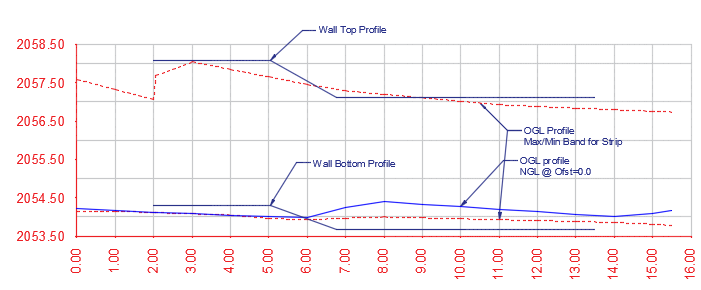

These objects are needed for retaining walls with varying heights along the longitudinal direction. A good example is the abutment wall of diversion weir structures. Otherwise, simple polylines can be used to represent the top and bottom of the retaining wall.

  > Note: It is important to have sufficient length of equal wall height along the length of the wall. Otherwise, the next step(s) may fail to proceed.

# Define and Start Session
[Back to ToC](#table-of-contents)

To define the design session:

1. Clear iCAD workspace from `Workspace > Clear Workspace` or
`CTRL`+`0`.
2. Start the *Module Browser* from `Workspace > Create and Run Session` or the toolbar item.
2. In the *Module Browser* dialog, select **RetwallDesign** module.

    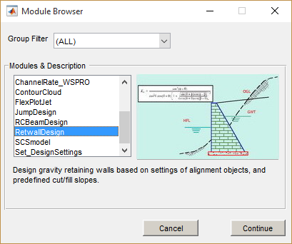

2. In the *New Session* dialog, click on the ***Wall Alignment Object*** type listed in the left box. AutoCAD will be in select mode. Pick the wall layout object prepared above.

    If the selection is accepted, the session is now completely defined. Hit the `Run Session` button. This will start the elevation view in the main iCAD interface.
    

    > Note: If the wall alignment object is referenced and does not contain any profile data, simple wall design is possible.Choose **Simple Design** when prompted. Then provide basie the wall height and foundation depth values. The elevation view is generated for the simple wall. Section view uses a sample profile data.
    
    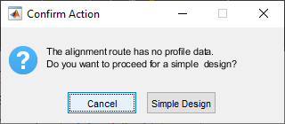

    Provide the dimensions as needed, and proceed.

    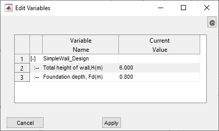

    Note an important limitation of simple walls: 
    - BoQ is extracted for the wall only. No earth volume is included.
    - Plan view is not available.

    The interface is now to proceed to the next step.

# ID Segments
[Back to ToC](#table-of-contents)

If the wall face is displayed in the interface, you can skip to the next step
below. This is especially true if simple walls are defined. Otherwise, define the top and bottom information from respective AutoCAD objects as follows.

1. Go to **iFunctions \> Pick Wall Top Level.** Go to AutoCAD and pick
the object defining the wall top level. Similarly, use **iFunctions \>
Pick Wall Bottom Level** and pick the corresponding object in AutoCAD.
Refresh View from **iFunctions \> Refresh View** or CTRL+R. The wall
face should be visible shaded in the profile view.

2. Use **iFunctions \> Id Segments** to define the design segments that
can be identified from the current setup. When successful, the grouping
is displayed schematically at the bottom of the wall with different
colors.

    > Tip: The segments are identified based on the variation of the height of the wall at incremental stations, grouping locations of similar heights together.

    
    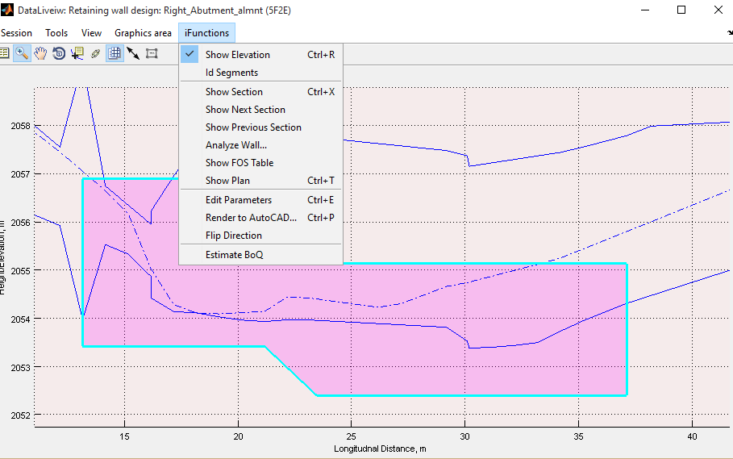

    Note: At least three incremental stations are expected under each segment group. If this is not met the following flag is thrown. As recommended, quit the design process and extract profile data at finer intervals again.

    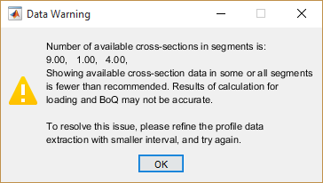

# Edit/Review Parameters
[Back to ToC](#table-of-contents)

Edit the settings for the different aspects of design and analysis from

1. Edit variables to define **Load Elements**.

    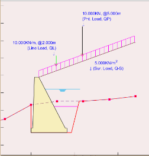

   Start the variable editor from **iFunctions \> View Variable Editor.** and set each variable to requirement. Below table summarizes input values.

   <table>
<colgroup>
<col style="width: 13%" />
<col style="width: 30%" />
<col style="width: 55%" />
</colgroup>
<thead>
<tr class="header">
<th><strong>Group</strong></th>
<th><strong>Variable Name</strong></th>
<th><strong>Description</strong></th>
</tr>
<tr class="odd">
<th rowspan="4"><blockquote>

<strong>Load Elements</strong>

</blockquote></th>
<th>Ground Water Height (m)</th>
<th>Height of water table in the backfill material behind the wall</th>
</tr>
<tr class="header">
<th>Intermediate Backfill Height (m)</th>
<th>Height of intermediate backfill material</th>
</tr>
<tr class="odd">
<th>Passive Backfill Height (m)</th>
<th>Height of fill material in front of the wall toe</th>
</tr>
<tr class="header">
<th>Drain Water Height (m)</th>
<th>Height of water level in front of the wall toe</th>
</tr>
<tr class="odd">
<th rowspan="3"><blockquote>

<strong>Loading Data</strong>

</blockquote></th>
<th>Surcharge Load (KN/m^2)</th>
<th>Uniformly distributed load magnitude</th>
</tr>
<tr class="header">
<th>Line Load (KN/m)</th>
<th>Line load applied along the length of the all</th>
</tr>
<tr class="odd">
<th>Point Load (KN)</th>
<th>Point load applied on top of fill material</th>
</tr>
</thead>
<tbody>
</tbody>
</table>

{br}
Notes:

- Load elements heights are measured from bottom of the wall
- Loads are applied on top of the backfill material. {br}

Continue.

    2. Edit variables defining the geomery and orientation of the retaining wall section

<table>
<colgroup>
<col style="width: 7%" />
<col style="width: 17%" />
<col style="width: 32%" />
<col style="width: 41%" />
</colgroup>
<thead>
<tr class="header">
<th><strong>Group</strong></th>
<th><strong>Variable Name</strong></th>
<th><strong>Variable description</strong></th>
<th><strong>Remarks</strong></th>
</tr>
<tr class="odd">
<th rowspan="8"><blockquote>

<strong>Retwall Settings</strong>

</blockquote></th>
<th>Top width of wall, Tw(m)</th>
<th>The top width of the abutment wall</th>
<th></th>
</tr>
<tr class="header">
<th>T-Shape Dims (m)</th>
<th>
[Toe, Stem width, flare, Heel]

Wall dimensions specifying the shape and geometry of the wall body
including the footing.
</th>
<th>
Use [0, 0] for simple gravity wall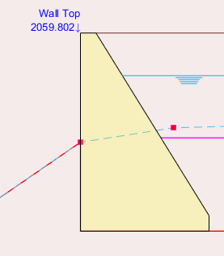

See notes below this table on how to define different
shapes.
</th>
</tr>
<tr class="odd">
<th>Footing Thickness (m)</th>
<th>Thickness of footing block</th>
<th></th>
</tr>
<tr class="header">
<th>Wall friction angle (Deg)</th>
<th>Wall friction angle denoting the backfill vs back of wall
interaction</th>
<th></th>
</tr>
<tr class="odd">
<th>Default B/H ratio (-)</th>
<th>Default ratio to determine the bottom width of the retaining wall as
a function of the wall height.</th>
<th>This value is used to schematically draw the wall before actual
designed width is assigned. Once a design value is assigned, this ratio
is not used.</th>
</tr>
<tr class="header">
<th>Side Cut slopes, (-)):</th>
<th>[Bcut, mut, hcut] values to specify earth cut slope</th>
<th rowspan="2">
See illustration below.

Bcut or Bfil: Flat space from cut edge

Mcut or mfil: cut slope after flat space

Hcut or Hfil: Height of cut
</th>
</tr>
<tr class="odd">
<th>Backfill Slopes, (-):</th>
<th>[Bfil, mfil, Hfil] values to specify earth fill slope</th>
</tr>
<tr class="header">
<th>Wall face direction, (-)</th>
<th>
Wall face direction

1: Orient wall to the left

-1: Orient wall to the right
</th>
<th>
Direction sect with reference to face looking at end of alignment
route.

See notes on <em>presentation and documentation</em> section, and the
plan view details to learn about the difference.
</th>
</tr>
</thead>
<tbody>
</tbody>
</table>

All variables related to Retaining wall described above are
schematically outlined in the illustration
below.

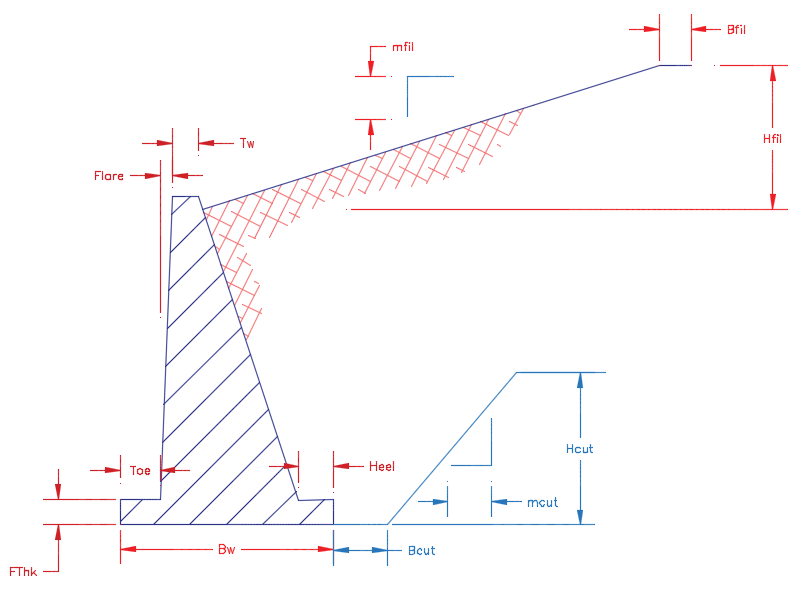

The following are examples of wall shapes that can be generated. Note:
Tw= 0.5m

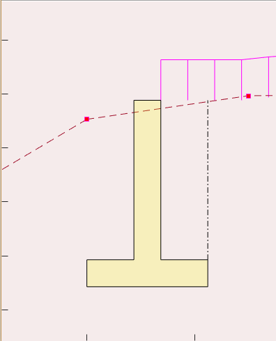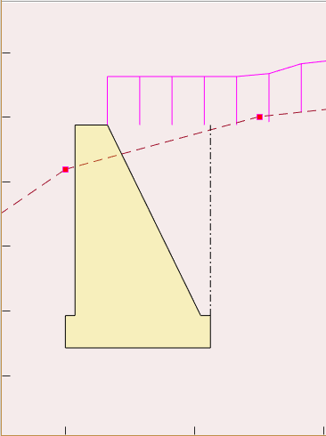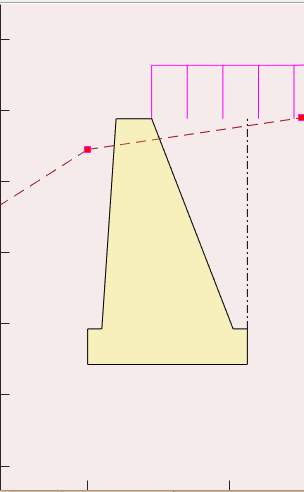

3\. Edit material properties that determine the magnitudes of loads
acting on the retaining wall body. A list of common materials are built
into the variables and reference values are available as shown in the
screenshot next to the table.

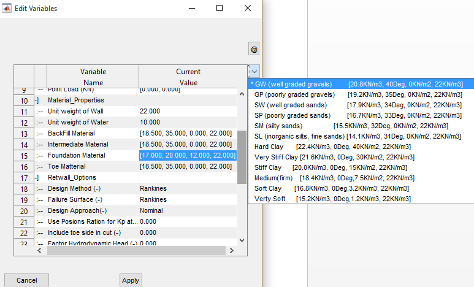

<table>
<colgroup>
<col style="width: 13%" />
<col style="width: 37%" />
<col style="width: 49%" />
</colgroup>
<thead>
<tr class="header">
<th>Group</th>
<th>Variable Name</th>
<th>Variable Description</th>
</tr>
<tr class="odd">
<th rowspan="6"><blockquote>

Material Properties

</blockquote></th>
<th>Unit weight of Wall</th>
<th>Unit weights of the retaining wall material</th>
</tr>
<tr class="header">
<th>Unit weight of Water</th>
<th>Unit weight of water</th>
</tr>
<tr class="odd">
<th>Backfill Material</th>
<th rowspan="4">
[<em>γ</em>, <em>ϕ</em>, <em>c</em>, <em>γ</em><em>s</em><em>a</em><em>t</em>]
values for earth materials, where:

<em>γ</em> is bulk unit weight
[KN/m^3]

<em>ϕ</em> is angle of friction
[deg]

<em>c</em> is cohesion [KN/m^2]

<em>γ</em><em>s</em><em>a</em><em>t</em>
is saturated unit weight

See note below.
</th>
</tr>
<tr class="header">
<th>Intermediate Material</th>
</tr>
<tr class="odd">
<th>Foundation Material</th>
</tr>
<tr class="header">
<th>Toe Material</th>
</tr>
</thead>
<tbody>
</tbody>
</table>

4\. Edit and/or set design process related settings and safety
parameters for the session.

<table>
<colgroup>
<col style="width: 7%" />
<col style="width: 20%" />
<col style="width: 25%" />
<col style="width: 46%" />
</colgroup>
<thead>
<tr class="header">
<th><strong>Group</strong></th>
<th><strong>Variable Name</strong></th>
<th><strong>Variable Description</strong></th>
<th><strong>Remarks</strong></th>
</tr>
<tr class="odd">
<th rowspan="6"><blockquote>

<strong>Retwall Options</strong>

</blockquote></th>
<th>Design Method (-)</th>
<th>
Design method to be used in analysis:

Rankine’s

Coulombs
</th>
<th>Apply either Rankine’s or coulombs methods to determine the active
and passive earth pressure on the wall</th>
</tr>
<tr class="header">
<th>Failure Surface (-)</th>
<th>Assumed failure surface for analysis, defining the application point
of earth pressures</th>
<th>
Rankine’s method assumes a forces are applied on the vertical
plane passing through the heel of the wall

Coulombs method assumes earth pressures are applied on the back of
the wall.
</th>
</tr>
<tr class="odd">
<th>Design Approach(-)</th>
<th>
One of available design options:

Nominal

DA-1 (Euro Code)

DA-2 (Euro Code)
</th>
<th>
These approaches establish the load and moment factors to be
applied from known practices to determine safety against failure.

See technical notes further below for details.
</th>
</tr>
<tr class="header">
<th>Use Poisons Ration for Kp at Rest (v)</th>
<th>Poisons ratio value to determine passive pressure at rest
condition</th>
<th>See technical notes below for the relationship used.</th>
</tr>
<tr class="odd">
<th>Include toe side in cut (-)</th>
<th>Include or exclude cut volumes in bill of quantity estimates</th>
<th></th>
</tr>
<tr class="header">
<th>Factor Hydrodynamic Head (-)</th>
<th>Consider or ignore hydrodynamic head in pressure analysis</th>
<th>If ignored, hydrostatic pressures is considered factoring the depth
of water at the heel and toe of the retaining wall.</th>
</tr>
</thead>
<tbody>
</tbody>
</table>

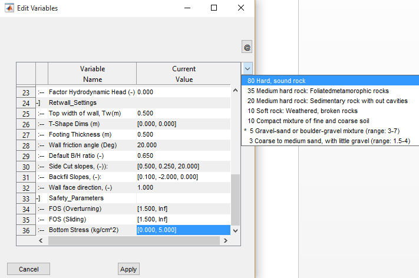

<table>
<colgroup>
<col style="width: 14%" />
<col style="width: 38%" />
<col style="width: 47%" />
</colgroup>
<thead>
<tr class="header">
<th><strong>Group</strong></th>
<th><strong>Variable Name</strong></th>
<th><strong>Variable Description</strong></th>
</tr>
<tr class="odd">
<th rowspan="3"><blockquote>

<strong>Safety Parameters</strong>

</blockquote></th>
<th>FOS (Overturning)</th>
<th>Desired range of values for factor of safety against overturning.
[1.5, Inf] input evaluates safety against minimum of 1.5.</th>
</tr>
<tr class="header">
<th>FOS (Sliding)</th>
<th>Same but against sliding</th>
</tr>
<tr class="odd">
<th>Bottom Stress (kg/cm^2)</th>
<th>Allowable bearing capacity of the foundation material [kg/cm^2]</th>
</tr>
</thead>
<tbody>
</tbody>
</table>

Note:

- Safety parameters are Minimum and Maximum values of parameters with in
  which range PASS flag is raised. Evaluated safety beyond this range
  will raise FAIL flag in the analysis report table.

- A list of preset materials are available to help choose the right
  material, or specify a different one.

# Design Sections
[Back to ToC](#table-of-contents)

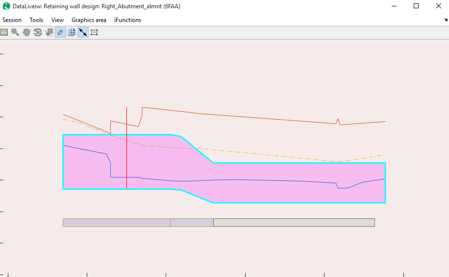

The next step in the process is to design the actual sections of the
retaining structures, factoring safety parameters.

1\. Once in elevation view, and variables are set as well as design
segments are identified, go to **iFunctions \> Cross Section view** or
CTRL+X. The interface will be on interactive mode to pick a location for
the cross-section view. Click on a region where uniform height exists.

Tip: The location picked is rounded to the nearest incremental station
recoded during profile extraction, and the section at that location is
generated.

2\. Select **iFunctions \> Design Wall…** to get a design solution guide
on bottom width values that can meet required safety parameters.

The interface shown on the right is displayed with guidelines for
picking a design point. In this snapshot, for instance, the Factor of
safety for overturning is met at a bottom width of close to 2.0metres,
while that for sliding is met around
2.8meters.

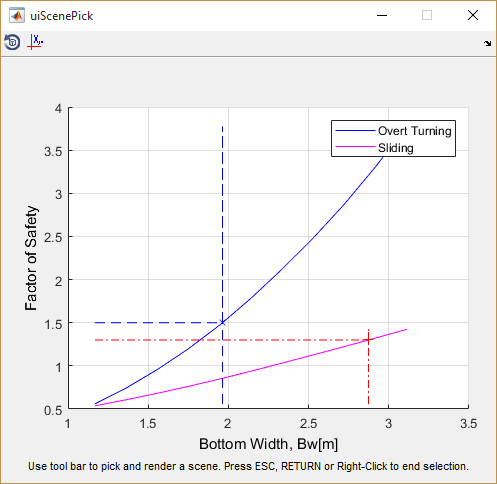

Using the *Pick A Scene Solution* toolbar, a desired width can be
selected, and the cross-section view will update automatically.

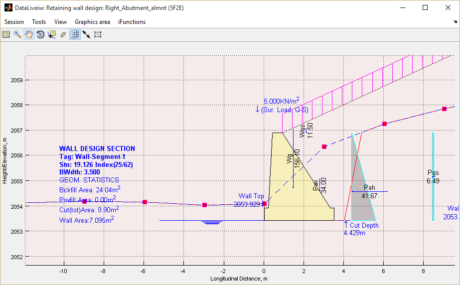

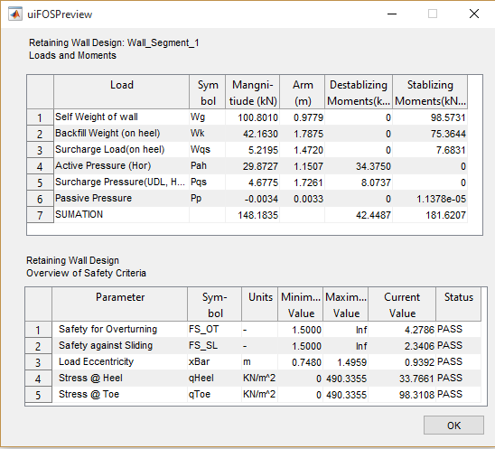

2\. Select **iFunctions \> Analyze Wall…** menu to analyze the
cross-section using current settings. This will generate loading
diagrams and summary of safety evaluations against set values.

Tip: Navigate between incremental stations by using SHIFT+period (\>) or
SHIFT+comma (\<) key.

Ensure all design parameters are met satisfactorily as indicated with
the PASS flag at the end of the lower table. If not met, increase or
decrease the bottom width as
follows:

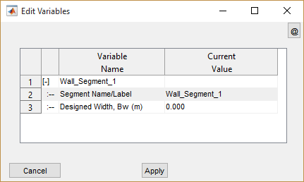

3\. Invoke the variable editor for this view from **iFunctions \> View
variable Editor** or CTRL+E. A compact editor window is displayed,
allowing you to edit design segment information.

Note: Segments not designed for bottom width show 0.000 as bottom width
value. Once set to a design value, this new value is maintained.

Insert desired value for bottom width and/or segment label and click
***Apply*** button.

Note: Transition walls, which are walls with variable height, cannot be
directly analyzed. However, bottom widths can be assigned from design
results of adjacent uniform height walls. Insert Bottom width for
transition walls in pairs, e.g., \[2.5, 3.0\] implies a uniformly
varying bottom width for the wall starting at 2.5m and finishing at
3.0m.

4\. Repeat steps 2 and 3 until satisfactory performance is verified
against provided safety parameters.

# Saving work
[Back to ToC](#table-of-contents)

Save work from **Session\> Save** menu.

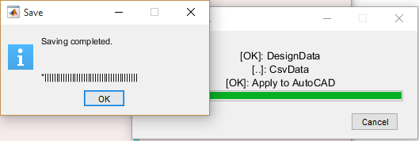

# Presentation and Documentations
[Back to ToC](#table-of-contents)

Once the design is satisfactorily completed for all design segments
identified – including transition walls, the finishing solutions can be
used to present and/or document the numerous details of the design
process. The following are available for this module:

1.  Standard output functions for report and BoQ and report generation

2.  AutoCAD Drawing for Elevations, cross-sectional and plan layout
    > views

## Standard Output Functions
[Back to ToC](#table-of-contents)

Any of the finishing and presentation solutions integrated in to iCAD
workflow can be used with this module. These include:

- Generating design and analysis report from **Sessions \> Build Report.**

- Generating bill of quantity (BoQ) estimate from **iFunctions \> Generate BoQ**

Note: To generate a complete listing of BoQ, make sure all segments are
designed satisfactorily, and:

\(a\) Navigate cross-section view from beginning to end

\(b\) Generate the plan view is also essential.

## Generating AutoCAD drawings
[Back to ToC](#table-of-contents)

Refer to the finishing solutions section of the user manual to learn how
common tools are use to generate drawings to AutoCAD, including
Transverse and longitudinal cross-section views.

## Generating Plan Views
[Back to ToC](#table-of-contents)

Plan views are key output for this module. These can be used to generate
important layout information overlaying topographic maps, as well as
related positioning details for the drawing album. To generate the plan
view:

1\. Make sure all identified segments are designed for appropriate
bottom widths. Then go to **iFunctions \> Show Plan** or CTRL+T. The
view is generated to maintain the orientation of the layout object.

2\. Use the *Generating Additional Plots to AutoCAD* option to render
this to AutoCAD.

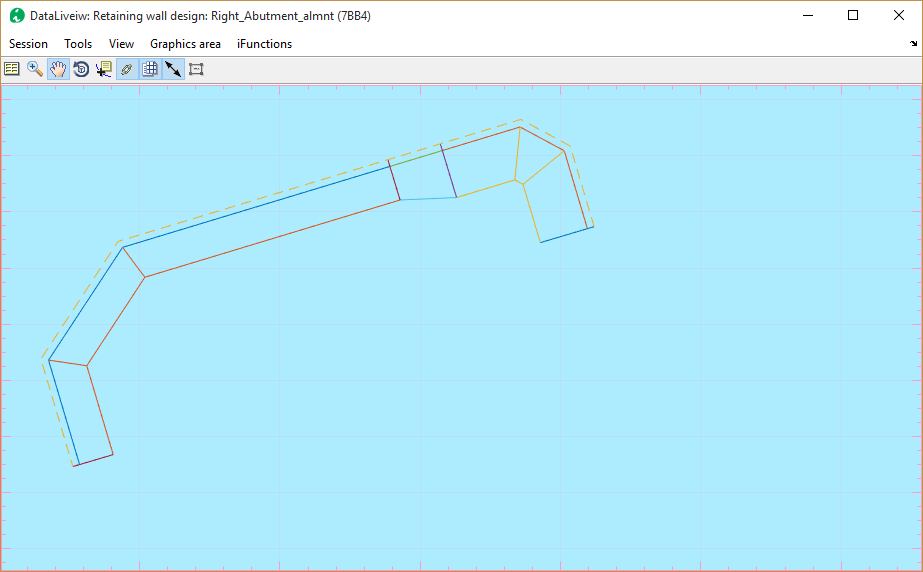

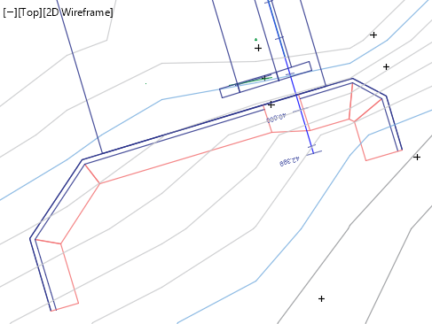

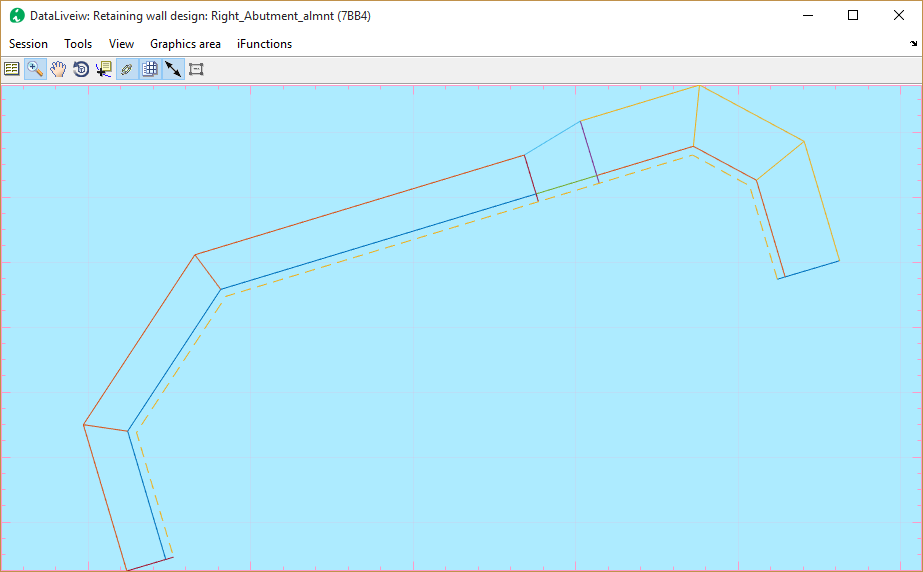

Note: The shape of the plan view may be rendered as shown below, if the
**Wall Face Direction** variable under ***Retwall Settings*** group is
set to -1 (or Right). Use option as fits the context.

Finally, an important guide to ensure smooth design process. The
generation of plan view may result in unrepresentative geometry – such
as shown below - if the vertices locations on the alignment route and
that of the wall top/bottom profile.

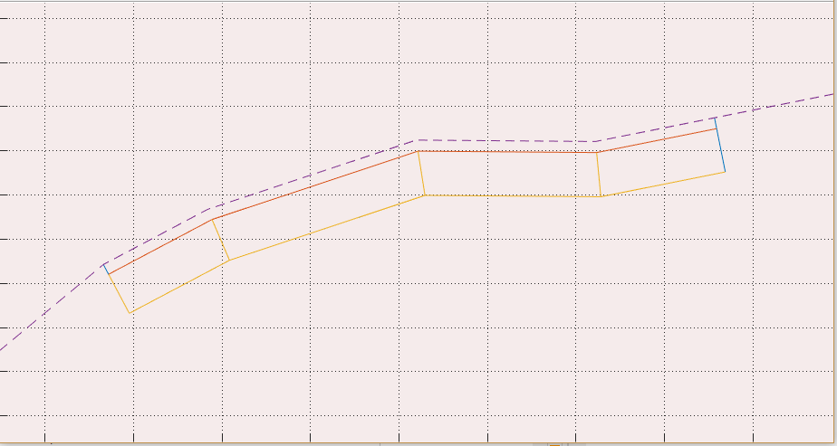

This is common, if the wall top/bottom profile objects are created after
the alignment route is set out and the profile is done.

Note: Alignment routes generated from ***JumpDesign*** module during the
design of weirs are free from such issues.

If vertices are in alignment, the correct image should appear as shown
here.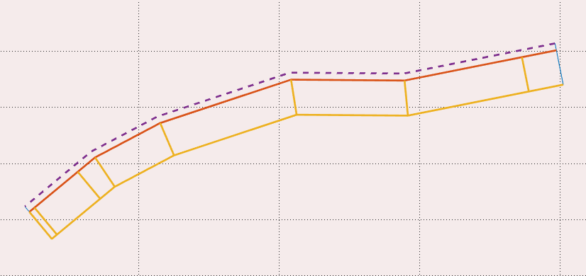

To avoid such issues:

1\. Draw the layout object overlaying the base map

2\. Mark station locations using appropriate intervals (e.g., 0.25, 0.5,
1.0).

3\. Decide the beginning, end and interim points for the retaining wall
and ensure vertices are created on those locations.

4\. Extract the profile with desired offset settings & save the profile
data. Before closing the profile data view, use Tools \> Copy Graphics
(for AutoCAD plot), and use the iCAD menu Tools \> Plot to AutoCAD (or
CTRL+P) to plot the data to AutoCAD. Use a scale of 1.0 to plot the
data.

5\. Now draw the wall top level and wall bottom level geometries using
the vertex locations positioned in step 2 above.

The design session defined using layout objects and wall top/bottom
profiles prepared in this manner will result in expected geometries.

Vertices at 1.25m and 18m stations – same as the begin and end point of
the wall top and wall bottom profile objects - as shown give the correct
layout.

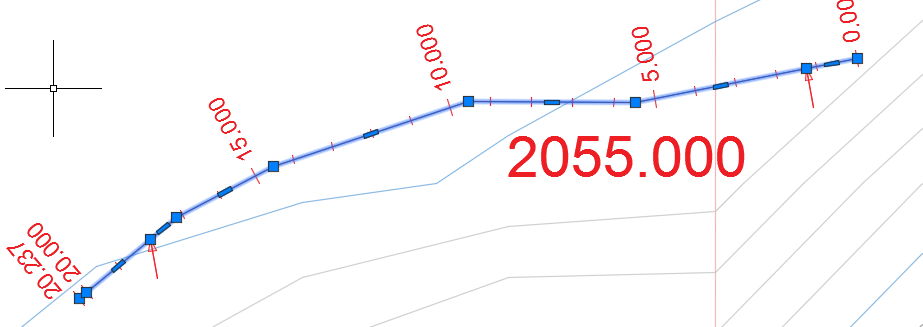

Note: Wall top and/or bottom profiles need to have the same number of
vertices. Profiles provided beyond the start and end of the profile data
are trimmed to data range.

Tip: A convenient way to ensure proper sync of vertices between the
layout object and the eall top/bottom profiles is to align the vertices
of the latter to stations that are easy to locate on the layout object.
Then the layout object can be edited for new vertices at these
locations, and a profile re-extracted.

Walls may not be rendered fully, if WallTop and WallBottom coordinates
do not strart at beginning and end of profile data.

# Technical Notes
[Back to ToC](#table-of-contents)

The product identifies segments along the alignment route of the wall.
It uses the wall height to identify design ranges with the same wall
height dimension, and label them in to segments. Each segment can then
be designed separately to determine the bottom width that gives a stable
structure.

## Earth Pressure Calculation
[Back to ToC](#table-of-contents)

Earth pressure is computed from the relationship

Where <em>γ</em> is the unit weight of the back fill material, H is the back
fill height, and K~a~ and K~p~ are active and passive pressure coefficients,
respectively, that depends on the method of analysis.

Rankins Concept: Active pressure coefficient in this concept is
determined from (Hunt 1986) (Arrora 2004) (Geo5 2005-2017) (W. 1999):

Coulomb’s concept: Active pressure in this concept is determined from

Where &phi; is the angle of internal friction, &alpha; is the back face
inclination of structure, &delta; is the angle of friction between structure
and soil, and &beta; is the inclination of backfill to the horizontal.

Note: The coefficients are computed for cohesion-less soil conditions.
Also for passive conditions &delta; = &beta; = 0 condition is assumed.

In the Rankins method, a virtual vertical plane at the heel of the wall
is assumed where the earth pressure is acting at an inclination equal to
that of the backfill slope.

Normally, in Coulombs method, the forces are assumed to act on the back
of the wall, at an angle factoring the soil-structure angle of friction.
In Rankine’s method, the failure surface is a virtual vertical plan
passing through the heel of the retaining wall. Users can specify
failure surfaces as fits their design problem, regardless of the method
for computing pressure coefficients.

## Pressure Coefficients on Cohesive soils
[Back to ToC](#table-of-contents)

Coulomb’s theory for cohesive soils estimates coefficient of active
earth pressure from:

Corresponding crack location is computed from:

Where &gamma;~t~ is unit weight of backfill material, c~eff~ is the effective cohesion, K~ac~ is the coefficient of pressure due to cohesion, and K~a~ is the coefficient of active earth pressure. In computation, h~o~ can’t exceed the thickness of the topmost layer, or depth to water table in the backfill, whichever is smaller.

## Hydrostatic and Hydrodynamic Pressure
[Back to ToC](#table-of-contents)

Hydrostatic pressure is computed using

Hydrodynamic pressure is computed from the gradient relationship

Where h~w~ is the difference in water is surface elevation, d~d~ and
d~u~ are the depth of the water table at heel and toe side respectively.

Where &gamma;~sat~ is the saturated unit weight of the earth body.

## Pressure from external loads
[Back to ToC](#table-of-contents)

Pressure distribution from uniformly distributed, line or point loads on the grade line of the back fill is estimated from the following relationships.

**Uniformly distributed loads:**

Where q~s~ is the load \[KN-m-2\], K~0~ is the
coefficient of active earth pressure.

**Line loads:**

Where n and m are distance factors.

**Point Loads:**

Where the European code of practice applies, the design approach is set
by the user to available options. The following load factors apply
respectively.

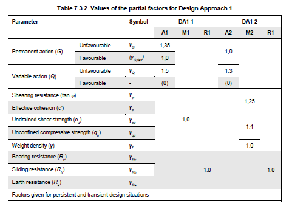

Accordingly, vertical and horizontal components of active pressure are
calculated.

Table: Values of partial factors in Design Approach 1 (DA1-1, DA1-2)
(Adrew J. Bond 2013)

## Stability Analysis
[Back to ToC](#table-of-contents)

Stability against acting loads is verified using five parameter test,
namely Factor of safety against overturning, Factor of safety against
sliding, load eccentricity, stress at toe and heel of the wall. The
relationships that are used to verify stability are summarized
below.

Where &Sum;M~-ve~ is summation of negative or destabilizing moments,
&Sum; M~+ve~ is summation of positive or stabilizing moments,
&Sum;V is summation of vertical forces, B is Bottom width of wall, e is
eccentricity, c’ is cohesion of foundation soil, and q is the stress at the
bottom of the wall (heel and toe respectively).

## Geometric Limitations

The ***RetwallDesign*** module can model most wall shapes including T or
cantilever walls, semi-gravity and gravity walls, subject to the
following limitations:

- The module solves horizontal bottom

- Unguided use of the module, without adequate technical support, for Wall sizes greater than 7 meters is not recommended.

- The solution may abort with unhandled error if calculated cut profiles do not intersect NGL. This may happen for large bottom width dimensions.
