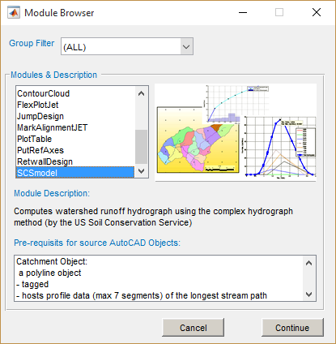
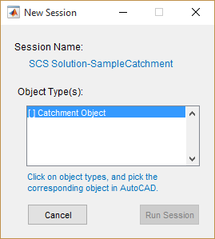
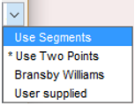
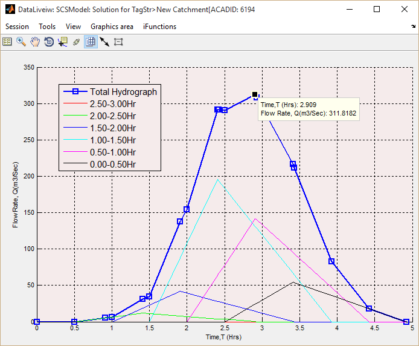

# Peak flood Estimation

Estimation of peak flood is solved using the **SCSModel** product. This module adopts conventional practice used to determine maximum probable floods using the SCS method of complex hydrograph. As main input variables, it uses:

- Basic catchment properties (area and profile of the longest stream path)

- Design Rainfall

- Estimation method for Time of concentration

# Table of Contents
<!--TOC-->
  - [Conventions](#conventions)
  - [Typical workflow](#typical-workflow)
    - [Prepare Object](#prepare-object)
    - [Define Session and Start](#define-session-and-start)
    - [Edit Variables](#edit-variables)
    - [Explore the solution](#explore-the-solution)
  - [Technical Notes:](#technical-notes)
<!--/TOC-->
## Conventions
[Back to ToC](#table-of-contents)

- Profile data for longest stream path must be provided in ascending
  order (increasing distance for increasing elevation, or decreasing distance for decreasing order). 

## Typical workflow
[Back to ToC](#table-of-contents)

A typical workflow for the use of the **SCSModel** module to estimate
peak design flood is shown in the chart.

### Prepare Object
[Back to ToC](#table-of-contents)

1\. Start with a host object in AutoCAD, that represents the catchment object drawn using a polyline drawing tool. Tag the object to represent the catchment or basin label.

> :bulb: **Tip**: Catchment host objects can be quickly generated from the There is no need to reference catchment object sketch. 

2. Provide stream profile data to the object. The data can be from a spreadsheet application, or CSV file. Copy the data, and use `Tools > Paste Clipboard to Object`. 
2. Follow the steps outlined in [Data Processing and Presentation]() section to put the profile data to the catchment object.

> **Note**: The profile data is an approximation of the profile data in a few
segments as commonly practiced. It should not too long as in the direct
extracted data from DTM sources.

### Define Session and Start
[Back to ToC](#table-of-contents)

3\. Define the session for the module from iCAD **Session \> Create and Run New
Session**. Select the ***SCSModel*** module, input the desired name for
the session, accept and continue. The **Catchment Object** type is
displayed in the *Workspace Manager* list box.

In the *New Session* dialog, click on the *Catchment Object* list item. AutoCAD will be in selection mode. Pick the catchment object prepared earlier. Back in the *New Session* dialog, hit `Run Session.`. This will start the module.

{br}

> **Note**: The Catchment Object will be marked \[x\] when associating the
AutoCAD object is successful. The Run Session button is activated once
the association is complete.

The module will start by displaying the rainfall distribution curve for the catchment.

{br}

Explor the hydrograph solution from `Workflow > Hydrograph` menu command.

{br}

### Edit Variables
[Back to ToC](#table-of-contents)

The results displayed are determined from the default settings. Edit the parameters from `Workflow > Edit Parameters` or `CTRL`+`E` to suit the specific catchment condition under investigation, as detailed below.

Edit default variables using **iFunctions \> Edit Variables** as
shown below. Then click Apply button to solve.

<table>
<colgroup>
<col style="width: 7%" />
<col style="width: 24%" />
<col style="width: 67%" />
</colgroup>
<thead>
<tr class="header">
<th><strong>Group</strong></th>
<th><strong>Variable Name</strong></th>
<th><strong>Description and Remarks</strong></th>
</tr>
</thead>
<tbody>
<tr class="odd">
<td rowspan="3"><blockquote>

<strong>Model Data</strong>

</blockquote></td>
<td>Design Peak Rainfall (mm)</td>
<td>The 24Hrs recurrent (e.g., 50Yrs, 100Yrs) design rainfall</td>
</tr>
<tr class="even">
<td>Catchment Area (Km^2)</td>
<td>The area of the basin in square kilometers</td>
</tr>
<tr class="odd">
<td>Curve Number</td>
<td>SCS curve number for the catchment♣</td>
</tr>
<tr class="even">
<td rowspan="5"><blockquote>

<strong>Model preferences</strong>

</blockquote></td>
<td>Tc computation method</td>
<td>
Choose desired method for computing TC values:

<ul>
<li>
<strong>Use Segments</strong>: Uses the longest stream path
profile provided to estimate the time of concentration as is.
</li>
<li>
<strong>Use Two Points</strong>: Uses the highest and lowest
<strong>points</strong> on the stream profile to estimate time of
concentration
</li>
<li>
<strong>Bandsbey Williams</strong>: This method accounts for the
area of the catchment.
</li>
<li>
<strong>User Supplied</strong>: This option allows to use a user
supplied value from other sources or methods (the <strong>Set TC
value</strong> variable just below)
</li>
</ul></td>
</tr>
<tr class="odd">
<td>Set TC value (Hrs)</td>
<td>A user set value for time of concentration.</td>
</tr>
<tr class="even">
<td>Incremental Duration (Hrs)</td>
<td>
Duration interval for the computation of the triangular
hydrographs for each incremental duration rainfall in the computed
rainfall profile. Choose from:

<ul>
<li>
<strong>Dmin &gt;0.5Hr</strong> forces a minimum of 30minutes
incremental duration to be respected in calculation
</li>
<li>
<strong>Accept Calculated value</strong> uses the calculated
value of incremental duration as is
</li>
</ul></td>
</tr>
<tr class="odd">
<td>Temporal profile method</td>
<td>
Method for determining the temporal variation of the 24Hr
rainfall. Choose from:

<ul>
<li>
IDD Graph
</li>
<li>
Equation
</li>
</ul></td>
</tr>
<tr class="even">
<td>Area Reduction method</td>
<td>
Method to be used for changing point rainfall to area rainfall.
Choose from:

<ul>
<li>
Equation
</li>
<li>
Table
</li>
</ul></td>
</tr>
</tbody>
</table>

> **Note**: The curve number corresponding to proper antecedent moisture condition must be used.

The first two methods use the Kiprich’s formula. (See note below for
details)

### Explore the solution
[Back to ToC](#table-of-contents)

Explore the solution by varying calculation methods and parameters to find a representative and fit solution to the design task. Use `Workflow > Compute TC, DRN` menu command to compute Time of concentration using all four available methods.

A tabular presentation of results is also available in the Table View interface as shown below.

## Technical Notes:
[Back to ToC](#table-of-contents)

Time of concentration is estimated using one of two methods, namely the
Kiprich’s formula, and Bransbey Williams Equations respectively:

Where L is horizontal distance (m), S is average slope of segment (m/m)
and A is the catchment area in square kilometers.

The peak flood is derived from the 24Hr design rainfall magnitude.

**Temporal distribution** of the design rainfall is approximated using one of two available options.
The first option uses this equation:

{br}

Where P is the recurrent design rainfall (mm).

The second option uses the above chart to determine the distribution
over 24Hrs period.

{br}

**Spatial variation** of the point rainfall is estimated using the Area
to Point ratio relationship. Two options are available.

1)  Tabular data (built-in) relating corrections for depth of rainfall as a function of incremental duration and Catchment Area (Such as found in the IDD manual). Factors are applied to catchment areas >25sq.Km.

2)  Using the following empirical relationship:

{br}

**Excess rainfall** is estimated using the following common relationships in litrature:

{br}

Where:

- Tc is time of concentration (hrs),

- D is incremental duration (hrs),

- Tp is time to peak (hrs), and

- Qp is excess rainfall(mm)
