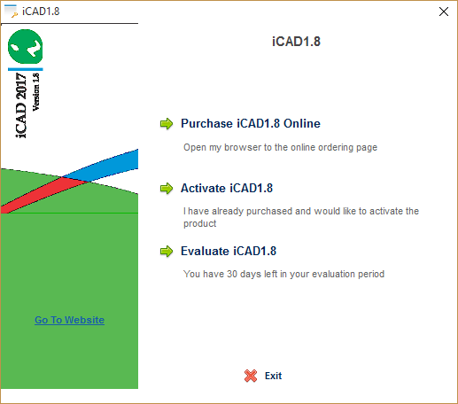

# iCAD and Related Products Setup and Licensing

[Back to Home](..\index#online-documentation)

Welcome to iCAD, and Thank you for choosing to use it. This small guide
will assist you to get your software up and running.

## Table of Contents
<!--TOC-->
- [System Requirements](#system-requirements)
- [Installation and setup guide](#installation-and-setup-guide)
  - [Setup Installation](#setup-installation)
  - [Setup AutoCAD for use with iCAD and related products](#setup-autocad-for-use-with-icad-and-related-products)
  - [Installing Update resources](#installing-update-resources)
  - [Software Updates](#software-updates)
- [Licensing Guide](#licensing-guide)
  - [Using iCAD with AutoCAD 2010 and later releases](#using-icad-with-autocad-2010-and-later-releases)
<!--/TOC--># Introduction
[Back to ToC](#table-of-contents)

iCAD is a unique software that can significantly and positively impact how you work and deliver your projects. Although iCAD is designed to be easy to use and intuitive, a minimum guidance is required to understand how it operates.

iCAD software documentation provides this guide to you through key contents that can make your experience with the software a lot better, than you would if you were to try it out without any guidance. We strongly recommend that you scan these documents for maximum productivity.

> :warning: **iCAD is Legally protected software**: iCAD is a licensed and copyright protected software under prevailing laws. Please read the End User Licence Agreement (EULA) before installing and using the software. Please DO NOT INSTALL or USE iCAD if you do not agree to the terms of the EULA.

**Operating License**: Currently iCAD line of products are available
only on subscription basis, available by request to
[www.quanomix.weebly.com](http://www.quanomix.weebly.com) or contacting
us at:

    Quanomic ITES
    No 6, Grnd FLR
    IT Village/IT Park
    Bole Subcity, POBox 170260
    Addis Ababa, ETHIOPIA.

You are well come to try the software for a trial period of 1month (extendable to 90days) upon request. We issue trial licenses fot this purpose, and do contact us to get your copy.

Connect with us on **LinkedIn** to stay up to date.

Write to us *quanomix@gmail.com* or visit [www.quanomix.weebly.com](http://www.quanomix.weebly.com) or for any queries you may have. We love to hear from you.

*Team Quanomic*

# System Requirements
iCAD and related software products have the following system requirements.

- Operating System: Windows 10 or latter 
- Architecture: X64
- Processor: Coire i7 or equivalent, or latter
- RAM: 4GB or more
- Screen: FHD (1020x1080)
- AutoCAD: 2018 or latter

# Installation and setup guide
[Back to ToC](#table-of-contents)

Make sure to obtain the correct and recent release of the installation file from your organizations IT dept, or from our website [here]().
> :bulb: **Note**: The download file size can be large (~2GB). A colleague in your organization may already have it. We recommend to install from a copy, and update as described [further below](#updating-the-new-release).

Follow below steps to install the applicaiton.

1. To begin installation, right click on the zip file, and extract to a new folder. Then open the created folder and double click on the exe file.

    

    This will start the **iLauncher Installer** process.

 
    

    Click the 'Next` button, to continue.

2. Installer Options: Check the *Add Shortcut to Desktop* option. It is highly recommended to accept the destination folder.

     {br}

    > :exclamation:**Note** If you choose a differnt location for installation, make sure you have full access previllages to the folder, or the application will not work properly.

3. Required Software: Matlab runtime is a required software, and comes bundled with your installer. Accept to install, and hit `Next` button.

     {br}

    > :bulb: **Note**: If you have been using previous versions of iCAD or CanalNETWORK product, you might already have the runtim installed. In that case the installer will flag that it is available.
3. Confirmation: Review and accept the installaiton options on this final dialog, and hit `Install` to finish.

      {br}

This will complete the installation. A short cut should be available on the desktop.

iCAD software is newly released as version 2.8 (Aug 2023) This version must be installed in a users machine. Any and previous versions and components of the software are not supported, and can be uninstalled.

## Setup Installation
[Back to ToC](#table-of-contents)

Before launching, make sure to setup the application as follows:

1. After installation, right-click on the desktop icon, and choose `Properties`. 

   

1. In the *iLauncher* dialog copy the contents in the **Target** field, and paste to the **Start In** field.Before completing, remove the last part of the text you pasted **iLauncer.exe**.

1. Hit `Apply`.

Now, you are ready to lauch the application.
> :bulb: **Tip**: Upon startup, the application will require to check and update automatically. If update is not succesful, it may not start.

1. If the Update Check dialog appears, that is normal. Choose `Update Latter` if the option is there, and continue. If not, choose `Abort Launch` and exit. Then follow the steps below in [Installing Update Resources](#installaing-update-resources).

## Setup AutoCAD for use with iCAD and related products

Upon first start, it is common to get the *Failed to Link* warning dialog. This happens if a running AutoCAD application is not detected while launching iCAD. That is normal, and continue by hitting `Ok` button. The application will start.

> :bulb: **Note**: If AutoCAD is running and the above dialog still appears, then the version of AutoCAD may not be supported. Install a supported version, and try again.

If a running AutoCAD application is deteceted, the following dialog appears.

This happens because AutoCAD is not setup yet. Follow below steps to set up AutoCAD.

> :bulb: **Important Note**: The Installed AutoCAD application must be VBA enabled. To check this, and resolve if any issue, go to this [Enabling VBA for AutoCAD](#enabling-vba-for-autocad) step first befor continuing. 

1. In the open AutoCAD environment, go to the command line and input **-appload** command. AutoCAD will respond by invoking the *Load/Unload Applications* dialog.
 

    Click on the `Contents` button in the *Startup Suite* pannel.
   
1. In the *startup suite* dialog, hot `Add` button.

     
1. Navigate to the installation folder (default: C:\Users\<username>\AppData\Roaming\Quanomic Engineering\iCAD 22\application), and choose **iCAD Bridge.dvb**.

     

1. The *Security* dialog displays. Choose `Always Load` button.

     

1. The Startup suite dialog now updates its contents listing iCAD Bridge.dvb in the list.

     

     Hit `Close` to finish.

 1. The *Load/Unload Applications* dialog confirms the operation at the bottom.

      

AutoCAD is now set. It will always load this application on startup, and you will not have to do this setup every time.

> Note: You can remove and add the bridge applicaiton at any time, with out any inconvenince to your normal workflow.

This setup process insures that, iCAD and related products communicate seamlessly with AutoCAD in every operation.

> :warning: **Important Note** You may continue to get the above error dialog every time you start iCAD application, if you DO NOT setup AutoCAD environement as detailed above.

## Installing Update resources
[Back to ToC](#table-of-contents)

At any time when using the application, users can check for updates from `Help > Updates...` menu command, and then choosing `Check Online`.

If an update is required, we recommend the abort the launcg process, and then follow the below steps.

1. Download the [Latest update for iCAD Software](https://drive.google.com/uc?export=download&id=1mSZVIIXOgk0yGErVAzAHIH8eWm1x0gZ6)
1. Go to your `Help > Updates...` on your application. Choose `Update Manually`. This will promot to exit and restart, accept and continue.
1. On restart, the Launcher application will promot for a method to update. Choose `Manuall Update`. 
1. In the file explorer dialog, point to the resource file downloaded above.

> :bulb: **Note** Do not tamper with the naming or content of the resoure file, or update will fail.

Your applicatoin must now be fully updated and working normally.

## Software Updates
[Back to ToC](#table-of-contents)

Software updates will be available from time to time. We will release updaes by period. Check for updates is automatically done by your application every once in a while. Where the application prompts there is a new version avaionble, either follow the manual or direct (download and update) methods to update your applciation.

Furtehr detail is available on every new release on the update page for the specific period. This is available in the index/home page (Click at the top of this page on **iCADdocs_online**).

END.

[Back to ToC](#table-of-contents)

# Licensing Guide

iCAD is a protected by prevailing copyright laws. It is an application
provided for use only as described in the license agreement (EULA).

1. The first time you start, or if there is a need to update license info, the system will display the dialog below. Coose **Activate iCAD (your version)**.

     

2. In the **Activation Dialog**, select **Activate iCAD online**.

     

3. Input your license ID and passowrd Information, and hit `Continue`.

    

4. The licensing should be succesful, as shown below. Hit `Continue` to launch the application.

    

If you have a valid license and get any error, do not hesitate to reach out to us. We will be more than happy to help.

## Enabling VBA for AutoCAD 

iCAD depends on an Application Interfacing (API) that is built on VBA
(Visual Basic for Applications) to interact seamlessly with AutoCAD, and
automate users tasks. However, The Visual Basic for Applications (VBA)
engine is no longer provided with AutoCAD OEM installation media since
2010. If you are using AutoCAD versions released in 2010 or latter
(2012,14 for example), your AutoCAD installation does not support VB.

To check if your AutoCAD installation is supported by VBA, start AutoCAD
and type *vbaide* on the command prompt. If VBA is embedded, you will
see the VB Editor window. Otherwise you will receive an error message
such as “Unknown command "VBAIDE". Press F1 for help.”

Below you will find information to get this engine and install it on
your computer.

Visit the [AutoDESK official resource website](https://www.autodesk.com/support/technical/article/caas/tsarticles/ts/3kxk0RyvfWTfSfAIrcmsLQ.html) here to locate the right VBA installer for your version of AutoCAD.

After download, follow these steps to install.

1.  Close all programs.

2.  In Windows Explorer, double-click the downloaded self-extracting EXE
    file.

3.  Unzip the file to the location of your choice, or use the default
    location.

4.  Follow the on-screen instructions.

Upon finish, check again by typing vbaide on the command line of AutoCAD. If insall is succesful, the Editor launches. Close it and continue to [AutoCAD setup process](#setup-autocad-for-use-with-icad-and-related-products) above.

[Back to ToC](#table-of-contents)

END.
