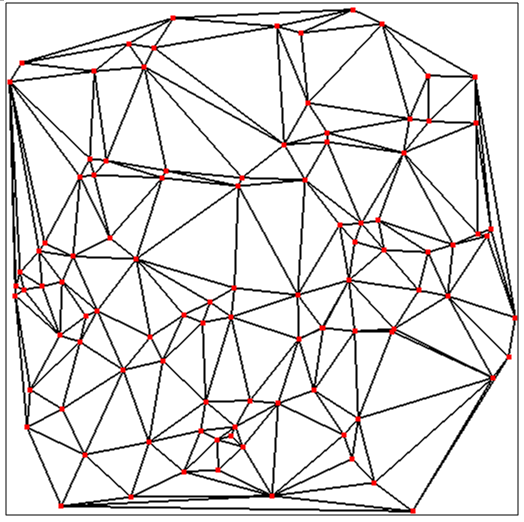
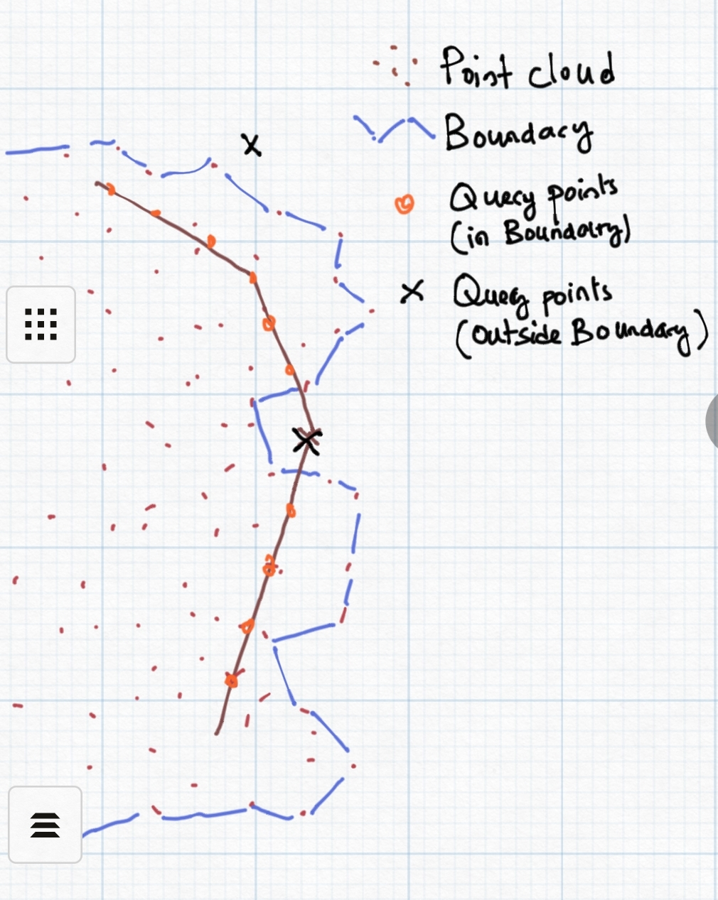
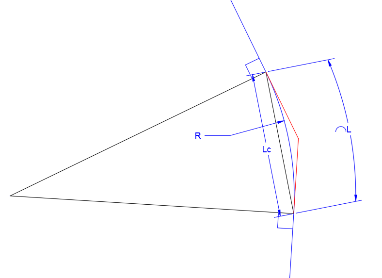

# Surface modelling and Profile Extraction
[Back to Home](..\index#online-documentation)

Calculation and presentation of ground surface data is a key process in the design of irrigation infrastructure. iCAD product incorporates dedicated module to manage this task, and deliver results in a convenient and easy to use environment.  The module and its extended applications (for instance in CanalNETWORK product) leverage computational algorithms from within Matlab, to generate representations of surface models, and determine elevation values at specific query points. The technical details are described further below. In the following, the steps to profile data extraction in iCAD envronment is described.

# Table of Contents
<!--TOC-->
  - [Steps to Profile Data Creation](#steps-to-profile-data-creation)
    - [Hosting the Topographic Data](#hosting-the-topographic-data)
    - [Understanding Profile Extraction output](#understanding-profile-extraction-output)
    - [Profile for a single alignment route](#profile-for-a-single-alignment-route)
    - [Profile Data for multiple objects](#profile-data-for-multiple-objects)
  - [Surface Interpolant](#surface-interpolant)
  - [Query on Topograhic Data](#query-on-topograhic-data)
  - [Extrapolation](#extrapolation)
  - [Curve Handling During profile extraction](#curve-handling-during-profile-extraction)
  - [Notes about Alignments](#notes-about-alignments)
<!--/TOC-->

## Steps to Profile Data Creation
[Back to ToC](#table-of-contents)

### Hosting the Topographic Data
[Back to ToC](#table-of-contents)

Before you can extract profile data, the scattered topographic data (often found in CSV format) must be availble associated in the drawing file. 

1. Save available data (XL, Text) in CSV format from with in Excel. Make sure the data is in X,Y,Z format; the first row is a header row labeled similar to East, North, Elevation; and the data is clean, i.e., does not have any text information except the header rows, and no blank cells. 
   
   
   
   Then save the data as .Csv data.
   
   Back in iCAD, make sure the iCAD session is connected to the current drawing. You can do this by (re)starting `CAD Tools > Invoke AutoCAD Addon Tools`. Then start the worspace manager from `Workspace > Start Workspace Manager` . This will invoke the workspace manager interface.
   
		

2. Preapre a host object in AutoCAD and collect it to the workspace. To do this, draw any object in your AutoCAD drawing. Give it a Tag if needed (In the figure below, it is tagged Surface1). In the workspace manager click on the first toolbar item labeled *Pick AutoCAD objects to Workspace collection*, and point on the object in AutoCAD. If you don't see the object listed, toggle the checkbox on top.
   
      

3. Once the object is in the workspace collection, click on it, and then click on the *Paste Clipboard Data* button, shown below. You will be prompted to select a data input source. Choose `File` button. In the file explorer dialog, navigate to the location of your CSV data file, and select it.
   
    

   
   Accept the default import formats as shown below. If the data is clean and appropriately prepared, a summary similar to the one on the right shall be displayed. Hit `Finish` button to complete hosting the data. iCAD Status Bar will report the results.
   
     

The host object now contains the spot data set for topographic processing. You can check the contents by clicking on *Preview Data Contents* button, next to the *Paste* button. A table will display the contents.

   

You can now proceed to next steps.

### Understanding Profile Extraction output
[Back to ToC](#table-of-contents)

Upon succesful run of a profile extraction process, the following typical outputs and tools are available.

   

*A Typical profile extraction output, showing different information available on the data.*

A typical profile data contains data on the following:

- Profile data along the center line of the route at the specified interval

- Profile data along offset points, to the left and right of the centerline (if defined).

- The variation of transverse profile along the route, shown in band plot.

- Curve locations along the route, if found.

> Note: For details on how curves are handled and pre-requisits, see further below.

### Profile for a single alignment route
[Back to ToC](#table-of-contents)

To create a profile data for a single alignment route, start by making sure iCAD session is connected to the current AutoCAD drawing, with the host object and desired alignment route ready. Follow below steps:

1. Start `AlignmentProfileJET` module from the toolbar button or, from `Session > Create and Run New Session...` 
   
    

2. The module is invoked, and the input dialog box is ready. Click on each value cell and pick the corresponding objects in AutoCAD. 
   
   

3. The last variable allows to input stations for lateral offset points to collect strip profile data. You can choose from available options, or input offset values of your own. If not needed, it can be left to the default value of 0. This will extract profile data along the centerline only.

4. The next input dialog allows to input additional parameters for the profile extraction task.
   
   
   
   <u>Starting Station</u>: The desired starting station for the profile data. Default is 0, and it is recommended to leave it as is, unless for special purposes which also require other steps to consider.
   
   <u>Incremental Distance(m)</u>: The interval for profile data extraction. The default is 20m. Incremental distance can be set as low as 2.5meters. 
   
   ***Important Note: Using small incremental distance can increase the accuracy of the design, say the calculated eatth volumes. However, the different computational processes could increase significantly.***
   
   <u>Include Vertices(-)</u>: This allows to include or exclude profile data at vertex locations along the alignment route. In recent versions, vertex locations are ALWAYS included, and this variable is redundant, and left at the default value of YES. It can be used to suppress curve extraction if set to NO.

5. Once done, the iCAD graphic interface will show the results of the extraction process. 
   
   
   
   - To see (or refresh) the graphic data view use Ctrl+R.  
   
   - To show/Hide the listing table, toggle the table view 'On' or 'Off'.
   
   

   
   Use `Workflow > Show Section` to explore the transverse profile along the length of the route. The result will show the cross-section at the nearest data point.
   
   
   
   - to view the setout information, use `Workflow > Show Set Out` 
   
   
- to view the list of curves in the data set, use `Workflow > List Curves` and watch or toggle the data table viewer. The listing of the curve data table include inice number, Station of PC and PT points, PI Easting and Norting points, as well as the length and radius of the curve.
  
   
   
   The contents of the curve listing include sequential indices, PI station, PT station, Length, Design Radius and more.

            

6. Before closing, save the data using the `Save` button on the toolbar, or from `Session > Save` menu command. If you recieve, the below alert message, make sure to add the route object to the current workspace collection, as shown above for the surface data host object.
   
   
   
   The profile data, created and saved in this manner is available for other iCAD and CanalNETOWRK functions.

### Profile Data for multiple objects
[Back to ToC](#table-of-contents)

[... more content to be added soon...]

## Surface Interpolant
[Back to ToC](#table-of-contents)

Surface fitting and interpolation, as applied in the context of topographic data processing in iCAD and CanalNETWORK products, specifically refers to the use of scattered data of the form x, y, z triplet to determine a representative surface model of the form z= F(x,y) and using this surface model to generate elevation (z) values at arbitrary x, y locations. This means, data from typical surveying work or other sources that is available in x, y, z format can be used to reach at the desired surface model, and undertake subsequent tasks.

To estimate the surface model for a given set of x,y,z data, iCAD builds on scattered interpolation algorithm in matlab. This algorithm performs Delauney triangulation over the data set, with the aim of creating a surface fit made up of small triangles. A Delaunay Triangulation maximizes  the smallest occuring triangle over all triangulations og the point set. In other words, any other triangulation will have a smaller angle at vertices.

   

It is important to note that the method:

- assumes a perfect plane inside each triangle, and 

- the elevation at any point inside or on the edge of each triangle is calaculated using linear interpolation

## Query on Topograhic Data
[Back to ToC](#table-of-contents)

Once the surface interpolant is determined, elevation at querry points of x, y is detemined from the same, using the following relation ship.

z= F(x, y)

where

F= f(x,y,z) is the surface interpolant.

The surface data extraction algorithm in iCAD and CanalNETWORK software products is applied at least in the following functions:

- Point  Query: This function is used to interactively querry elevation data from x,y input obtained from the AutoCAD environment. The function reads the x, y (or E, N) data from user selection in AutoCAD, and displays the elevation value calculated from z= F(x,y)

- Profile Extraction: The fundamental input to profile extraction is an alignment path object defined in AutoCAD environment. This object provides the  x, y data at fixed intervals along the path object. The same function is applied on x,y data set to return corresponding elevation values. 
  
  ![[  ] ](Images/Image%2040.png)
  
  *Fig: Alignmnet route, vertices and querry points showing for an alignment route with and without offset querry points.*
  
  When extracting strip elevation data for an alignment object, normal lines are generated at fixed intervals. In addition to x,y data at center line - i.e., on the alignment route - other x,y data are created at offset locations specified by the user along these normal lines. The offset locations are applied on both sides of the alignmnet. The resulting x,y data set forms a strip area along the alignment route. The elevation data at this data set is calculated from z= f(x,y).
  
   
  
  *Schematic showing Alignment route, and offset querry points consideration. Offsets are read from Left to Right, facing in the direction of progress of the alignment route.*

Note: The intervals for extracting profile data are specified by the user. The algorithm includes vertex points along the alignmnet route object, but the user has the option to exclude these points during the extraction process.

- Profile Reload tools: Sometimes engineers want to modify alignment routes to meet some design requirements. This is naturally handled with in the AutoCAD environment. In such cases, both iCAD and CanalNETWORK products offer a function that allows reloading profile data for an alignmnet object whose vertices are modified. Reload functions essentially repeat the profile extraction steps described above using  settings used to create the original profile data.

## Extrapolation
[Back to ToC](#table-of-contents)

The implementation of the surface interpolant function in above described querry methods of either iCAD or CanalNETWORK product, allows extrapolation to determine elevation data ouside the area covered by input x,y data set. This meanse, the implementation can estimate elevation values for points outside the boundary area defined by the inpit data set. 

   

*Schematic showing point data set, boundary area defined by the data set, and querry points for extrapolaiton.*

It is important to note that:

- The returned values are derived from linear extrapolation

- the reliability of the values returned decreases significantly as the querry points move away from the boundary area, original data set. 

Hence, the extrapolation capability is to be considered as only a complimentary feature to obtain a crude estimate of terrain variation beyond the boundary area. There is no guarantee that designs based on extrapolated data will be of acceptable quality and accuracy.

## Curve Handling During profile extraction
[Back to ToC](#table-of-contents)

Curves, if found in the AutoCAD alignment object, will be considered while extracting prorfile data. The requirements for succesful data extraction are:

- the begining and ending segments of the alignment route must be straight segments of at least longer than the incremental distance for profile extraction. This is set to 20meters by default.

- Curve radius(R), the curve length (L), and the chord length (Lc) are all greater than or equal to 20meters

- The backward tangent and forward tongent lines to the curve begining and ending, respectively, align with the preceeding and following segments with in acceptable error.

> Note that these are limitations set to ensure practicality of designs, as curves of a smaller size are not encouraged in practice. If all the conditions are not met, no curve data will be extracted. 

Route curvatures meeting all these requirements are succesfully extracted as curves. The data will contain curve data listing the key parameters including:

- curve begining point, PC

- Curve tangent point, PT

- Tangent Intersection point, PI

- Curve Median point, PM

- Curve Center location, PC.

The schematic below shows detailed curve information extracted.

The following sample route geometry shows the validity of curves for profile extraction.

There are seven curves on the route, including the compound curve near station 500. The table report states that 3 out of 7 curves are extracted.

Curve 1 is discarded, because curves at the begining and end do not mee tangency requirements.

Curve 3 of radius 15 units is discarded, becasue its radius is less than the minimum treshold of 20m.

Curve 4 is discarded because the calculated radius of 55.34 is not similar to that found from tangency requirements of 150m.

Curve 5 and 6 are compound curves, discarded because tangency requirements are not met for either curve.

However, the data is collected at the specified incremental station to the last end.

For the same route, removing the last vertex, will cause a curve to be at the last segment. This results in two issues: (a) reduced length of the alignment route, and (b) miscalculated Point of Tangency. To avoid such issues, always ensure there is a stratight segment at the end of every alignment routes.

## Known Issue with extracted data
Rarely, we have noted that transverse profile data are flipped. These are common when horizontal or near horizontal (small bearring from Easting) are followed by a segment of any bearing value. If suchh cases are encountered they can easily be solved as follows.

1. Start the cross-section view from `Workflow > Cross-section View` or `Ctrl`+`X`. Click near a desired station. This will show the transverse profile view.
1. Use the `Shift`+`,` (`<`) and `>` key (`Shift`+`,`) to move back and forth in station. The display will show transverse sections for 2 stations before and after the current station. In the example below, the transverse data for station 100 is reversed.
 
    

1. While at the desired station, use `Workflow >  Flip Direction` menu command, and confirm to the dialog. The data is corrected as desired.

   

## Notes about Alignments
[Back to ToC](#table-of-contents)

The profile extraction process relies on a number of assumptions to execute the above mentioed tasks. Observing the following conventions and assumptions will help to avoid failed attempts, and hence save time. 

**Direction of Increasing Station**: Profile extraction process is designed to work from the begining vertex of the alignment object towards the its end vertex, when extracting elevations at incremental locations. This is based on the key convention stating, 'alignments are drawn from begining to ending station.' For canal alignments, this would mean from upstream to downstream direction. All preceeding and subsequent tasks to profile extraction build on this convention. It is therefore mandatory to work accordingly, to avoid mulitple invonveniences as the design task progresses.

**Scaling of routes**: Canal routes are required to be referenced to a pair of axes generated by iCAD product. Generally, this referencing is not limited in any way. That is to say, the user can adopt any prefered scalling for the referencing to work. However, when applied to canal routes, the scaling used may impact the quality - or even success  - of profile extraction. 

> **Note**: that the current version is tested and validated for alignments with 1: 1 scale (both when using WCS and LCS refernces), and we recomend strict adherence to this guidance. Otherwise, results may not be accurate. 

A known issue exists where profile extraction process fails or returns poor quality data, when a small scale (like 1000:1) is used to draw and reference alignment routes.

**Incremental lengths**: iIncremental length is input for every profile extraction task. Often this is kept at 20m interval. iCAD and CanalNETWORK products can process and use profile data extraction at finer intervals of upto 5.0 meters. This can be helpful when precise design - and hence even more accurate BoQ estimates - are required. However, reducing the incremental distance, can imply heavier computational cost during design process. This is simply because there will be more station points to process for every route at all stages of design, and production (for Lsec, Plan, xsec etc). 

The optimal incremental distance to be used shall depend on the project scale/type, available DEM data resolution, expected variabilities of terrain, as well as the anticipated canal size. We recommend to limit minimum incremental distance to 10meters.

**Curve data limitations:** The size of curves that can be read in to alignment profile data, as seen above, is limited by design for iCAD and CanalNETWORK products. Irrigation canals are, by practice, expected to meet some general principles of practice. The software products attempt to implemtn a pragramatic approach towards filtering curves provided by the user in the original AutoCAD drawing. As mentioned above, the smallest allowable curve radius and length, are limited to 15 and 20 meters, respectively. We anticipate that provissions below these limits are not practical, and hence are automatically filtered out during the extraction process.

[Back to ToC](#table-of-contents)

END.
