# TerraForm
The analysis and visualization of fill and cut works over ground
surfaces brings a significant challenge to designers. iCAD’s new
**Terraform** module presents the tools and analytic details needed to
visualize and present details of earth modification works, be it in cut
or in fill, and allow automatic and accurate processing of quantity
information.

The module can work on drawing and estimation works for formations consiting of complex cut and/or fill works including trench excavations, in:

- Earth and embankement Dams
- Bunds
- Dykes
- Saddle Dams, and the likes.

The module can be used as described below.

# Table of Contents

 <!--TOC-->
- [Conventions:](#conventions)
- [Preparing Objects](#preparing-objects)
- [Defining the session](#defining-the-session)
- [Creating Assemblies](#creating-assemblies)
  - [Creating Design Levels](#creating-design-levels)
  - [Creating Simple Assemblies](#creating-simple-assemblies)
  - [Compound assemblies](#compound-assemblies)
- [Creating views](#creating-views)
  - [Section Views](#section-views)
- [Generating Fill Work Estimates](#generating-fill-work-estimates)
- [Assemblies with Tracer (Bees):](#assemblies-with-tracer-bees)
- [Modified Ground Levels Processing](#modified-ground-levels-processing)
<!--/TOC-->

# Conventions:

[Back to toc](#table-of-contents)

The following conventions apply for using the module.
- The axis for representing the center of the formation is drawn from left to right facing upstream
- Section views are, therefore, drawn from upstream (left) to downstream (right)

# Preparing Objects
[Back to toc](#table-of-contents)

For successful execution of an session instance of TerraForm, two objects are required.

1. Axis object:

    This object in AutoCAD represents the centerline for the earth formation. This is conveniently drawn overlaying a contour/feature map. The axis object must be:

    - Drawn from left to right, facing upstream/upslope direction

    - Referenced

    - Contain a profile data (generated using the AlignmentProfile module).

    The resolution used to create the profile data determines the quality of output information. It is recommended to use moderate settings to extract profiles for use using this modle.

    - Earth Dams: -100:10:100 at 10 meters increment

    - Small Dams and bunds: -50:5:50 at 5m increment.

1. Host object

    The host object is required to store all the design information and  analysis results during the use of the module. All information saved, is associated with this object. It is good practice to tag the host object.

    > Note: This object should not be delted in AutoCAD. If deleted, all  indormation may remain inaccessible.

    Any object can be used as a host. It is strongly recommended to generate a  suitable host object from `CadTools > Generate Host Sketch` to maintain consistency in practice. Host objects generated in this way are automatically tagged, which avoids the need to manually tag them before use.

    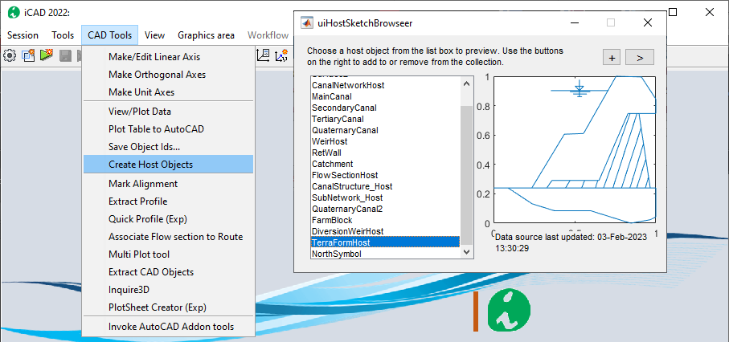

# Defining the session
[Back to toc](#table-of-contents)

A session for this module is defined similar to other iCAD modules.
Start by invoking the **Module Browser** from either the iCAD main
interface, or the workspace browser. In the list, choose the modile and
hit continue.

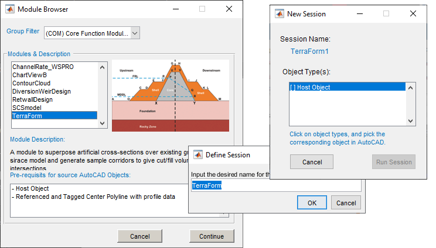

When prompted, provide the name for the session. On the *New Session* dialog, click on the first object type listed, and go to AutoCAD to select the host object created above. If the host object does not have any data stored, the *Start Fresh* dialog will apear, and choose `Pick Alignment`.

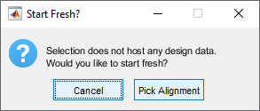

In AutoCAD, pick the alignment object that is refernced, and has profile data. If these data are succesfully found, the module will start with a view of the profile data in the main axis.

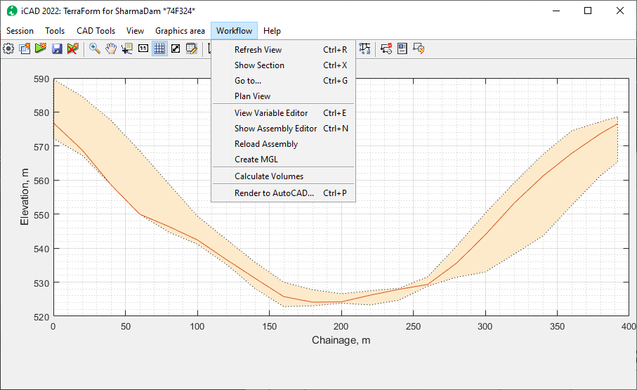

All the tools to use this module are listed under the `Workflow` menu
item. It is possible to exevute different functions from this menu. The
below sections describe the available features, function and how they
can be used to analyze formation data.

# Creating Assemblies
[Back to toc](#table-of-contents)

The first task should be create assemblies. Assemblies are cross-sectional information describing the geometric shapes of different formations. For bunds, this would be the finished fill profiles. For earth dams, they also  nclude filter and impervious materials. 

Assemblies constitute a key role in processing formation data on ground levels. This section deals with how to create and save assemblies for processing. There are two types of sections:

- Simple assemblies: defined by using the standard shape definition format for iCAD. They do not include any other information or data. 

- Compound assemblies: a combination of two assemblies, that may also have additional information. These will be discussed later.

Simple assemblies are made up of two components:

- Design level object

- Shape data.

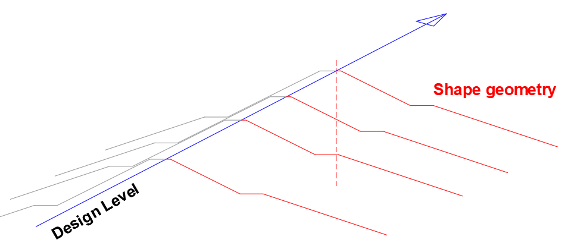

They both add to create the arrangement needed to completely define a
spatial formation. Therefore, every assembly at least requires these two
components.

## Creating Design Levels
[Back to toc](#table-of-contents)

The first step is hence to prepare desgn levels, for the various
formation shape geometries. This can easily be done in AutoCAD over the
profile drawing of the axis object. Below figure shows a snapshot of
such profile information plotted in AutoCAD.

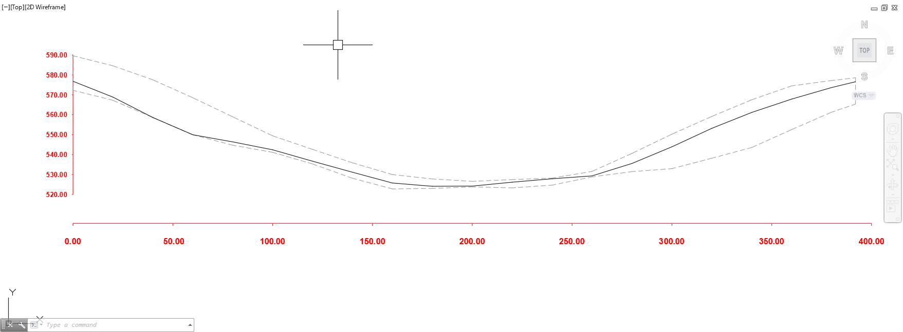 {br}

Design levels can easily be created using on this profile plot. Taking
the example of an earth dam, three design levels are indicated in the
next figure, representing the following three formations:

- Crest level

- Core level

- Blanket level.

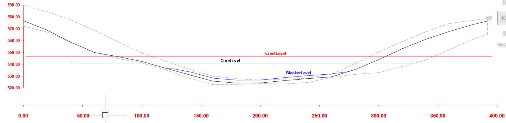 {nr}

Before continuing, make sure that all design levels are referenced and
appropriately tagged.
> Note: Do not use spaces or hyphens when tagging the design level objects. Use Underscores in stead of spaces or hyphens,

## Creating Simple Assemblies
[Back to toc](#table-of-contents)

Start the **Assembly Editor** from
`Workflow > Show Assembly Editor`. This will start the interface for assembly editor.

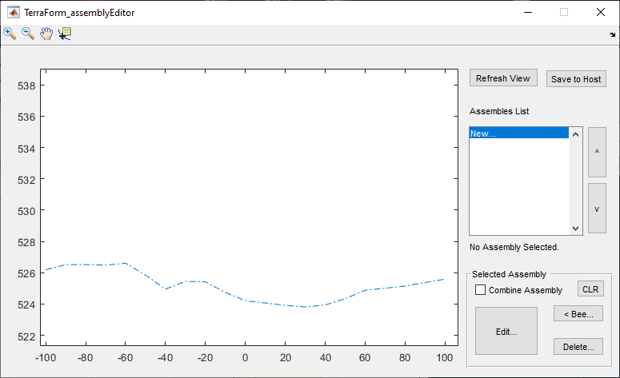

On the Assembly List, click on *New…* to create a new assembly. This will start the *Pick Object* dialog. Choose the `*Pick Level` button, and back in AutoCAD, pick the desired design level object. This will start the *Variable Editor* dialog with detailed informaation used to define the assembly.

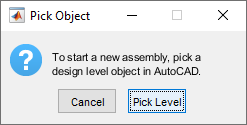

In the Variable editor dialog, enter unique informations to the desired
assembly. 
- The tag given will be used for listing the assembly in the *Assembly Editor* interface.
- Earth shape defines how the embankement shapes form a shape to the left and to the right of the centerline. Use the drop-down selector for some of preset values.

> Note: The Design Level name value is set to the tag provided to the object in AutoCAD and can not be changed.

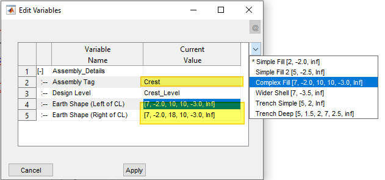

When done, hit `Apply.` The assembly is created with the provided
details. Once created, use the provided tool buttons to edit the
informaitons, or delete the assembly.

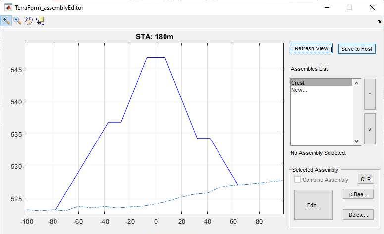

Repeat the steps above to create the next two assemblies of core and blanket.

They are created and shown here.

here..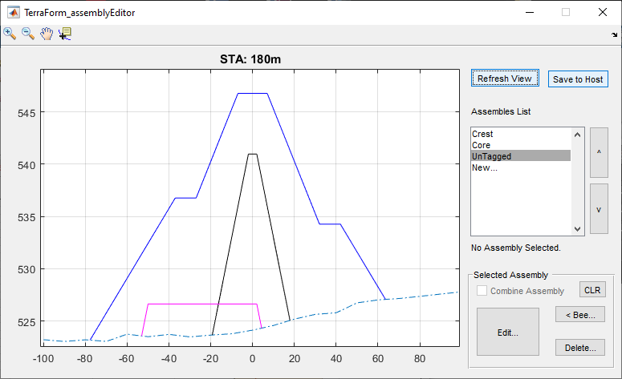

To review edit any of the assemblies, select it from the list. This will
highlight the assembly in the graph area. Click on the `Edit` button
to invoke the editor dialog, and review the settings.

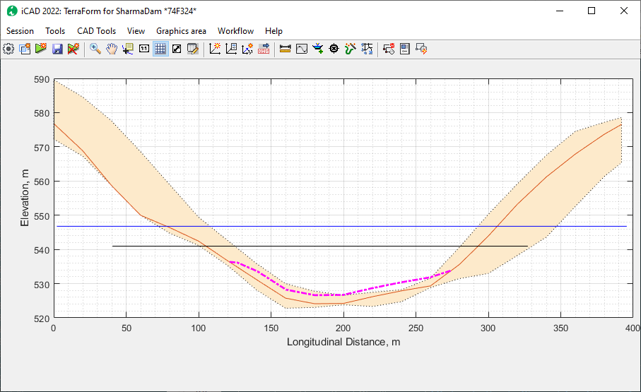

Refreshing the view in iCAD main interface and the assembly editor dialos. The  design levels for the new assemblies are also updated in the main interface.

> :bulb: **Tip**: It may be required to use **Save to Host,** then **Workflow \>
Reload Assembly** then **Refresh View** to update contents and display of assembly.

Start `Workflow > Cross-section View` menu to interact dynamically with the two views as the section bar is dragged along the differnet stations.

## Compound assemblies
[Back to toc](#table-of-contents)

Assemblies can be bound together to create a combined enclosed area to
represent one material or work area. In the above example, the Core and Blanket
assemblies can be bound together to represent the impervious fill
material.

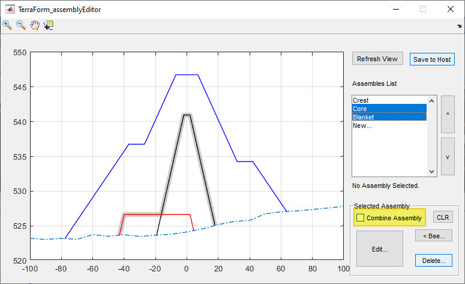

To combine assemblies, select the desired assemblies, and click on the
'Combine Assembly` check box.

> :bulb: **Important Note**: Before combining, move the order of simple assemblies in the list box to make sure the one with higher design level is at the top.

To remove combination informaiton from source assemblies, select the
assemblies one at a time, and hit the `CLR` button.

Notice also, after assemblies are combined, clicking on either assembly in the list box, highlights the combined assembly (as shown in above figure).

Use the **Save to Host** button, to save the modified assembly
information to the host object. This will also refresh the contents in the main interface. 

# Creating views
[Back to toc](#table-of-contents)

Now that we have assemblies ready, generating views is possible. The
views can help in further building the assemblies to be more responsive
to the ground conditions as will be seen later. Here the creation of
plan and section views is discussed.

## Section Views
[Back to toc](#table-of-contents)

To create cross-secional view at any point, change to default (profile) view using `Ctrl`+`R`and start `Workflow > Show-section`. An interavtive tool is created, which dynamically updates the section on the Assembly Editor window for the current station.

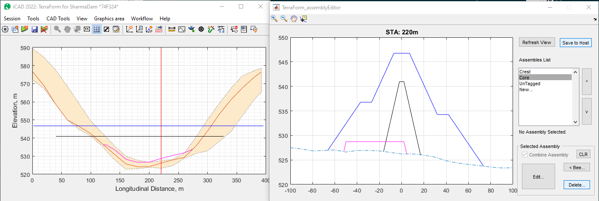

 Click any where, and the section view for that location is generated in the main iCAD interface.

This can also be achieved by using `Workflow > Go To` menu command.
Insert the required station on the **Input STA** dialog.

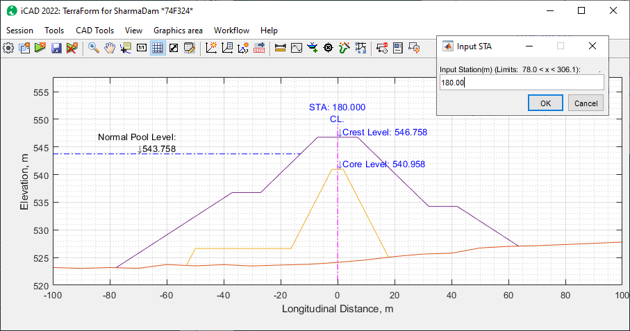

The normal pool level information is a label only informaiton. It enhances display and visualization. The label text and elevation can be adjusted from **Workflow \> Variable Editor.** To supress this label, set the *Display Flood Level* variable to 0.0.

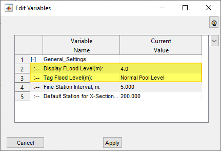

# Generating Fill Work Estimates
[Back to toc](#table-of-contents)

Once assemblies are defined, volumes of work involved for each area
between assemblies can be done from the `Workflow > Calculate Volumes` menu command.

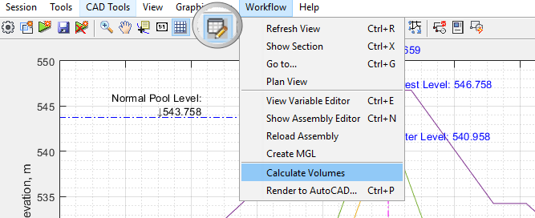

This will start and show the calculation process on a progress bar.

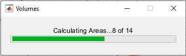

The results of calculation are sent to the Data Table. If not visible,
you can toggle the visibility of this table from the toolbar menu (See
above)

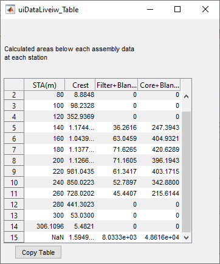

The last row of the table shows cumulative volumes based on the area and
stations for each calculation. Note: Each volume is worked out as the
net amount corresponding to each assembly (single or combined),

The table data can be copied for further documentation, or processing
using the Copy Table button.

# Assemblies with Tracer (Bees):
[Back to toc](#table-of-contents)

Tracer assemblies are assemblies with additional geometric constraints
defined. The constraints are defined using an AutoCAD object
representing a plan view of the desired constraint. The constraint
represents the extent to which b (in b,m,h triplet) extends at any given
station.

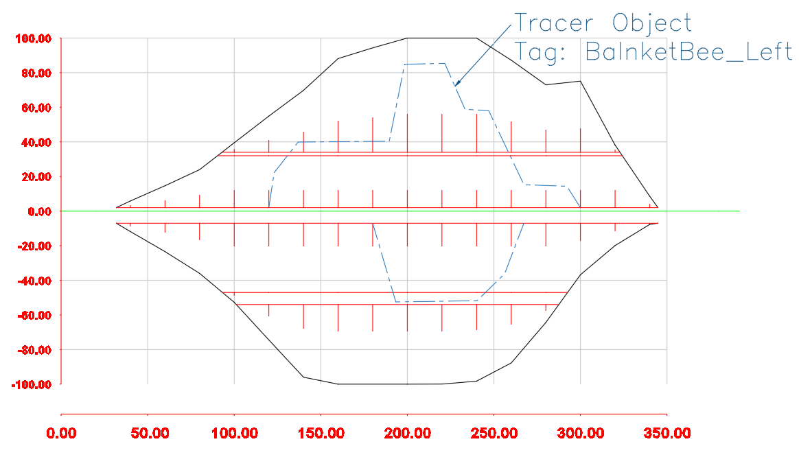

Fig: Plan view of a fill work with schematic of tracer objects or lines.

This can be applied to any assembly section to dynamically transform how
the assembly changes shape along the stations.

Note: All tracer lines must be drawn to scale, referenced to a valid
axis pair, and properly Tagged.

To add a tracer line to an assembly:

1.  Select the assembly from the list box.

2.  Click on the \<Bee button. AutoCAD will be in select mode, prompting *Pick a Tracer Object:*

3.  Upon selection, the geometry of the selected object is applied to the assembly. Choose the Edit button, and you will notice that the selected object is included in the last row.

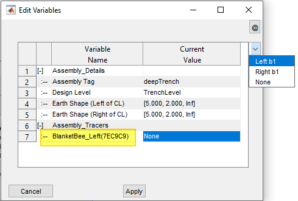

To complete the definition, choose how it is to be applied (either to
the left or right side of the assembly, defined in rows 4 or 5 above).

Cross-section views from the main interface now show the assembly
dynamically changing size and shape as the cross-section line is moved
along various stations.

# Modified Ground Levels Processing
[Back to toc](#table-of-contents)

To Be completed.