# TerraForm

[Back to Home](..\index#online-documentation)

The analysis and visualization of fill and cut works over ground
surfaces brings a significant challenge to designers. iCAD’s new
**Terraform** module presents the tools and analytic details needed to
visualize and present details of earth modification works, be it in cut
or in fill, and allow automatic and accurate processing of quantity
information.

The module can work on drawing and estimation works for formations consiting of complex cut and/or fill works including trench excavations, in:

- Earth and embankement Dams
- Bunds
- Dykes
- Saddle Dams, and the likes.

The module can be used as described below.

## Table of Contents

<!--TOC-->
  - [Conventions:](#conventions)
  - [Preparing Objects](#preparing-objects)
  - [Defining the session](#defining-the-session)
  - [Creating Assemblies](#creating-assemblies)
    - [Creating Design Levels](#creating-design-levels)
    - [Creating Simple Assemblies](#creating-simple-assemblies)
    - [Compound assemblies](#compound-assemblies)
  - [Defining Shapes from Valid AutoCAD Objects](#defining-shapes-from-valid-autocad-objects)
  - [Creating views](#creating-views)
    - [Section Views](#section-views)
    - [Creating Plan Views](#creating-plan-views)
  - [Generating Fill Work Estimates](#generating-fill-work-estimates)
  - [Assemblies with Tracer (Bees):](#assemblies-with-tracer-bees)
  - [Modified Ground Levels Processing](#modified-ground-levels-processing)
  - [Listing Volumes](#listing-volumes)
  - [Known Limitations](#known-limitations)
<!--/TOC-->

## Conventions:

[Back to toc](#table-of-contents)

The following conventions apply for using the module.
- The axis for representing the center of the formation is drawn from right to left FDS (Facing Downstream). In other words, for a person standing with face towards the begining station of the axis alignment, Left must be on upstream side, and right on downstream side.

   

- Section views on iCAD interface and on Assembly Editor are drawn with upstream side on the left, and downstream side on the right.

   

 

## Preparing Objects
[Back to toc](#table-of-contents)

For successful execution of an session instance of TerraForm, two objects are required.

1. Axis object:

    This object in AutoCAD represents the centerline for the earth formation. This is conveniently drawn overlaying a contour/feature map. The axis object must be:

    - Drawn from left to right, facing downstream direction

    - Referenced

    - Contain a profile data (generated using the AlignmentProfile module).

    The resolution used to create the profile data determines the quality of output information. It is recommended to use moderate settings to extract profiles for use using this modle.

    - Earth Dams: -100:10:100 at 10 meters increment

    - Small Dams and bunds: -50:5:50 at 5m increment.

1. Host object

    The host object is required to store all the design information and  analysis results during the use of the module. All information saved, is associated with this object. It is good practice to tag the host object.

    > Note: This object should not be delted in AutoCAD. If deleted, all  indormation may remain inaccessible.

    Any object can be used as a host. It is strongly recommended to generate a  suitable host object from `CadTools > Generate Host Sketch` to maintain consistency in practice. Host objects generated in this way are automatically tagged, which avoids the need to manually tag them before use.

    

> **Important Note**: The module works best on a single embankment reach. Avoid modelling embankement works that extend to multiple reaches, as shown below. Presentation of results may not be accurate.

   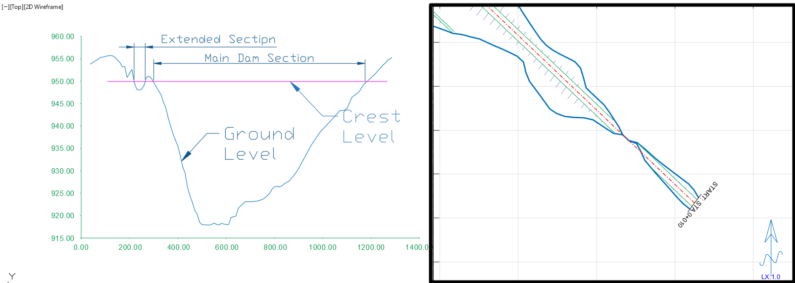

## Defining the session
[Back to toc](#table-of-contents)

A session for this module is defined similar to other iCAD modules.
Start by invoking the **Module Browser** from either the iCAD main
interface, or the workspace browser. In the list, choose the modile and
hit continue.

When prompted, provide the name for the session. On the *New Session* dialog, click on the first object type listed, and go to AutoCAD to select the host object created above. If the host object does not have any data stored, the *Start Fresh* dialog will apear, and choose `Pick Alignment`.

In AutoCAD, pick the alignment object that is refernced, and has profile data. If these data are succesfully found, the module will start with a view of the profile data in the main axis.

All the tools to use this module are listed under the `Workflow` menu
item. It is possible to exevute different functions from this menu. The
below sections describe the available features, function and how they
can be used to analyze formation data.

## Creating Assemblies
[Back to toc](#table-of-contents)

The first task should be create assemblies. Assemblies are cross-sectional information describing the geometric shapes of different formations. For bunds, this would be the finished fill profiles. For earth dams, they also  nclude filter and impervious materials. 

Assemblies constitute a key role in processing formation data on ground levels. This section deals with how to create and save assemblies for processing. There are two types of sections:

- Simple assemblies: defined by using the standard shape definition format for iCAD. They do not include any other information or data. 

- Compound assemblies: a combination of two assemblies, that may also have additional information. These will be discussed later.

Simple assemblies are made up of two components:

- Design level object

- Shape data.

They both add to create the arrangement needed to completely define a
spatial formation. Therefore, every assembly at least requires these two
components.

### Creating Design Levels
[Back to toc](#table-of-contents)

The first step is hence to prepare desgn levels, for the various
formation shape geometries. This can easily be done in AutoCAD over the
profile drawing of the axis object. Below figure shows a snapshot of
such profile information plotted in AutoCAD.

Design levels can easily be created using on this profile plot. Taking
the example of an earth dam, three design levels are indicated in the
next figure, representing the following three formations:

- Crest level

- Core level

- Blanket level.

Before continuing, make sure that all design levels are referenced and
appropriately tagged.
> Note: Do not use spaces or hyphens when tagging the design level objects. Use Underscores in stead of spaces or hyphens,

### Creating Simple Assemblies
[Back to toc](#table-of-contents)

Start the **Assembly Editor** from
`Workflow > Show Assembly Editor`. This will start the interface for assembly editor.

On the Assembly List, click on *New…* to create a new assembly. This will start the *Pick Object* dialog. Choose the `*Pick Level` button, and back in AutoCAD, pick the desired design level object. This will start the *Variable Editor* dialog with detailed informaation used to define the assembly.

In the Variable editor dialog, enter unique informations to the desired
assembly. 
- The tag given will be used for listing the assembly in the *Assembly Editor* interface.
- Earth shape defines how the embankement form a shape to the left and to the right of the centerline. Use the drop-down selector to pick from a list of of preset values.

> **Note**: The ***Assembly Tag*** name can contain only letters and underscore. Numbers can not be at the begining. No spaces are allowed.

> **Note**: The ***Design Level*** name value is set to the tag provided to the object in AutoCAD and can not be changed.

When done, hit `Apply.` The assembly is created with the provided
details. Once created, use the provided tool buttons to edit the
informaitons, or delete the assembly.

> **Note**: Both Left and right of centerline specification are required for a valid shape specification.

> **Tip**: See further below, to learn how to pick shapes from AutoCAD Objects.

Repeat the steps above to create the next two assemblies of core and blanket.

They are created and shown here.

here..

To review edit any of the assemblies, select it from the list. This will
highlight the assembly in the graph area. Click on the `Edit` button
to invoke the editor dialog, and review the settings.

Refreshing the view in iCAD main interface and the assembly editor dialos. The  design levels for the new assemblies are also updated in the main interface.

> :bulb: **Tip**: It may be required to use **Save to Host,** then **Workflow \>
Reload Assembly** then **Refresh View** to update contents and display of assembly.

Start `Workflow > Cross-section View` menu to interact dynamically with the two views as the section bar is dragged along the differnet stations.

### Compound assemblies
[Back to toc](#table-of-contents)

Assemblies can be bound together to create a combined enclosed area to
represent one material or work area. In the above example, the Core and Blanket
assemblies can be bound together to represent the impervious fill
material.

To combine assemblies, select the desired assemblies, and click on the
'Combine Assembly` check box.

> :bulb: **Important Note**: Before combining, move the order of simple assemblies in the list box to make sure the one with higher design level is at the top.

To remove combination informaiton from source assemblies, select the
assemblies one at a time, and hit the `CLR` button.

Notice also, after assemblies are combined, clicking on either assembly in the list box, highlights the combined assembly (as shown in above figure).

Use the **Save to Host** button, to save the modified assembly
information to the host object. This will also refresh the contents in the main interface. 

Once a desired assembly is fully defined, clicking on the assembly shows which areas are included as part of the assembly for cut and fill volume computation. 

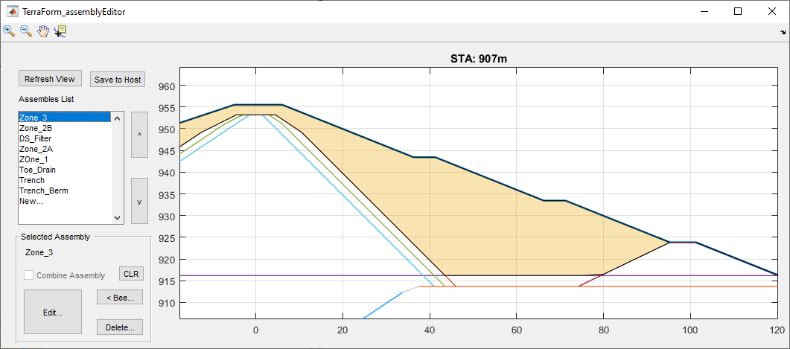

> Note: The order of appearance of the assemblies affects how zones are calculated. Use the buttons on the right of the assembly list to change the priorities of assemblies as needed.

## Defining Shapes from Valid AutoCAD Objects
[Back to toc](#table-of-contents)

As stated above, assembly shapes can be defined by listing geometry of the desired shape using the bmh triplet specification. An alternative method is to draw the desired shape in AutoCAD and use it as a source. The source AutoCAD object must fulfil the following requirements:

- drawn using LWPolyline 
- drawn begining from the centerline
- must have even number of segments, and the minium is 2)
- odd segments must be perfectly horizontal

If the object fails to meet any one of the above, it will not be used.

As an example, consider the following shape templates defined in AutoCAD. The shapes for left of Centerline and right of centerline are separately prepared, adn referenced to the axis.

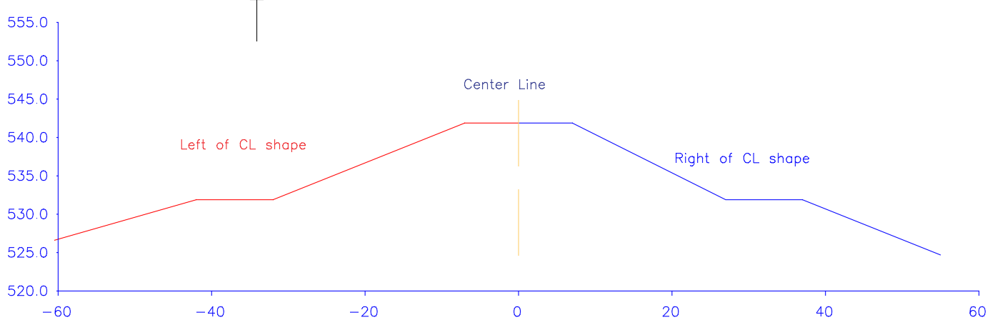

To read the gemoetry of these shapes, start the assembly definition dialog as you would for any assembly. Once the dialog shown below appeadrs, follow the next steps.

1. Type the left arrow key `<` for the **Earth Shape (Left of CL)** variable.

    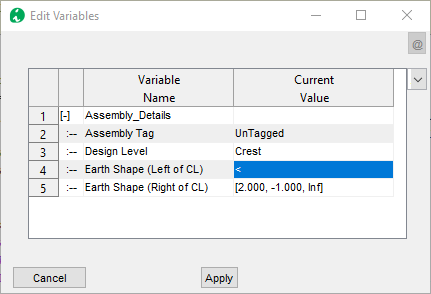

2. Click outside, and click on the cell again. AutoCAD will be in select mode.

    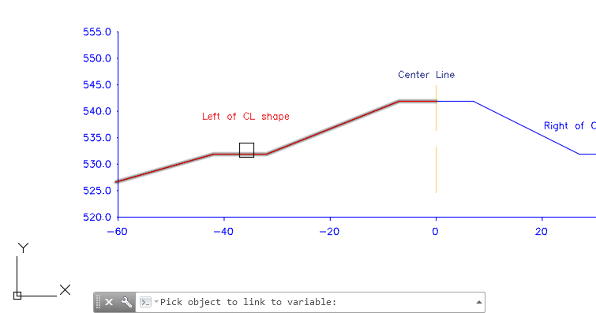

3. In AutoCAD, pick the red shape object. If the object selected does not meet the criteria, the following dialog appears. Resolve the issue and try again. If acceptable, then the values are read and recreated in the dialog, as shown below.

     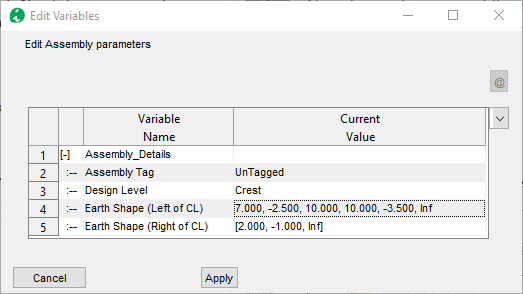

3. Repeat the same process for the right side, to pick the blue shape in AutoCAD representing the geometry for the Right of Center Line. The shape values will be listed as shown below.
 
    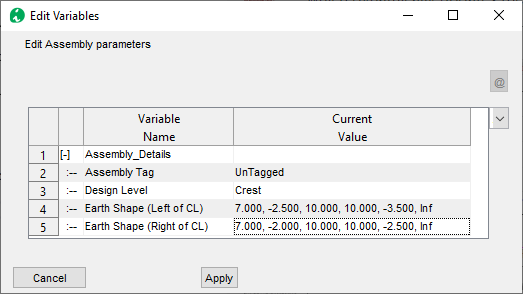

4. Click `Apply` when ready. The shapes are drawn in the assembly editor as shown below.

    

In this manner, users can create and use AutoCAD defined shapes for assembly creation.

> Note: The shape data are read once, and updating the object does not update the geometry listing.

## Creating views
[Back to toc](#table-of-contents)

Now that we have assemblies ready, generating views is possible. The
views can help in further building the assemblies to be more responsive
to the ground conditions as will be seen later. Here the creation of
plan and section views is discussed.

### Section Views
[Back to toc](#table-of-contents)

To create cross-secional view at any point, change to default (profile) view using `Ctrl`+`R`and start `Workflow > Show-section`. An interavtive tool is created, which dynamically updates the section on the Assembly Editor window for the current station.

 Click any where, and the section view for that location is generated in the main iCAD interface.

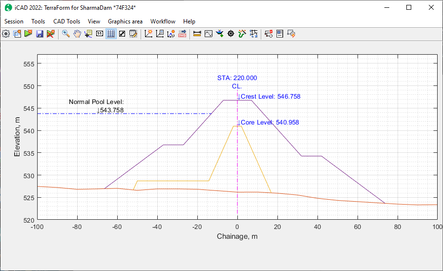

This can also be achieved by using `Workflow > Go To` menu command.
Insert the required station on the **Input STA** dialog.

The normal pool level information is a label only informaiton. It enhances display and visualization. The label text and elevation can be adjusted from **Workflow \> Variable Editor.** To supress this label, set the *Display Flood Level* variable to 0.0.

> Note: You can use 0 value to suppress the pool level text from appearing. Use negative values to render it on the left (-ve offset) side of the section, and positive values to do the reverse.

### Creating Plan Views
[Back to toc](#table-of-contents)

The module creates accurate presentation quality plan views using the ground surface and the top-most assembly (in the assembly list), showing slope edges and hair lines to indicate slope direction. These drawings can be generated to AutoCAD with desired scaling.

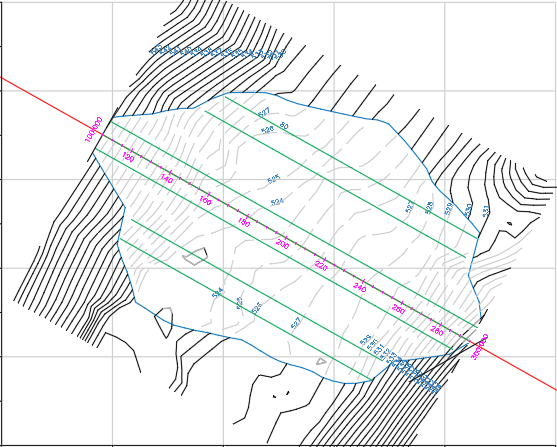

*Figure of a straight axis alignment with hidden contours under fill.*

*Figure of a formation resulting from a curved axis alignment showing accurate presentation of plan view.*

Plan views are generated from `Workflow > Plan View` menu command. Choose options for generating contour as desired, and proceed.

## Generating Fill Work Estimates
[Back to toc](#table-of-contents)

Once assemblies are defined, volumes of work involved for each area
between assemblies can be done from the `Workflow > Calculate Volumes` menu command.

This will start and show the calculation process on a progress bar.

The results of calculation are sent to the Data Table. If not visible,
you can toggle the visibility of this table from the toolbar menu (See
above)

The last row of the table shows cumulative volumes based on the area and
stations for each calculation. Note: Each volume is worked out as the
net amount corresponding to each assembly (single or combined),

The table data can be copied for further documentation, or processing
using the Copy Table button.

## Assemblies with Tracer (Bees):
[Back to toc](#table-of-contents)

Tracer assemblies are assemblies with additional geometric constraints defined. The constraints are defined using an AutoCAD object representing a plan view of the desired constraint. The constraint represents the extent to which b (in b,m,h triplet) extends at any given station.

Fig: Plan view of a fill work with schematic of tracer lines.

This can be applied to any assembly section to dynamically transform how the assembly changes shape along the stations.

Note: All tracer lines must be drawn to scale, referenced to a valid axis pair, and properly Tagged.

To add a tracer line to an assembly:

1.  Select the assembly from the list box.

2.  Click on the \<Bee button. AutoCAD will be in select mode, prompting *Pick a Tracer Object:*

3.  Upon selection, the geometry of the selected object is applied to the assembly. Choose the Edit button, and you will notice that the selected object is included in the last row.

To complete the definition, choose how it is to be applied (either to the left or right side of the assembly, defined in rows 4 or 5 above).

Cross-section views from the main interface now show the assembly dynamically changing size and shape as the cross-section line is moved along various stations.

> :bulb: **Tip**: Edits in the coordinates of tracer lines or design levels, can be updated at any time with out leaving the session by using `Workflow > Reload Assemblies`. However, make sure to NOT EDIT the starting coordinate of any of these. If so, re-reference the objects before reloading.

> **Note**: Tracer bees can not be applied to top most assemblies. If lower assemblies with tracer bee data are moved up, the data will be cleared upon reload.

> **Note**: Assigning different assembly sets for different (sections of) stations is not allowed in the current version.

## Modified Ground Levels Processing
[Back to toc](#table-of-contents)

In real-life projects, fill works are created over well prepared ground levels that can be very different from the original ground level formation. Modified ground levels in TerraForm allow to imitate this workflow, and generate realistic drawings and quantities.

Modified ground levels are created using an already defined assembly data. The assembly data must represent a cut shape. For this example, take the below assembly definition. The Fill works are currently drawn over the existing ground level.

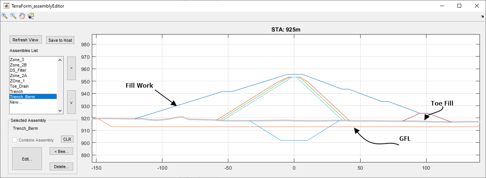

In reality however, the fill works are desired above the excavated ground level - commonly known as the **General Foundation Level(GFL)**. To create this condition:

1. In the main iCAD interface, go to Workflow > Create MGL. 
1. On the *Pick Assembly* dialog, choose the **Trench** assembly representing the GFL, and click `Ok`.

    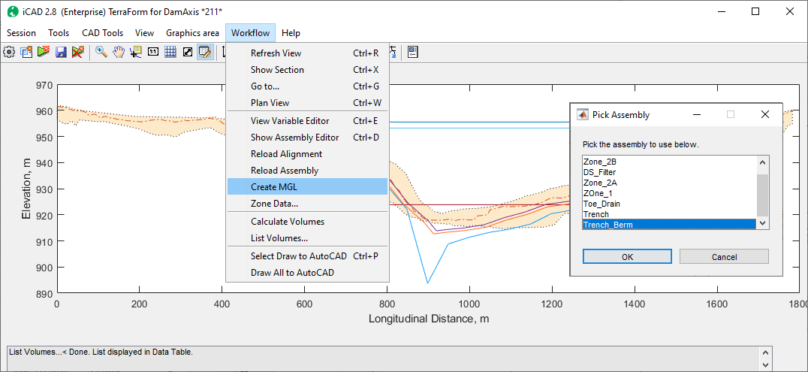.
1. Notice the progress bar, and the status bar at the bottom for progress. As indicated on the status bar, the resulting list is displayed in the Data Table view.

    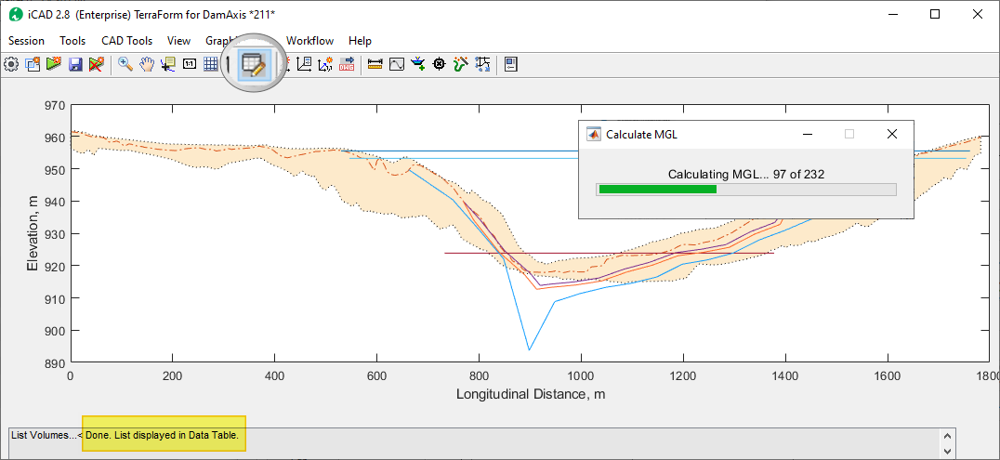

1. If not already, click on the *Table View* toolbar to see the result. The desctiption on the table view underlines the list is a result of the calcualtions for **Ground Level Modifications** and a summary value, also highlighted in yelow at the bottom of the table.
    
    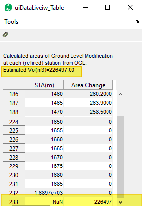

1. Before you can see the change in the assembly editor, go to the **Workflow > Create MGL** once again. Notice, it is not checked. Click on it and a dialog will apear. 
    1. Choose **Toggle** to change the status to on/off. If the state is on, a check mark will be put before the menu item as shown below.
    1. Choose **Clear** to clear all modified ground level data, and start over.
    2. Choose **Modify** to create another modified level, which we will use next.
     
     For this step, we will choose the **Toggle** button, and confirm the action in the menu item.

    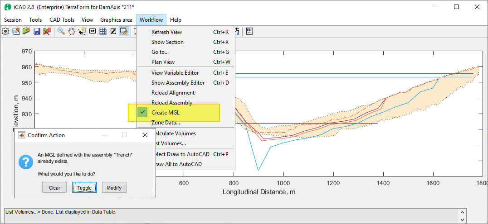

1. Start the **Workflow > Show Section** command or `Ctrl`+`X` keyboard short cut and move the cursor back and forth to see how the modified ground level is created. Notice the deep in the thick graye line indicating the new ground level.

    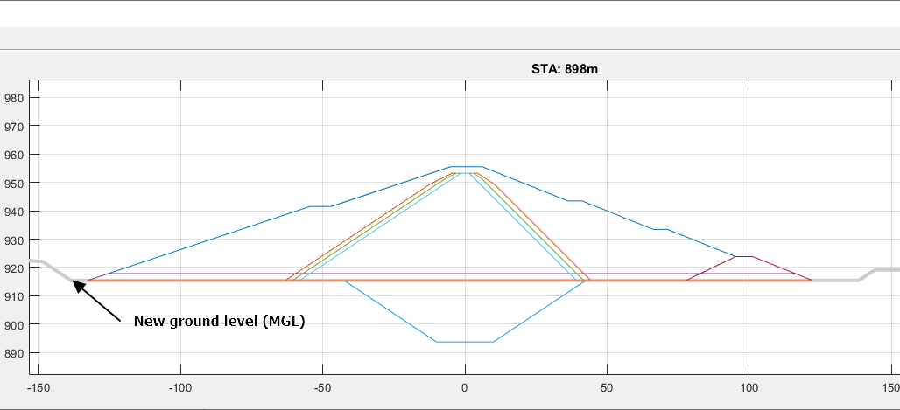

1. We will still need to modify the GFL to incorporate the shape of the deep trench. To achieve this go to **Workflow > Create MGL** once again. Note the menu item is **Checked**. When the dialog appears, choose **Modify**. This will start the *Pick Assembly* dialog. Choose the Trench assembly, which represents the deep trench in the schematic.
 
    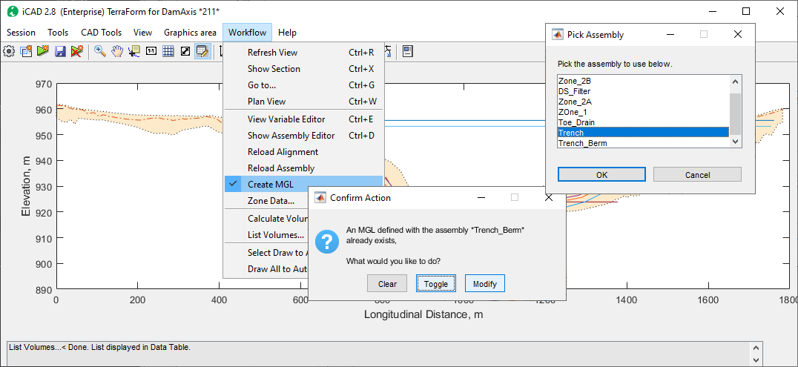

    The progress bar will show status and complete as above.

1. Start the table view to see the change in volumes due to the ground level modification. Notice the highlighted areas showing cummulative values for estimated change in volume (also at the bottom of the table)

     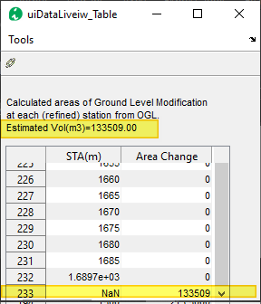

1. Repeat step 6 to see the changes in the assembly editor. As shown below, the fill works now extend to the newly modifed ground level.

    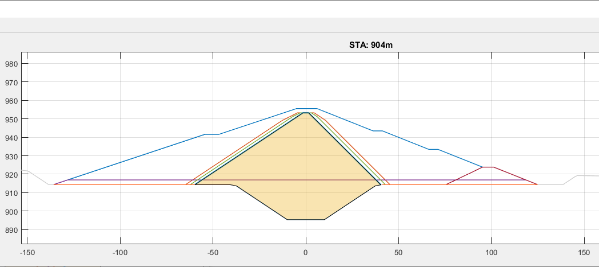

Modified levels created in this manner are available for use and/or further modification after saving.

## Resolving modelling Issues

When working with alignments and their assemblies, it is often needed to update data to suit the desired layout. The following options are available.

1. Reload Alignment
    The alignment object may not have the right coordinates or the correct resolution of profile data. This can be adjusted at any time as follows:
    - Close the Terrafrorm module (if open).
    - Make the necessary adjustment to the alignment object (reverse, move...)
    - Re-extract the profile data with the desired resolution, and save the data.
    - Reopen the Terraform session, then go to `Workflow > Reload Alignment` menu command. 
    The new profile data is brought, and updated.

    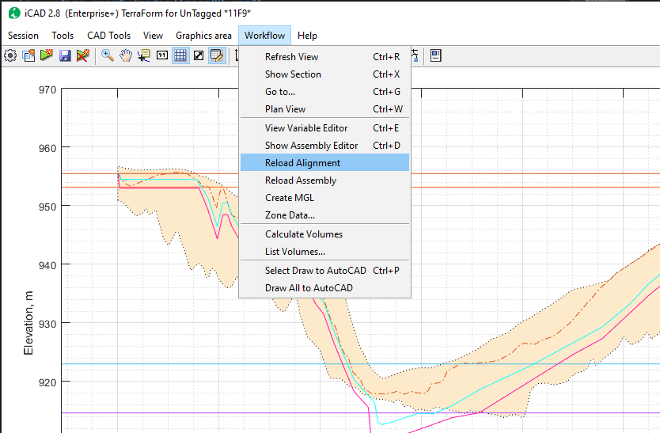

1. Assembly Overlap
    Each assembly is understood to envelop the others below them. Order of appearance therefore matters. Some times, the lower assemblies may extend beyong the boundary shape of the topmost envelop. In such cases, the algorithm attempts to trim those vertices extending beyond.
    
    Sometima This process may not be succesful, and result in the same boundary as the top most assembly, causing display and processing issues. This is typically highlighted by a BLINKING zone (when clicked). 

    Resolve the issue by adjusting the coordinates of the assembly with issue, and refresh view.
 

## Listing Volumes
[Back to toc](#table-of-contents)

Volumes can be listed for all fill and cut related works in one step.

1. Start the **Worflow > Calculate Volumes** to update all figures.

1. Then use the **Workflow > List Volumes...**. A dialog appears requesting input for desired stations. One can choose any length span to calculate volumes with in valid ranges.

    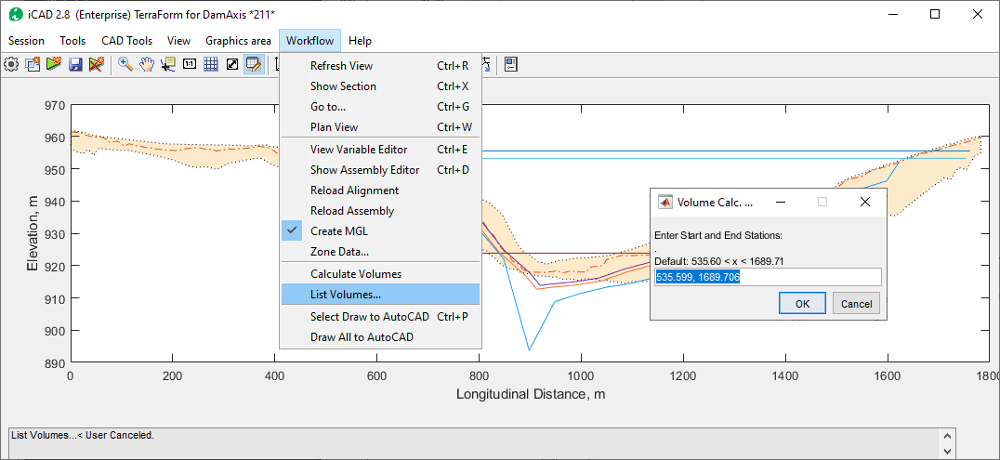

1. The volumes will be listed in the table view as shown below.

    

Descriptive Notes:

- The Fill Works represent fill volumes involved for each assembly above the last modified gorund level (MGL). 
- Volumes for combined assemblies are shown on the first of the two assemblies (in order of appearance). The second assembly reports zero volumes. (See Zone_2B+DS_Filter, and DS_Filter columns above.)
- Cut Works involved are reported with respect to the Original Ground Level (OGL).
- Two sections

    For better visibility, the data can be coppied to cliboard and pasted in a spreadsheet application such as MS Excel, or Open Office.

    Note: 

## Known Limitations
[Back to toc](#table-of-contents)

- There are not limits to the number of assemblies that can be defined. However, only two assemblies in cut formation can be used to process Modified ground levels, and get volume reports.
- Rarely, cross-sections generated at intermediate stations - i.e., at stations other than those in profile extraction - may show double lines for assemblies. This is caused by anavoidable differences encountered during interpolation for the different formations.

    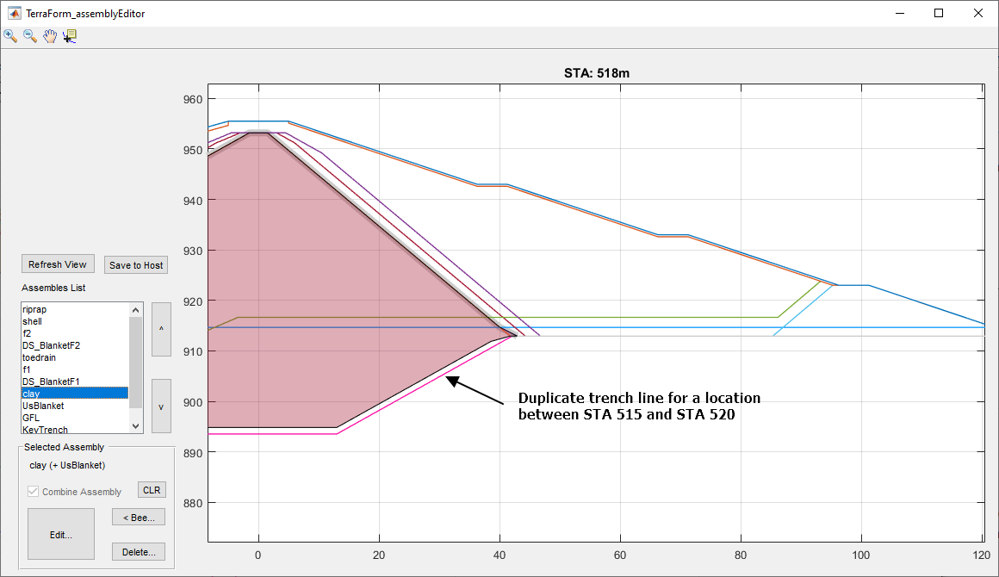

[Back to toc](#table-of-contents)

END.

