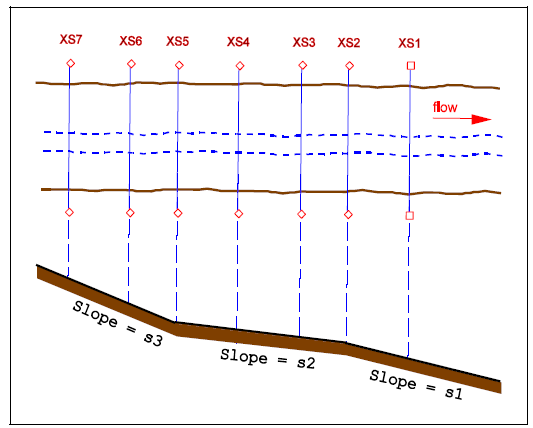

# iCAD Update Notes (Aug 2023)

[Back to Home](..\index#Updates-for-this-Release)

**Hello There,** 

Well come to this update. We are excited to bring more functions and features to our users. This release marks a milestone, where we have included new modules for the design of diversion weirs and embankement analysis modules. We have also refined previously existing modules to meet the work needs of practitioners.

> :warning: **Important Notice**: If you have a previous version of iCAD, remove it from your system, and install the new release. It is an improved one-click installation, avoidng the need to download and install other applications previously required.

Key in this release include new modules for diversion weir design and embankment works analysis.

## Table of Contents
<!--TOC-->
  - [Diversion Weir Design :new:](#diversion-weir-design-new)
  - [TerraForm module for embankment works analysis :new:](#terraform-module-for-embankment-works-analysis-new)
  - [Advanced Stream rating curve development using WSPRO](#advanced-stream-rating-curve-development-using-wspro)
  - [Support for Latest AutoCAD Releases](#support-for-latest-autocad-releases)
<!--/TOC-->

## Diversion Weir Design :new:
[Back to ToC](#table-of-contents)

A flexible and easy to use diversion weir design module is now integrated and available as part of the Professional iCAD Software edition. It offers up to 8 different views to work with different compoentns of the structure.

It has the following features:
- Automatic link to channel rating data
- Longitudinal cross-section views across overflow span, sluice bays with piers, and outlets
- Dynamic weir overflow sizing
- Automatic and full stability analysis for the weir body
- Trapezoidal or ogee shaped weir
- Full surface, and sub-surface flow hydraulis, with appron sizing and design features
- and more.

## TerraForm module for embankment works analysis :new:
[Back to ToC](#table-of-contents)

We have designed and implemented an ambitious workflow in formation analysis and work volume estimation for embankement works. TerraForm module builds on previous versions of surface analysis to give users the computational edge and easy workflow to tackle earth work estimation and drawing generation tasks.

This version includes the follwing features:
- Easy definition of complex shape assemblies
- Parameteric assemblies for even more complex assemblies
- Ability to reduce surfaces (to emulate excavation works), before computing fill works
- Interactive cross-sections
- Full drawing generation capability
- and more.

## Advanced Stream rating curve development using WSPRO
[Back to ToC](#table-of-contents)

ChannelRating module is upgraded to include complex analyis features that enable determination of a stage discharge curve from multiple river or stream cross-sections. This methos is known to be more accurate than the conventional method that used one cross-section only.

This feature is validated using data provided by WSPRO/USGS and found to be accurate. Read the validation document [here]().

## Support for Latest AutoCAD Releases
We are continually integrating latest versions of AutoCAD to our products. AutoCAD 2o22 and 23 are now supported with our applications.

> :warning: **NOTE**: The applications are being fully tested on these latest AutoDESK products, and the test is not completed. Please let us know if you encounter any issues, and we will be glad to help.

[Back to ToC](#table-of-contents)

END.
