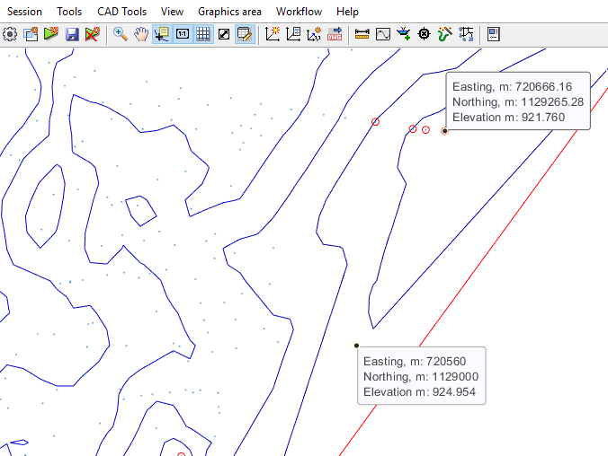

# iCAD Update Notes (Jul-Aug2024)

**Hello, and welcome again,** 

We are excited to bring more functions and features to our users. This release marks a milestone, where we have included new modules for the design of diversion weirs and embankement analysis modules. We have also refined previously existing modules to meet the work needs of practitioners.

The current release is **Version 2.9.0.10407**.

## Table of Contents

Key in this release include new modules for diversion weir design and embankment works analysis.

<!--TOC-->
  - [What's New](#whats-new)
    - [General to iCAD Environment](#general-to-icad-environment)
    - [Contour Cloud](#contour-cloud)
    - [Channel Rating](#channel-rating)
    - [Terraform](#terraform)
    - [Diversion Weir](#diversion-weir)
  - [Support for Latest AutoCAD Releases](#support-for-latest-autocad-releases)
<!--/TOC-->

## What's New

### General to iCAD Environment
[Back to ToC](#table-of-contents)

- Data tip improvement
    
  Data tip display information is now synced for font name and size, set to the iCAD environment (accessible from `Graphic Area > Annotation Font`).

  

- Image copy

  Image copy now takes high quality snapshots of the iCAD environment, with out the need for additional tools.
  
  
  

### Contour Cloud
[Back to ToC](#table-of-contents)

The ContourCloud module is enhanced for the following funcitons:

- Improved contour generation

  Contour generation is now enhanced to accept inputs for major and minor contour lines in one run. Previously the types needed to be generated separately.

  
  

    Furthermore, plotting via buffer file is improved to change properties of polylines sent to AUtoCAD for elevation data. This greately improves drawing generation speed with complete data set for further processing (creating anotations).
  
  

- Data tip for Z values

    Data tip tool is improved to show z values where available. This can be helpful while exploring data point values in cloud data processing.
  
    

### Channel Rating
[Back to ToC](#table-of-contents)

Channel Rating module has been improved for:

- Imrpoved computational algorithm and data presentation. Data viuslization and interaction is also enhanced, giveing users flexibility and intution.

    

### Terraform
[Back to ToC](#table-of-contents)

- A key improvement is made to the algorithm, to allow more complex shapes for defining intricate fill layers that can represent dam/embankment construction design.{br}

    

    The above filter layer is created using an assembly shape in AutoCAD shown below. Such a shape (a fill shape containing positive slope) is now acceptable.

    Key algorithms are improved to better understand complex shapes accurately, and return accurate measures of areas involved.
  
    

### Diversion Weir
[Back to ToC](#table-of-contents)

Further to updates in previous release (also included here for completeness), the following improvements are applied:

- Sluice bay view now includes percent of design discharge that can be accomodated in fully open position (for HFL)

    

- Improved plan view now showing correct placement of divde wall (with no bay condition), and coordinate transformation to meet axis alignment.
- 
    

- Imrpoved navigation and view extent for all views, now stores view extents in all views, and restores them appropritately. The menu command for this task is removed.

-  Corrected algorithm for hydraulic jump length calculation as a function of sequent depth. [previously it was set as a function of tail water depth. For jump mechanisms other than Type I, the actual sequent depth and the tail water depth are equal. This correction uses the theoretical sequent depth, aligning with provisions with litrature.
 
    

- Length of jump for Type I structures is now set by the software. ALong with this improvement, the hotspot for interactively positioning the end of the stilling pool is removed. Previously, it was set manually.

- Subsurface profile views are now hidden by default. Users can toggle their visibility from the `Workflow > Show Subsurface HGL` menu item.

    

- The sub-surface pressure variation algorithm is enhanced to account for interference due to intermediate cutoff walls. Results now show values that are modified accordingly.

- A new report is included for stilling pools, now generating complete design information for selected energy dissipater mechanism.

    

- Plan views now include detailed energy dissipater block dimension and placement dimension for all jump mechanisms.
  
  

- Different views of the design session now retain display extents, for smoother navigation experience.

Bug fixes:
- Baffle blocks appearing in Sluicebay views removed
- Corrected views for sluice bay's (on left side)
- Bugfix to display outlet view and design
- corrected plan view display issues (rotation and alignment, divide wall locations)
- Cd Selection for Ogee shaped weirs
- Subsurface hydraulic calculation, and exit gradient values corrected.
- Report for ogee type weir corrected and displayed
- Hydraulic grade lines for USBR type basins corrected.
- Rare NaN values displayed for prejump depth corrected.
- Reported numbers with arithmetic error

## Support for Latest AutoCAD Releases
We are continually integrating latest versions of AutoCAD to our products. AutoCAD 2022 and 23 are now supported with our applications.

> :warning: **NOTE**: The applications are being fully tested on these latest AutoDESK products, and the test is not completed. Please let us know if you encounter any issues, and we will be glad to help.

[Back to ToC](#table-of-contents)

END.
