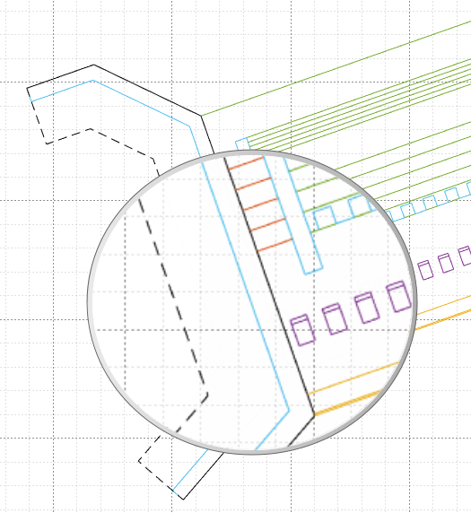

# iCAD Update Notes (Mar2024)

**Hello, and welcome again,** 

We are excited to bring more functions and features to our users. This release marks a milestone, where we have included new modules for the design of diversion weirs and embankement analysis modules. We have also refined previously existing modules to meet the work needs of practitioners.

The current release is **Version 2.8.3.9164**.

## Table of Contents

Key in this release include new modules for diversion weir design and embankment works analysis.
<!--TOC-->
  - [TerraForm Enhancement](#terraform-enhancement)
    - [Terraform](#terraform)
    - [Diversion Weir](#diversion-weir)
  - [Support for Latest AutoCAD Releases](#support-for-latest-autocad-releases)
<!--/TOC-->

## TerraForm Enhancement

### Terraform
[Back to ToC](#table-of-contents)

A key improvement is made to the algorithm, to allow more complex shapes for defining intricate fill layers that are needed in emulating dam/embankement construciton design.

The above fiilter layer is created using an assembly shape in AutoCAD shown below. Such a shape (a fill shape containing positive slope) is now acceptable.

### Diversion Weir
[Back to ToC](#table-of-contents)

- The sub-surface pressure variation algorithm is enhanced to account for intereference due to intermediate cutoff walls. Results now show values that are modified accordingly.

- A new report is included for stilling pools, now generating complete design information for selected energy desiaptor mechanism.

    

- Plan views now indlude detailed energy desipator block dimension and placement dimension for all jump mechanisms.
  
  

Bug fixes:
- Subsirface hydraulic calculation, and exit gradient values corrected.
- Report for ogee type weir corrected and displayed
- Hydraulic grade lines for USBR type basins corrected.
- Rare NaN values displayed for prejump depth corrected.

## Support for Latest AutoCAD Releases
We are continually integrating latest versions of AutoCAD to our products. AutoCAD 2o22 and 23 are now supported with our applications.

> :warning: **NOTE**: The applications are being fully tested on these latest AutoDESK products, and the test is not completed. Please let us know if you encounter any issues, and we will be glad to help.

[Back to ToC](#table-of-contents)

END.
