# iCAD Update Notes (Jan2024)

[Back to Home](..\index#updates-for-this-release)

**Hello, and welcome again,** 

We are excited to bring more functions and features to our users. This release marks a milestone, where we have included new modules for the design of diversion weirs and embankement analysis modules. We have also refined previously existing modules to meet the work needs of practitioners.

The current release is **Version 2.8.3.9067**.

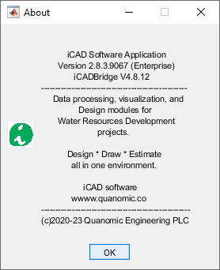

## Table of Contents

Key in this release include new modules for diversion weir design and embankment works analysis.
<!--TOC-->
  - [Data Table View](#data-table-view)
    - [CloudContour Module](#cloudcontour-module)
  - [Retwall Module](#retwall-module)
  - [ChannelRating_WSPRO](#channelrating_wspro)
  - [Diversion Weir Design](#diversion-weir-design)
    - [Increased Weir Heights](#increased-weir-heights)
    - [More Energy Dessipator types](#more-energy-dessipator-types)
    - [Relaxed locking with min RBL](#relaxed-locking-with-min-rbl)
    - [Resolved issues for report generation](#resolved-issues-for-report-generation)
  - [TerraForm module for embankment works analysis](#terraform-module-for-embankment-works-analysis)
  - [Advanced Stream rating curve development using WSPRO](#advanced-stream-rating-curve-development-using-wspro)
  - [Enhanced ChartView](#enhanced-chartview)
  - [Support for Latest AutoCAD Releases](#support-for-latest-autocad-releases)
<!--/TOC-->

## Data Table View
[Back to ToC](#table-of-contents)

iCAD's Data viewer table interface is frequently used to explore data contents of AutoCAD objects. In this update, it can directly call on AutoCAD objects to see if CsvData is hosted and its contents, if any.
* Choose **Tools > Show Csv Data** menu command or the toolbar item to start the command. Go to AutoCAD, and pick the object whose data you want to explore.

	

### CloudContour Module
The module is enhanced to address the requested issue of contour smooting. A new variable is introducted to this effect, and great results obtained in our test cases.

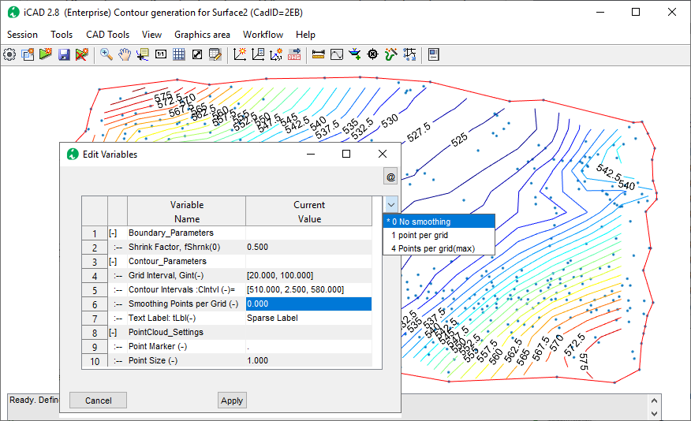

Below figure shows raw contours (generated with out smoothing points) and smoothed contour with 4 points per grid specified.

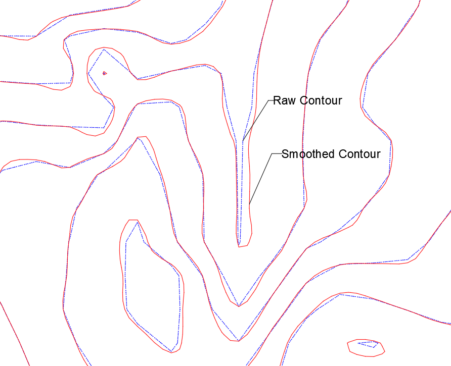

## Retwall Module
[Back to ToC](#table-of-contents)

Retaining wall module is enhanced to indlude the following features, particularly suited for designing long retaining wall.

* New variable included to allow Segment identification from Wall Top and bottom profiles. This is a useful feature giving the user additional flexibility to define and solve practical problems.

	

* New variable included to allow flexible BoQ extraction (summarized or detailed). The summary will generate BoQ for all Segments in the wall.

	

* A new safety criteria included on the Design Scene selector showing trends on eccentriciy and aiding in desin width selection.

	

## ChannelRating_WSPRO
[Back to ToC](#table-of-contents)

Recent updates to ChannelRate_WSPRO are included to make the module more interactive and generate rich information to AutoCAD.
The following are key features:
- Relaxed the bed slope entry parameter range to up to a value of 1/20.
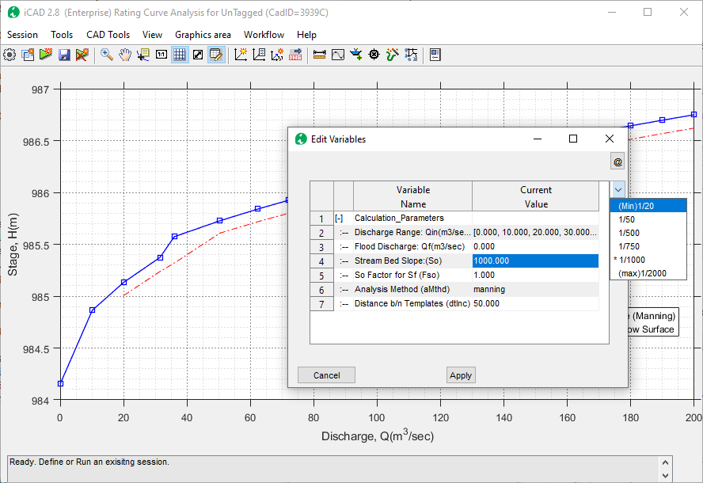

- Enhancement to handle complex river bed levels with raised bed levels.

- New variable included to show flood levels for upto two discharges

	

- Show the solutoin method used for analysis
- Generate texts and annotations to AutoCAD
    

- Additional Solution method using original stream section (and not templates) which is useful for comparison of rating curves with anlytical solutions

    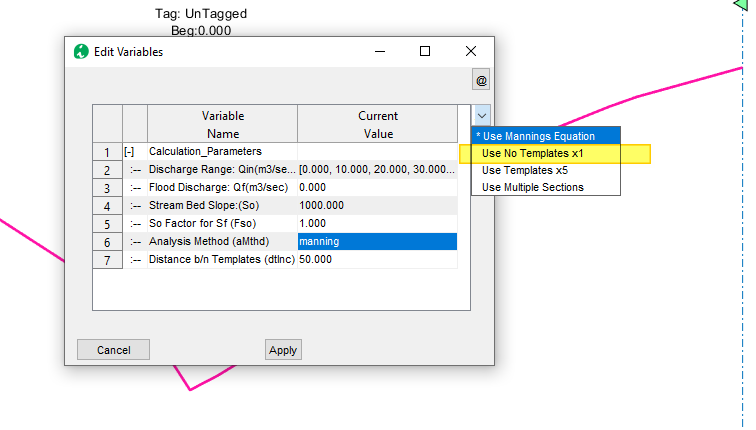

- New settings for Boundary conditions, allowing simulation of critical flow condition at cross-sections in Water Surface Elevation computation

- **Renamed** So Factor to Boundary conditions, and adjusted input values to 0 <= Fso <=1.25.

- Bug fixes on for advanced analysis (multi sections with variable N)

- Improved error handling for discharge ranges. An bug in calculation of rated levels. that gave exagerated elevations, is also corrected.

## Diversion Weir Design
[Back to ToC](#table-of-contents)

A flexible and easy to use diversion weir design module is now integrated and available as part of the Professional iCAD Software edition. It offers up to 8 different views to work with different compoentns of the structure.

It has the following features:
- Automatic link to channel rating data
- Longitudinal cross-section views across overflow span, sluice bays with piers, and outlets
- Dynamic weir overflow sizing
- Automatic and full stability analysis for the weir body
- Trapezoidal or ogee shaped weir
- Full surface, and sub-surface flow hydraulis, with appron sizing and design features
- and more.

The December update has allowed flexible data entry options as well as other types of energy dessipators than Type I.

### Increased Weir Heights
Up to 5 meters of weir height are now allowed.

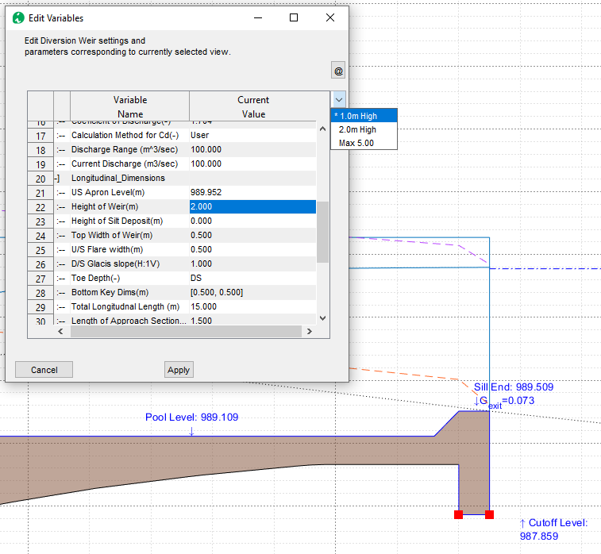

### More Energy Dessipator types
Type II, III and IV type desipators are now included.

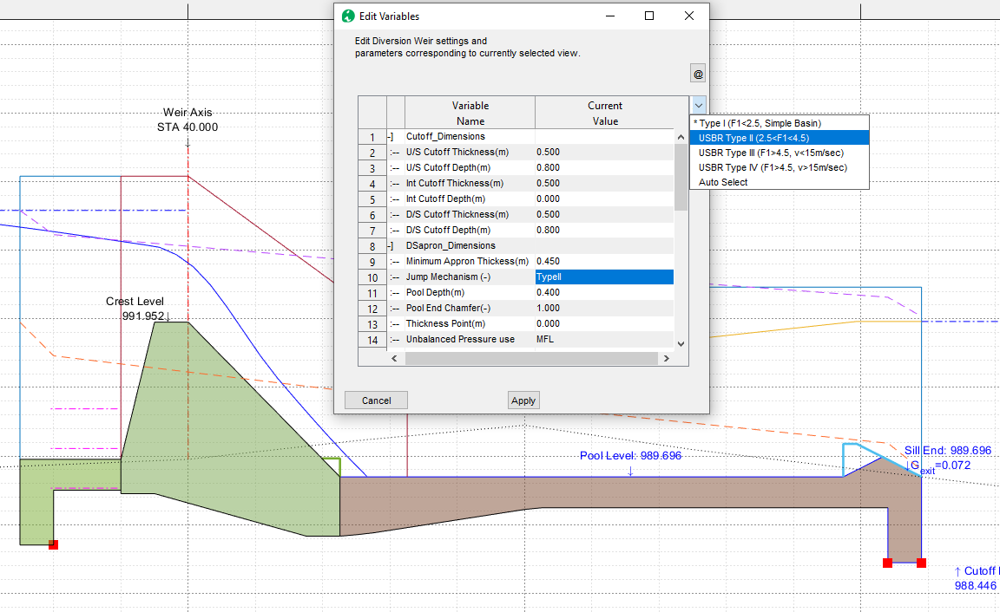

### Relaxed locking with min RBL
Users can now lock the upstream appron level of the weir with in 1.0 meters of the minimum river bed level on the weir axis.

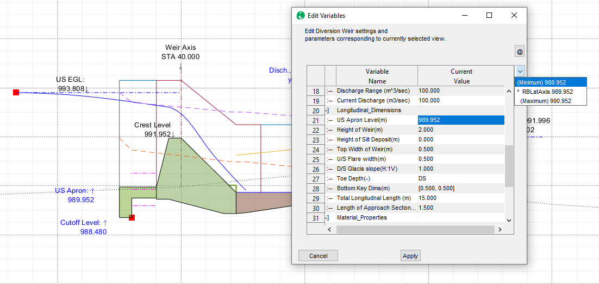

### Resolved issues for report generation

The reported tool has been updated for error issues, and now succesfully reports results.
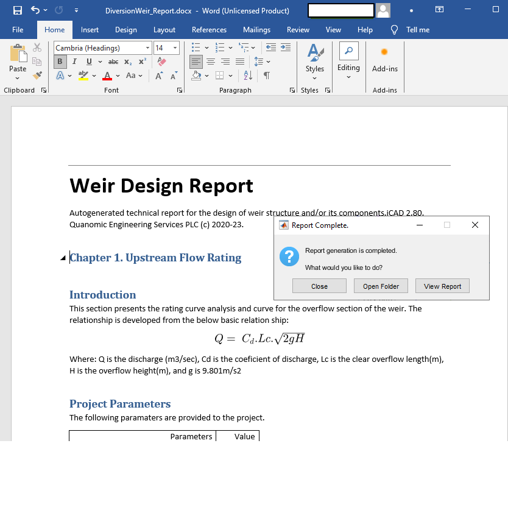

## TerraForm module for embankment works analysis
[Back to ToC](#table-of-contents)

We have designed and implemented an ambitious workflow in formation analysis and work volume estimation for embankement works. TerraForm module builds on previous versions of surface analysis to give users the computational edge and easy workflow to tackle earth work estimation and drawing generation tasks.

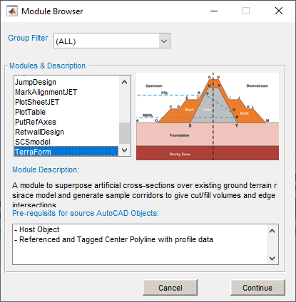

This version includes the follwing features:
- Easy definition of complex shape assemblies
- Parameteric assemblies for even more complex assemblies
- capability to create general foundation levels to reduce surfaces (to emulate excavation works), before computing fill works
- Interactive cross-sections
- Full drawing generation capability
- and more.

	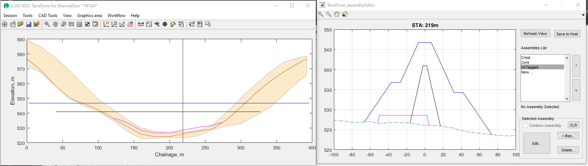

In this release, many features are enhanced to allow quicked modelling of fill zones (materials) focusing on embankement dams.

- Enhanced validation for field names prohibiting using invalid characters (e.g., spaces or hyphens)
- Visuall presentation of the zone materials showing which subareas are captured before drawing or report generation.

    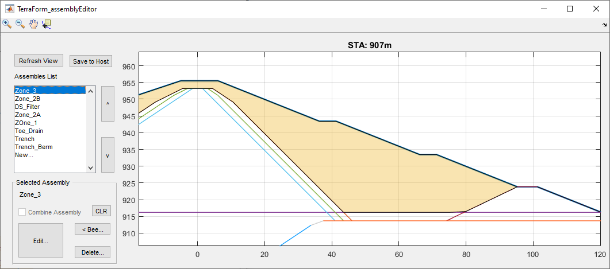

- ability to model offset assemblies, whose centerline is different than the embankement centerline. This can be used to effectively model toe drains and similar provissions.

	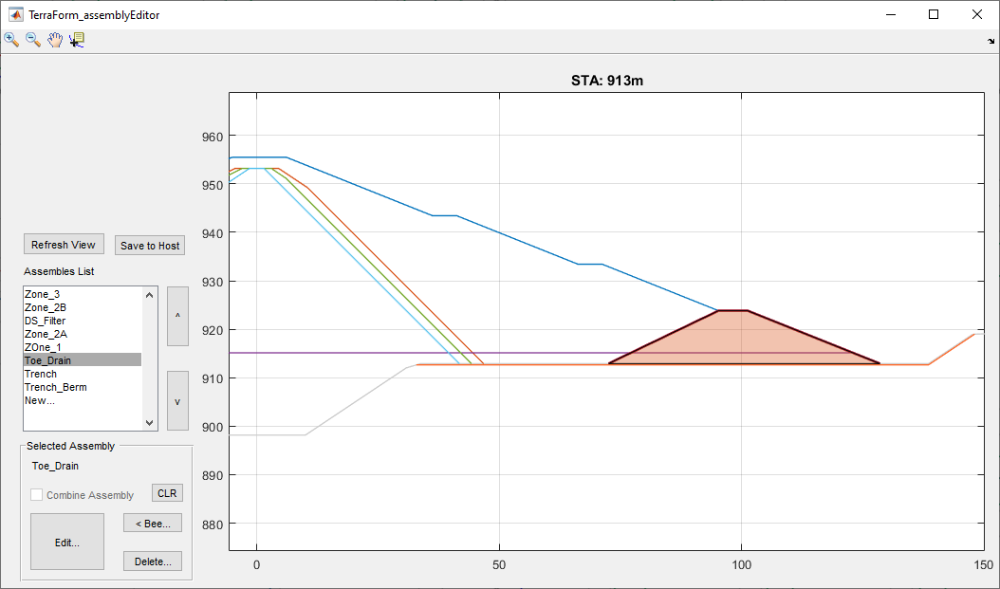

- Enhanced plan view generator to handle a multiple fill reaches, as shown below.

	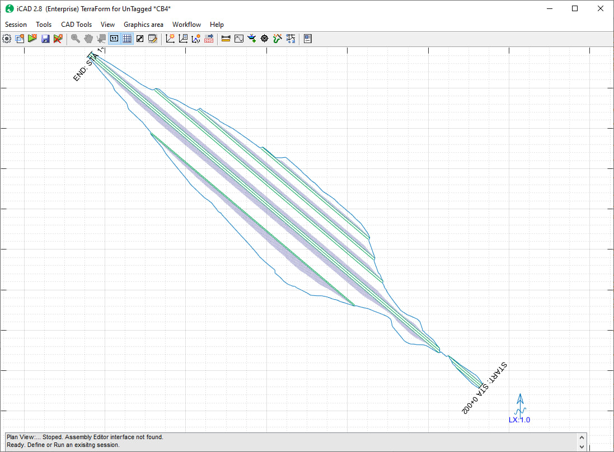

- Consolidated volume reporting for all fill and cut works, with ability to compute between given stations.

    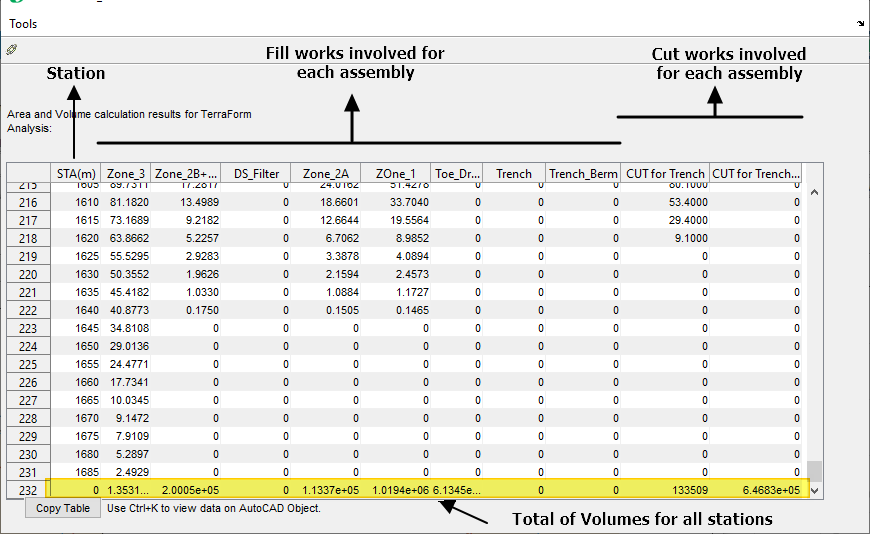

## Advanced Stream rating curve development using WSPRO
[Back to ToC](#table-of-contents)

ChannelRating module is upgraded to include complex analyis features that enable determination of a stage discharge curve from multiple river or stream cross-sections. This methos is known to be more accurate than the conventional method that used one cross-section only.

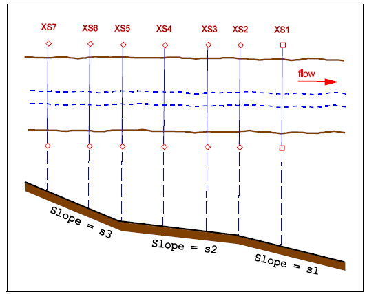

This feature is validated using data provided by WSPRO/USGS and found to be accurate. Read the validation document [here]().

## Enhanced ChartView
[Back to ToC](#table-of-contents)

iCAD introduces a novel and handy solution to digitally read complex charts. Charts of different sorts are used by engineers to determine design paramters or performance data. Often reading these charts are challenging, and subject to significant human error. Where parameteric charts are involved, shch as the one below, the challenge becomes evern more concetning.

ChartView module is enhanced to quickly digitize charts, read interpolated values, and save capability. It also accepts importing chart images from the windows Clipboad.

In this demo, it was easy to read values for parameter z=2.5, based on values for z=1, 2, and 3.

## Support for Latest AutoCAD Releases
We are continually integrating latest versions of AutoCAD to our products. AutoCAD 2o22 and 23 are now supported with our applications.

> :warning: **NOTE**: The applications are being fully tested on these latest AutoDESK products, and the test is not completed. Please let us know if you encounter any issues, and we will be glad to help.

[Back to ToC](#table-of-contents)

END.
